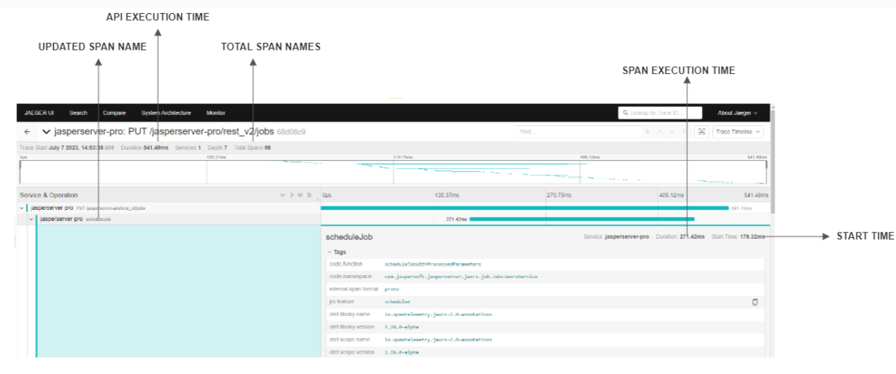
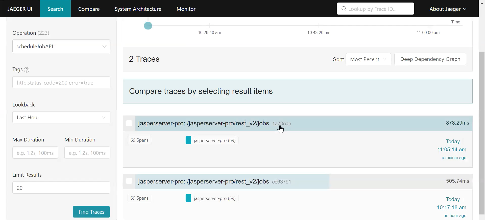
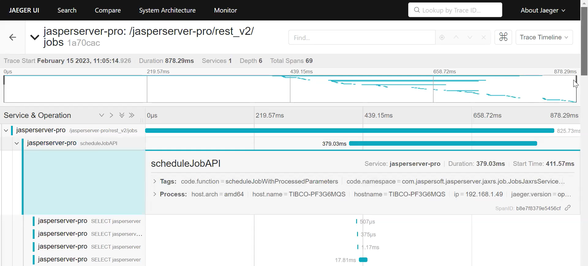
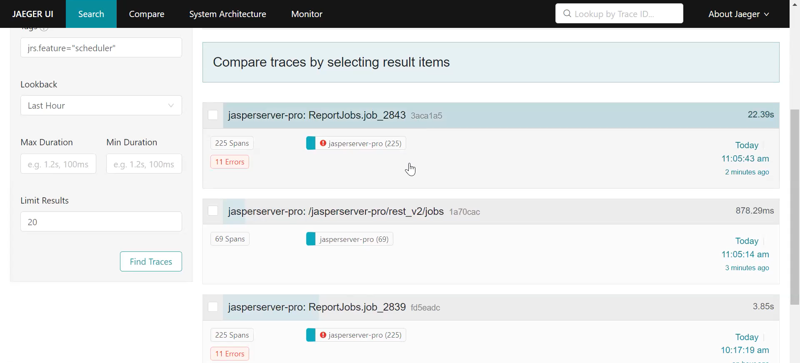
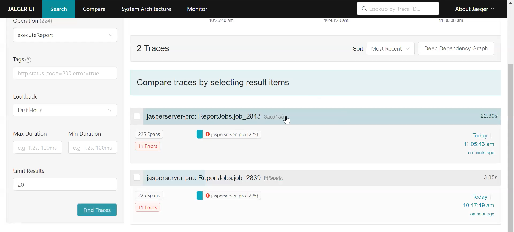

# Viewing and Analyzing Traces

The section describes the process of searching, sorting, and reading traces of logs in the Jaeger UI. Consider an example of the `rest_v2/jobs` API service, which gets triggered to create a scheduled report execution. The below section includes steps to search, sort, and read traces of Scheduler for the `rest_v2/jobs` API service.

## Viewing and Reading Traces

The following figure shows various attributes of spans in the Jaeger UI.

*Figure 1: Viewing Spans on Jaeger*

### Example of Viewing traces of Report Scheduling

To search and read traces of the scheduled report in Jaeger UI, do the following:

1.  Login to JasperReports Server and create a schedule (For more information, see JasperReports Server User Guide).

2.  Login to Jaeger UI using `http://<hostname>:16686`.

3.  Choose the `scheduleJobAPI` method name in operation. This method is responsible for scheduling a report.

4.  Click `Find Traces`.

*Figure 2: Viewing Traces of Report Scheduling*

5.  Choose from any result items to view traces of `rest_v2/jobs`.

For filtering and viewing only Scheduler methods you can search `jrs.feature="scheduler"` in the tags. This filters out the span names of only Scheduler methods and displays them in the Jaeger UI.

The following figure shows the traces of report job and scheduler. Choose any trace and then click Tags, to see which tag was added for filtering Scheduler traces.

*Figure 3: Filtering Traces of the Scheduler*

### Example of Viewing traces of Report Execution

To search and read traces of report execution in Jaeger UI, do the following:

1.  Login to JasperReports Server and create a schedule (For more information, see JasperReports Server User Guide).

2.  Login to Jaeger UI using `http://<hostname>:16686`.

3.  Choose the `executeReport` method name in operation. This method is responsible for executing a report.

4.  Click `Find Traces`.

*Figure 4: Viewing Traces of Report Execution*

## Suppressing Span

Suppression of unwanted spans is required to remove the unnecessary database calls, which gets added in traces. While viewing traces in Jaeger, we observed unnecessary database calls, which resulted in increasing the span number within the trace.

You need to suppress the spans to remove the unwanted hibernate spans that are not required to view only relevant spans. For suppressing span, instrument the span by setting `export OTEL_INSTRUMENTATION_HIBERNATE_ENABLED=false` in `tomcat/bin`.
