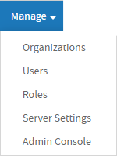
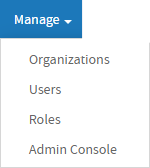
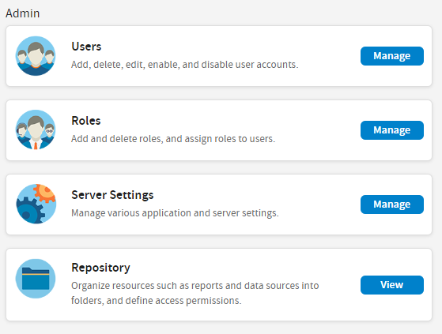
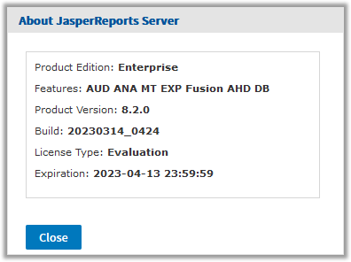

# Administrator Pages

Administrators have access to special pages to manage the server. After logging in, click **Admin Menu** on the Home page, or select an item from the **Manage** menu on any page.

<table>
<colgroup>
<col style="width: 50%" />
<col style="width: 50%" />
</colgroup>
<tbody>
<tr>
<td>
System admin:

</td>
<td>
Organization admin:

</td>
</tr>
<tr>
<td colspan="2">
<em>Figure 1 Manage Menu for Administrators</em>
</td>
</tr>
</tbody>
</table>

The administrator controls are different for system and organization admins, as shown in the previous figure. Organization administrators can manage users, roles, and suborganizations, but only within their organization. System admins can manage top-level organizations, as well as users and roles in any organization. And only system admins have access to the server settings for configuring logs, Jaspersoft OLAP, and Ad Hoc cache and data policies.

The following figure shows the **Admin** page for system admins. The page is similar for organization admins, but it does not have the Server Settings heading.

*Figure 2 Manage Server Page for System Admins (superuser)*

The pages for administering organizations, users, and roles are documented in [User and Role Management](../management/management_intro.md). The pages for administering Server Settings are documented in [Configuration Settings in the User Interface](../configuration/configuration_settings_in_the_ui.md).

The **About JasperReports Server** link in the footer of all pages displays the product version along with the software build and the details of your license. Please have this information available if you need to contact Jaspersoft for support.

*Figure 3 About JasperReports Server Dialog*
