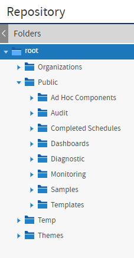
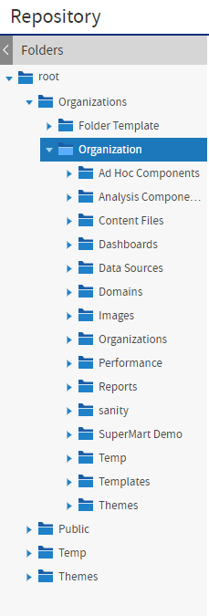
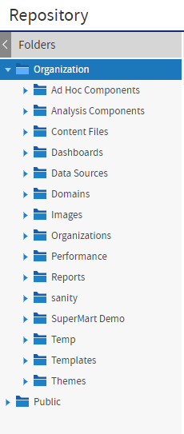
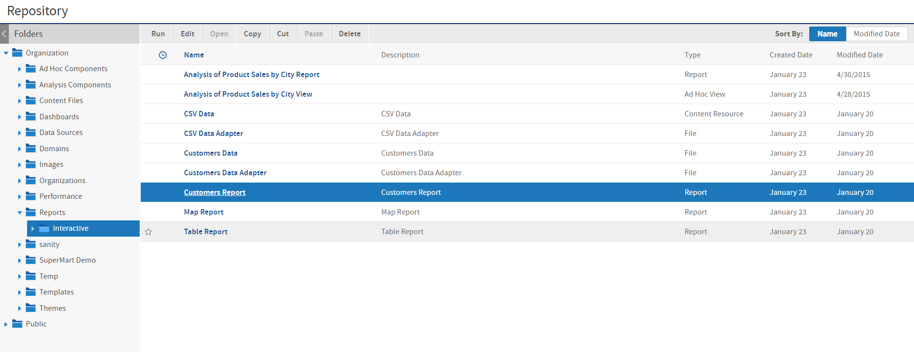
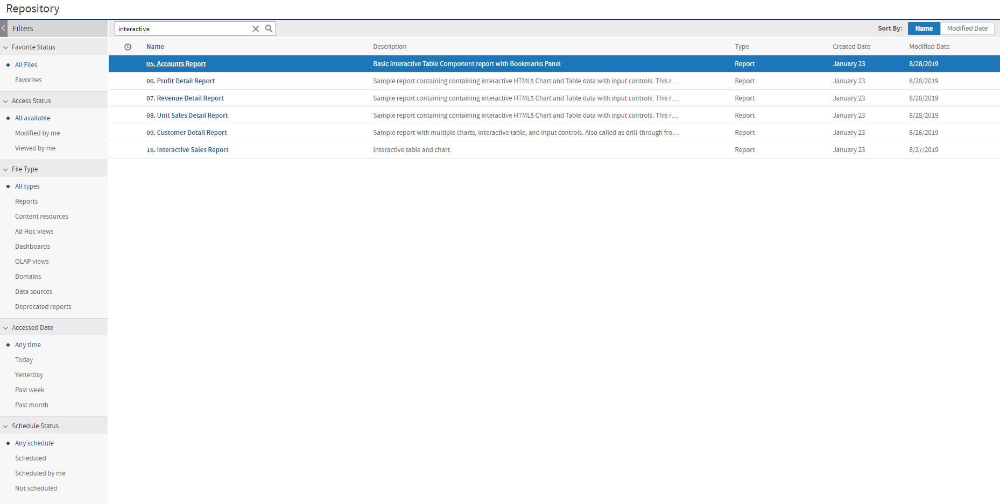

# Overview of the Repository

The repository is a hierarchical structure of folders where administrators and users create and store resources for running reports. In its appearance and function, the repository resembles a file system with a structure of folders containing files. However, the repository is actually implemented as a database that is private to the server instance. As a result, it lacks a few of the functions of a file system.

## Folder Structure

The repository is a tree structure composed of folders and resources. The root contains folders for the sample data installed with the server. The root of the repository tree structure is accessible only to the system admin logged in as `superuser`. The tree contains the folders for each organization's reporting resources, and folders for certain features of the server.

*Figure 1 Root of the Repository Showing Default Folders*

In general, we recommend that you avoid placing resources directly in the root or organization folder. Instead, use folders for various resource types, as in the sample data. The Themes folder contains files that control the look and feel of the user interface, as described in [Themes](../themes/themes_intro.md).

The Organizations folder contains a folder for the default organization, named Organization. If you create more than one organization, each organization has its own folder, contained in a folder named for the organization. Each organization also contains a folder called Organizations where suborganizations are created.

Organizations located in root/Organizations are called top-level organizations. Organizations located within other organizations are called suborganizations.

JasperReports Server automatically restricts every user's access to their own organization's branch of the repository. System admins (`superuser`) can view and create folders in all organizations, while organization admins (`jasperadmin`) can view and create folders only in the organizations they administer. The following figure shows the system admin's view starting at root, and the organization admin's view starting in his organization.

<table>
<colgroup>
<col style="width: 50%" />
<col style="width: 50%" />
</colgroup>
<tbody>
<tr>
<td>
System admin (<code>superuser</code>) view:

</td>
<td>
Organization admin (<code>jasperadmin</code>) view:

</td>
</tr>
</tbody><tfoot>
<tr>
<td colspan="2">
<em>Figure 2 System Admin and Organization Admin Views of the Repository</em>
</td>
</tr>
</tfoot>
&#10;</table>

The Public folder is a special system folder that appears at the root and in every organization folder. All instances are links to the same folder, so that its contents are shared with all organizations. The system admin should manage the Public folder and set permissions so that users can access shared resources (such as data sources, logos, and report templates) but not modify them.

## Resources

Resources are stored in the repository and used as input for creating reports and performing analysis. Some resources, such as images, fonts, or JRXML files created in Jaspersoft Studio, are uploaded from files. Others, such as data sources and Domains, are created in JasperReports Server itself. Of course, dashboards, data views, and reports can also be saved in the repository to be run as often as needed. Output such as PDF or HTML can be saved in the repository as well.

All resources, including folders, have unique IDs, names, and optional descriptions. The ID of a resource, along with the ID of its enclosing folders create the path used to reference that resource. The path of a resource is also called its repository URI (Universal Resource Indicator). The name and description appear in the user interface when you browse or search the repository.

Resources are stored in an internal format not accessible to users or administrators. Any resource can be exported with the `js‑export` utility, but the resulting files are for backup or transfer to another JasperReports Server instance and cannot be modified.

JasperReports Server restricts access to folders and resources based on organizations, permissions, user names, and roles. For more information, see [Repository Administration](../repository/repository_intro.md).

The sample data includes dashboards, reports, Domains, data sources, and many of their components, such as input types and image files. Each type of content is stored in a separate folder, making it easy to locate. The Supermart Demo folder contains a complete example of dashboards, reports, and resources for various business scenarios in a fictional grocery store company.

## Browsing and Searching

Users and administrators can browse or search the repository, depending on what action they want to perform and how resources are organized. Searching the repository finds specific resources faster. For more information on browsing and searching the repository, see the JasperReports Server User Guide.

-   Browsing - On the Home page, click **View &gt; Repository**.

    The Folders panel on the left lists the folders in the repository and the Repository panel lists the contents of the selected folder. The tool bar in the Repository panel allows administrators to perform actions such as **Copy**, **Cut**, **Paste**, and **Delete**; select several resources with Control-click or Shift-click to perform actions in bulk.

*Figure 3 Browsing the Repository*

-   Searching - Enter a search term in the search field at the top of any page, or select **View &gt; Search Results**. 

*Figure 4 Search Field in the Menu Bar*

The search results page displays a search field with the current search term at the top of the Repository panel. The search applies to resource IDs, names, and descriptions. Use the filters in the left-hand panel to refine your search.

*Figure 5 Searching the Repository*
