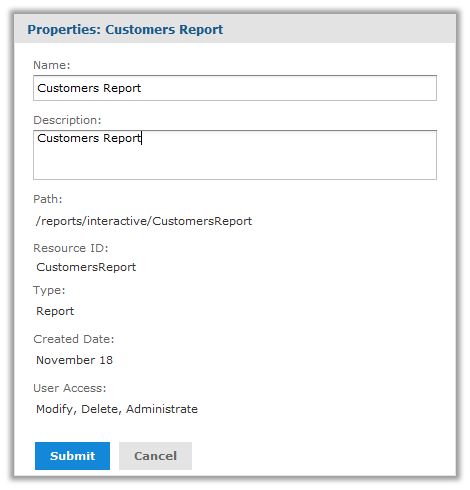
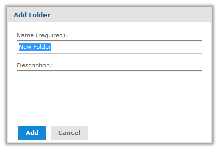
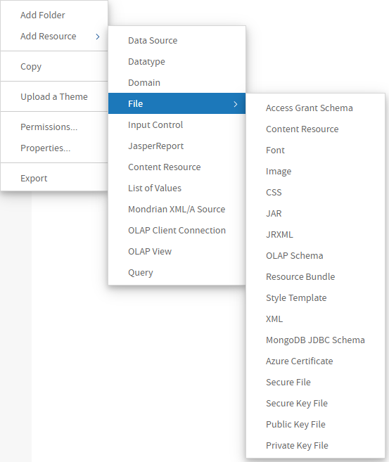
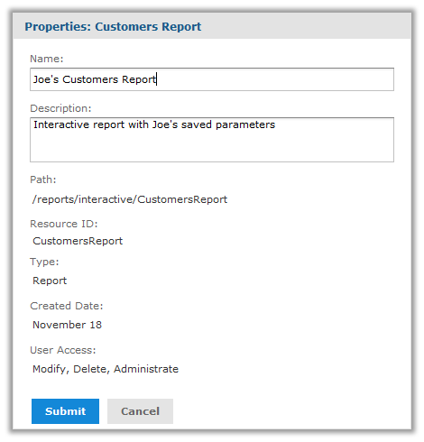

# Managing Folders and Resources

Administrators and users with the proper permissions can create, modify, move, and delete folders and resources in the repository. The specific roles and permissions of the user determine the actions available. For the definition of the permissions on folders and resources, see [Repository Permissions](permissions.md).

One responsibility of an administrator is to set up an environment for users to create and save dashboards, Ad Hoc views, and reports. That usually means to create a folder structure where users have write permission. Users with write permission can also create their own sub-folders to store their reports and dashboards.

Only administrators can create data sources in the repository. So, although users with write permission can upload JRXML files and define resources, they cannot run their reports without data sources. For this reason, we recommend that administrators create data sources and other shared resources in the repository. For example, uploading one shared logo file and keeping it up to date is better than many users uploading and maintaining their own separate logo files.

## Resource IDs

Each resource, including each folder, has an ID, a name, and an optional description:

-   The ID is used internally to reference a resource. The ID must be unique within its folder, but may exist in multiple folders.
-   The resource name is displayed in the repository.
-   The description, if defined, appears in the repository and in the tooltips.

As in a file system, the IDs of nested folders define the path to a resource. For example, the path to a report might be: /reports/samples/Freight.

To view the name and resource ID of a resource, right click the folder's name or the resource in the repository or search results and select **Properties...** from the context menu.

*Figure 1 Resource Properties Dialog for a Writable Resource*

If you have write or administer permission as shown in the figure, you can also edit the name and description of the resource. For some operations such as export, you need the path, also called repository URI, which you can copy from this dialog.

!!! note

    The path that is displayed is always relative to the logged in user's organization. For example, the following paths are the same resource for different users: 
    `superuser` - /organizations/organization_1/images/JRLogo 
    `jasperadmin|organization_1` - /images/JRLogo 

## Creating Folders

Any user with write permission on a folder can create new sub-folders.

To create a folder

1.  Log in as a user who has write permission to the parent folder.

2.  Select **View &gt; Repository** and locate the parent folder in the Folders panel.

3.  Right-click the parent folder and select **Add Folder** from the context menu. The Add Folder dialog appears.

    

    *Figure 2 Add Folder Dialog*

4.  Enter the folder name and, optionally, a description, then click **Add**. 
    The folder is created in the repository. The name appears in the hierarchy of folders. The description is visible only when viewing the properties of the folder, as shown in Resource Properties Dialog for a Writable Resource. 
    New folders and their future contents inherit the permissions of their parent folders. Users with Administrator permissions can change permissions folders, as described in [Setting Permissions](permissions.md).

## Adding Resources

Each resource has different requirements. For example some are created from uploaded files, whereas others are created by defining values in a wizard. The procedures for adding each type are available in the documentation below:

-   Interactive resources such as Ad Hoc views and dashboards are described in the JasperReports Server User Guide.
-   JasperReports are covered in the JasperReports Server User Guide.
-   Domains are covered in the JasperReports Server Data Management Using Domains.
-   Mondrian and OLAP resources are covered in the Jaspersoft OLAP User Guide.
-   Data sources are explained in the chapter [Data Sources](../datasources/datasources_intro.md).
-   Queries, data types, lists of values, input controls, and file resources are explained in the chapter [Other Resources in the Repository](../resources/resources_intro.md)

Most resources are created through the Add Resource menu item on the context menu for folders in the repository. In the following figure, you can see the full menu and submenu with all the resources administrators can create:

*Figure 3 Add Resource Context Menu Expanded*

For every resource you create, you must specify a name and resource ID for referencing the resource in the repository. Each wizard also has one or more pages for specifying the values and controls specific to the resource.

!!! note

    New resources inherit the permissions of the folder in which they are created. Administrators can change the permissions on the new resource, as described in the section [Setting Permissions](permissions.md).

## Renaming Folders and Resources

Any user with write permission on a folder or resource can change its name and description.

!!! note

    You cannot change the name of an organization's top-level folder in the way described here. The name of the top-level folder defaults to the name of the organization. So to change the name of the folder, you have to change the name of the organization, as described in the section [Editing an Organization](../management/managing_organizations.md).

To rename a folder or resource

1.  Log in as a user who has write permission for the folder or resource.

2.  In the repository, browse or search for the resource. For renaming folders, select **View &gt; Repository** and locate the folder.

3.  Right-click the object and select **Properties...** from the context menu. The Properties dialog appears. 

    

    *Figure 4 Properties Dialog for a Report Resource*

    You can change the folder or resource's name and description, but not the ID. The ID is permanent once the resource is created.

4.  Click **Submit** to save your changes.

## Copying and Moving

The repository interface lets any user with the proper permission copy or move both resources and folders. Copying requires read permission on the source, moving requires delete permission on the source, and both require write permission on the destination folder.

You can drag-and-drop the objects, or you can copy-paste or cut-and-paste them from their context menus. Folders must be moved one at a time, but multiple resources from the same folder can be copied or moved together.

Copying and moving actions are not possible on the search interface, only on the repository interface showing the list of folders. Currently, it is not possible to create a copy of a resource in the same folder.

!!! warning

    The moved objects inherit their permissions from the destination folder. They do not keep the permissions they had before the move. If you want the objects to have other permissions, you can set new permissions after the move (see [Repository Permissions](permissions.md)).

To copy or moving folders and resources

1.  Log in as a user who has the required permissions for the folder or resource.

2.  Click **View &gt; Repository**, and expand the folders to display the object to be copied or moved.

3.  Right-click the resource and select **Copy** or **Cut** (delete permission is required to cut a resource).

    You can select multiple resources with Control-click or Shift-click, but only a single folder.

4.  Right-click the destination folder and select **Paste** in the context menu (write permission is required on the destination folder). 
    Alternatively, you can drag to move the selected resource or folder to the destination folder. To copy, press and hold the Ctrl key then click and drag. When dragging resources, the destination folder is highlighted in blue if you have write permission to it.

## Editing Resources

The procedure for editing a resource depends on the resource type. All of the dialogs are available by right-clicking on the resource in the repository and selecting the proper action from the context menu. In nearly all cases, the dialog for editing is the same one that was used to create the resource.

**Editing Resources**

<table>
<colgroup>
<col style="width: 50%" />
<col style="width: 50%" />
</colgroup>
<thead>
<tr>
<th>
Resource Type
</th>
<th>
How to Edit
</th>
</tr>
</thead>
<tbody>
<tr>
<td>
Ad Hoc view
</td>
<td>
Right-click the Ad Hoc view in the repository and select <strong>Open</strong>, then modify the view interactively. After changing the content, you can overwrite the existing view or save it as a new view. For more information, see the JasperReports Server User Guide.

Reports created from Ad Hoc views are saved in the same format as JasperReports, but the resources referenced in the report unit are generated by the Ad Hoc Editor and should not be modified. There is one exception: administrators may create a JSP file and set it as a custom report view.
</td>
</tr>
<tr>
<td>
Ad Hoc Topic
</td>
<td>
Topics are JasperReports that are located in the Ad Hoc Components/Topics folder. Right-click the report and select <strong>Edit</strong>, then modify it like a JasperReport. For example, if the Topic contains a query as a local resource, you can edit it. For more information, see the JasperReports Server User Guide.
</td>
</tr>
<tr>
<td>
Dashboard
</td>
<td>
Right-click the dashboard in the repository and select <strong>Open in Designer</strong>, then modify the dashboard interactively. After changing the content, you can overwrite the existing dashboard or save it as a new dashboard. For more information, see the JasperReports Server User Guide
</td>
</tr>
<tr>
<td>
Domain
</td>
<td>
Administrators only: right-click the Domain in the repository and select <strong>Edit</strong>, then use the Domain Designer to make changes. For more information, see the JasperReports Server Data Management Using Domains
</td>
</tr>
<tr>
<td>
Domain Topic
</td>
<td>
Administrators only: right-click the Domain Topic in the repository and select <strong>Edit</strong>, then use the Data Chooser dialog to make changes. For more information, see the JasperReports Server User Guide
</td>
</tr>
<tr>
<td>
JasperReport
</td>
<td>
To change the layout of an interactive report, users may <strong>Run</strong> the report, then change the column filters or sorting. Users may save the report, either by overwriting the original or as a new copy, depending on their permissions.

To change the definition of a report, right-click the report resource and select <strong>Edit</strong>. Then you can change the data source, input controls, or file resources referenced in the JasperReport. For more information, see <a href="jasperreport_structure.md">JasperReport Structure</a>.
</td>
</tr>
<tr>
<td>
Report Option
</td>
<td>
Expand the saved options under a report, then right-click one of the report options and select <strong>Edit</strong>. You can change the parameter values stored as input controls to the report.
</td>
</tr>
<tr>
<td>
Content Resource
</td>
<td>
A content resource is report output that is stored as a file stored in the repository. These files cannot be edited, only downloaded or deleted.
</td>
</tr>
<tr>
<td>
Data Source
</td>
<td>
Administrators only: right-click the data source, then select <strong>Edit</strong> from the context menu. For more information, see <a href="../datasources/datasources_intro.md">Data Sources</a>.
</td>
</tr>
<tr>
<td>
Query
</td>
<td rowspan="5">
Right-click the resource, then select <strong>Edit</strong> from the context menu on these resources. You edit these resources in the same dialog that you used to create them. For more information, see <a href="../resources/resources_intro.md">Other Resources in the Repository</a>.
</td>
</tr>
<tr>
<td>
Input Control
</td>
</tr>
<tr>
<td>
Datatype
</td>
</tr>
<tr>
<td>
List of Values
</td>
</tr>
<tr>
<td>
File
</td>
</tr>
</tbody>
</table>

When editing a resource, you have several limitations:

-   You cannot change a resource's ID. If you need to change an ID, you have to create a new resource and delete the old one.
-   You cannot change the location of a resource. To change the location of the resource, see [Copying and Moving](#copying-and-moving).
-   For file resources, you cannot see the name of the file that was uploaded, nor in most cases download and view the contents of the file. Your only option is to upload a new file to replace the old one.

## Deleting Folders and Resources

Users with delete permission on folders or resources can delete those objects from the repository. To delete a folder, you also need to delete permissions on all the resources and folders in that folder. Folders must be deleted one at a time, but multiple resources can be deleted together.

!!! warning

    You cannot undo a delete.

The repository will not allow you to delete resources currently referenced by other resources. For example, an input type used by a report or a properties file used by a Domain cannot be deleted as long as the report or Domain still references them.

To find the resources that reference the one you want to delete, you need to look at each report, view, Ad Hoc Topic, or Domain that you suspect of referencing it. When you edit the definition of a JasperReport or a Domain, you can see the resources it references. Then you can either remove the reference from the resource or delete the entire resource containing the reference.

To delete a folder or resource

1.  Log in as a user who has delete permission for the folder or resource.
2.  In the repository, browse or search for the object to be deleted.
3.  Right-click the object and click **Delete** in the context menu. 
    In the repository view, you can select multiple resources and click **Delete** in the tool bar or in the context menu. In the list of folders, you can delete only one folder at a time, but all contents of that folder will be deleted. In the search results, you can select multiple resources and right-click to select **Delete** in the context menu.
