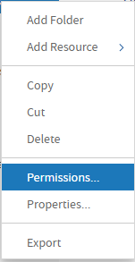
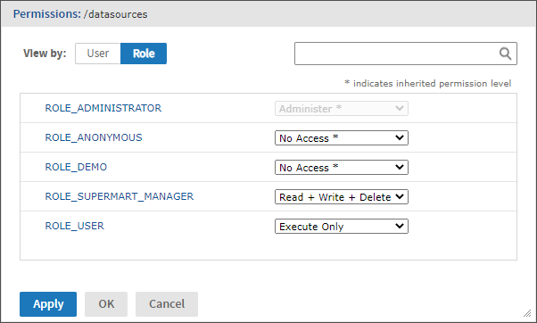
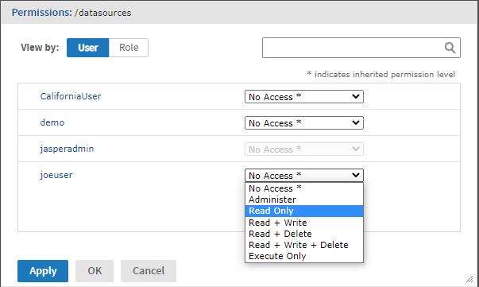

# Repository Permissions

Permissions on folders and resources determine what users see in the repository and what actions they're allowed to perform. In the following table, the actions granted by each permission include all of the actions granted by permissions above it, except for the No Access permission. The actions granted by each permission strictly exclude all of the actions granted by permissions below it.

<table>
<colgroup>
<col style="width: 50%" />
<col style="width: 50%" />
</colgroup>
<thead>
<tr>
<th>
Permission
</th>
<th>
Actions Granted on Repository Folders and Resources
</th>
</tr>
</thead>
<tbody>
<tr>
<td>
No Access
</td>
<td>
Users can never see or access the folder or resource, either directly in the repository or indirectly when running a report, Ad Hoc view or dashboard. If one of these reference a resource that is set to no-access, the user will see an error when trying to run it.
</td>
</tr>
<tr>
<td>
Execute Only
</td>
<td>
Users can never see the folder or resource in the repository, but they can run reports, dashboards or Ad Hoc views that access them. Typically, data sources are execute-only so that users may run reports but not see database connection details.
</td>
</tr>
<tr>
<td>
Read Only
</td>
<td><ul>
<li>See the folder or resource in any server</li>
<li>See the properties of a folder or a resource</li>
<li>Copy a folder and all of its readable contents</li>
<li>Copy resources individually or in bulk</li>
<li>View (run) a report, dashboard, Ad Hoc view</li>
<li>Run a report in the background</li>
<li>Schedule a report to run later</li>
</ul></td>
</tr>
<tr>
<td>
Read + Delete
</td>
<td><ul>
<li>Cut (move) a folder and all of its contents</li>
<li>Delete a folder and all of its contents</li>
<li>Cut (move) resources individually or in bulk</li>
<li>Delete resources individually or in bulk</li>
</ul></td>
</tr>
<tr>
<td>
Read + Write
</td>
<td><ul>
<li>Save report options for a JasperReport</li>
<li>Delete report options</li>
<li>Copy resources to a folder with this permission</li>
<li>Edit and modify resources</li>
</ul></td>
</tr>
<tr>
<td>
Read + Write + Delete
</td>
<td><ul>
<li>Add a subfolder</li>
<li>Add (create) a resource in a folder (except Domains and data sources)</li>
<li>Paste into a folder (copy or cut)</li>
<li>Save a new Ad Hoc view, report, or dashboard in a folder</li>
<li>Save the output of a scheduled report in a folder</li>
<li>Rename a folder or resource and change its description string</li>
<li>Open an Ad Hoc view in the Ad Hoc Editor or a dashboard in the designer</li>
<li>Modify and overwrite an existing Ad Hoc view, report or dashboard</li>
<li>Add a JasperReport resource to the repository (upload a JRXML)</li>
<li>Edit the definition of a JasperReport resource in the repository (replace the JRXML)</li>
</ul></td>
</tr>
<tr>
<td>
Administer
</td>
<td><ul>
<li>Set the permissions (by role and by user) on a folder or resource. This effectively delegates certain repository administration tasks.</li>
</ul></td>
</tr>
<tr>
<td>
Administer and ROLE_ADMINISTRATOR
</td>
<td><ul>
<li>Add (create) a Domain or a data source</li>
</ul></td>
</tr>
</tbody>
</table>

Permissions apply when browsing or searching the repository and when using any dialog that accesses the repository, like browsing folders to save a report. Note that:

-   Copying does not preserve the permissions on an object. Users may copy a read-only object, paste it into a read-write folder, then edit the object. For more details, see [Copying and Moving](managing_folders_and_resources.md).
-   Copying and cutting (moving) actions can be completed only by a user with Read + Write + Delete access to the folder in which the object is pasted. For more details, see [Copying and Moving](managing_folders_and_resources.md).
-   Cutting, deleting, and setting permissions on folders is allowed only if the user has the same permission on all folder contents.
-   Cutting and deleting resources in bulk is allowed only if the user has at least Read + Delete permission on all selected resources.
-   Deleting a resource is allowed only if no other resources rely on it. For more details, see [Deleting Folders and Resources](managing_folders_and_resources.md)

## Inheriting Permissions

According to the permission architecture, there may be a permission setting for every user and role on every folder and resource in the repository. To simplify the definition of permissions, JasperReports Server supports the inheritance of permissions from the parent folder to a folder or resource. If no permission is explicitly defined for a user or role on a given folder or resource, the user or role has the same access permission that is defined on the parent folder. When a permission is defined explicitly, that permission is enforced, regardless of those on the parent folder.

Using permissions, you can manage large hierarchies of content and keep them secure. When you set a permission explicitly, that permission for a given user or role is inherited recursively by all of the folder's contents and subfolders, unless they have an explicit definition of their own. Permissions assigned on an organization's top folder are inherited across the entire organization. Permissions set on the root folder or Organizations folder by the system admin are inherited across multiple organizations.

For example, the system admin can make all organizations read-only by default to ordinary users, and each organization admin can make specific folders writable so that users can store their reports and output.

## Cumulative Permissions

Because permissions can be assigned to both users and roles, a user belonging to one or more roles may have multiple permissions defined or inherited on any given folder or resource. In fact, every permission must be defined on the root, even if it has the default value of No Access, and therefore every role- and user-based permission on every folder and resource has a setting through inheritance. So, for every folder or resource, every user has their own user-based permission and the permission assigned to the ROLE_USER.

How does JasperReports Server determine the effective permission from the many that apply? Permissions in the server are strictly cumulative, meaning that the least restrictive among the set of all permission applies. Even if a more restrictive permission, such as No Access, is set explicitly, the less restrictive permission such as Read-Only applies, regardless of whether it is inherited or set explicitly. This is why all default permissions at the root are set to No Access initially.

## Administrator Permissions

The JasperReports Server authorization architecture distinguishes between administrators and all other users. Administrators are defined as users with either ROLE_SUPERUSER (professional edition only), ROLE_ADMINISTRATOR, or both. By design, system administrators with the ROLE_SUPERUSER always have irrevocable Administer access to the entire repository, including the contents of every organization. The system administrator cannot modify the permissions for ROLE_SUPERUSER, to prevent being locked out or unable to administer some resource. Therefore, the system administrator can set permissions for all other users, on any folder or resource, and in any organization if necessary. In particular, the system administrator can modify permissions for ROLE_ADMINISTRATOR, for example to share some resources across all organizations by making them read-only to everyone, including the organization admins.

Organization admins are organization users with the ROLE_ADMINISTRATOR, like the default `jasperadmin` user created in every organization. By default, organization admins have the Administer permissions to everything in their organization, except what the system admin has changed to a lesser permission. However, organization admins cannot change the permissions granted to ROLE_ADMINISTRATOR, to prevent them from overriding the settings of the system admin and from locking themselves out of a folder or resource.

## Execute-Only Permission

As in file systems, execute-only permission in JasperReports Server allows running reports, dashboards and Ad Hoc views to access a resource, but keeps the resource from appearing in the repository.

Execute-only permission applies to folders as well, keeping them from appearing in the folder tree when users browse the repository, yet still allowing the resources they contain to inherit the execute-only permission. This is useful for hiding folders and resources such as data sources that only administrators and data analyst roles need to access in the repository. However, if your execute-only folder contains read-only resources, those resource are hidden when browsing folders but can be found with a repository search.

As with all other permissions, execute-only permission is either role-based or user-based, so only certain users can access a resource from a running report.

!!! warning

    If you have data or sensitive content in a resource, always set No Access permission for users or roles that must not be able to access it.Hiding a resource with execute-only permission does not protect against access, because malicious users who find the resource ID may be able to create a report or dashboard that extracts the sensitive content.

## Default User Permissions

For all non-administrator users, the default permission at the root is No Access and any permissions must be explicitly defined. In practice, the default installation of the repository contains sample data with a mix of no access, execute only, read only, and read-write permissions that allow the sample users to access folders and resources. The sample permissions demonstrate a common approach to permissions, allowing users to see the resources they can access and hiding the ones they can't, while administrators have full access.

We recommend you familiarize yourself with permissions by viewing and setting permissions in the sample data, as described in the following section.

## Setting Permissions

Administrators can assign permissions to access any folder or resource throughout the repository. Users with the Administer permission on a folder can assign permissions to that folder and any contents that inherit the permission. Users granted Administer permission to a resource can set the permissions only on that specific resource.

To set permissions on a folder or resource in the repository

1.  Log in as a user with administrator privileges.

2.  Browse or search the repository for the folder or resource.

3.  Right-click the object and select **Permissions...** from the context menu:

    

    The Permissions dialog opens showing the permissions in effect for the selected object. By default, it first shows the permissions given to roles. Permissions that are inherited from the object's parent are indicated by asterisks (`*`).

    

    *Figure 1 Permissions Dialog Showing Permissions by Role*

    In systems with multiple organizations, the users and roles displayed include only those within the scope of the user. For example, in the default single organization, the organization admin (`jasperadmin`) can't see the permission for the system admin (`superuser`) or for ROLE_SUPERUSER.

    In the previous figure, you can see the default role-based permissions on the sample Data Source folder as seen by the organization admin (`jasperadmin`). Members of certain roles can see and modify the resources stored in this folder; these roles likely correspond to users such as data analysts. Regular users have execute only permission so they do not see this folder, but the reports they run can access its contents. Administrators are prevented from changing the permission for their administrator role or user name, to prevent them from removing their ability to set permissions.

4.  In the dialog, click **User** to view the permissions assigned to specific users. Click **Role** when viewing user permissions to toggle back.

5.  For each user or role, you can select a new permission from the drop-down. 
    In the next figure, you can see the default user permissions on this folder. In the default installation, all permissions are defined by role; so, all user permissions are No Access inherited from the root. The figure shows a read-only permission being granted to the sample end user. This enables `joeuser` to see but not modify the Data Sources folder and its contents. For all other end users, the folder is still execute-only due to the settings in Permissions Dialog Showing Permissions by Role.

    

    *Figure 2 Permissions Dialog Showing Permissions by User*

6.  Click **Apply** to apply your changes. If you toggle between user and role permissions, first apply any changes you made.

7.  Click OK to save your changes and close the permissions dialog when you're finished. 
    You can open several permissions dialogs for different resources or folders at the same time while navigating the repository. This helps when trying to set permissions uniformly across several folders or organizations.

!!! note

    There are two special cases when setting permissions:

    -   If a resource inherits a permission, for example Read-Only, you cannot set the permission to the same value, at least not directly. You need to temporarily change the permission level on the parent folder, then set the explicit permission, then set the parent folder's permission back to the original value. 
        When a resource and its parent folder have been set to the same permission in this way, the permission dialog still shows the asterisk as if the permission were inherited. But if the parent is later given a different permission, for example Read-Write, the resource retains its explicit Read-Only permission instead of inheriting Read-Write.
    -   To reset the permission level so that it once more inherits from its parent folder, select a different permissions level and click **Apply**, then select the permission with the asterisk and click **Apply** again.

## Testing User Permissions

Once you have configured users, roles and permissions, we recommend that you test the permissions granted to a few representative users. We also recommend testing whenever you add new users, roles, and resources or make any major modifications to your access control configuration.

To test user permissions

1.  Log in as an administrator.
2.  Select **Manage &gt; Users**.
3.  Select the user's organization, then browse or search for the user whose permissions you are testing.
4.  In the Users panel, select the user.
5.  In the Properties panel, click **Login as User**. The selected user's Home page appears. The login information in the upper-right corner shows that you are logged in as that user.
6.  Verify that the expected folders and resources are available in the repository. Make a note of any objects that should be there but are not, and any that should be hidden but are displayed.
7.  When you have verified the user's permissions, click **Log Out** to exit that user's account.
8.  To change the user's permissions, edit the permissions in the repository and modify the user or role definitions.
9.  Continue testing until the user's permissions are satisfactory.
10. Repeat these steps with several representative users to ensure that your access control is properly configured. 
    An untested access control configuration can't secure your data adequately.
