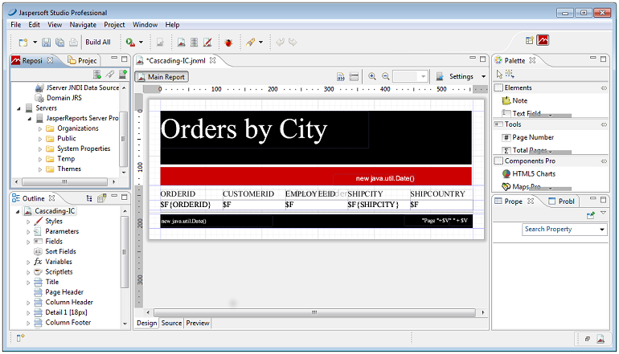
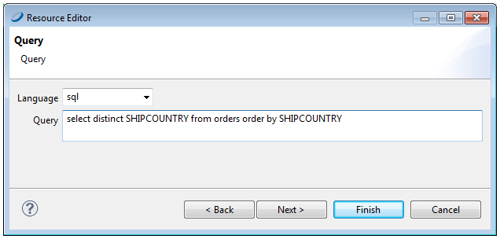
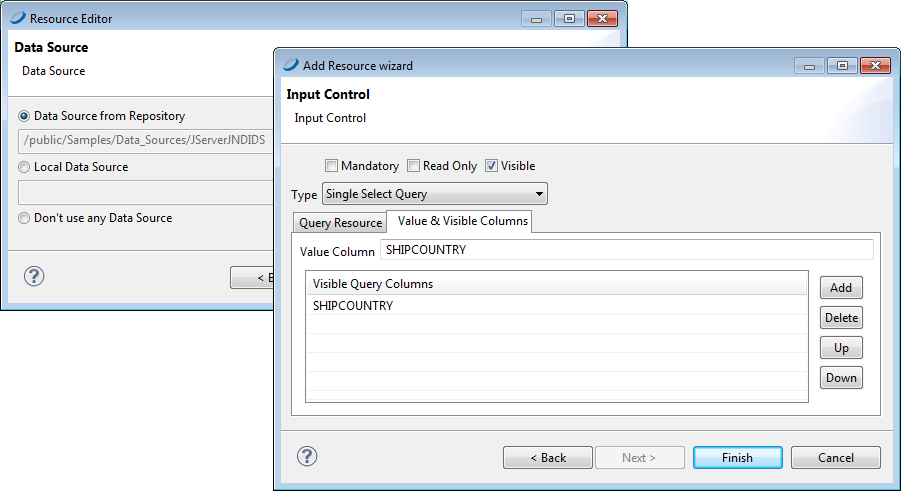
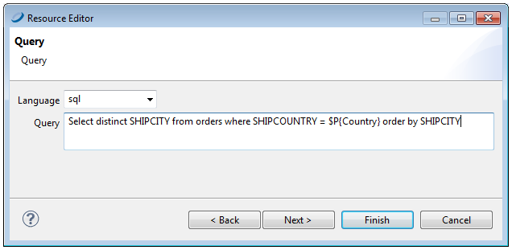
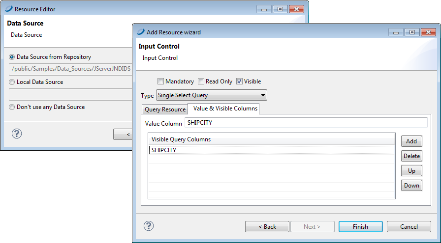
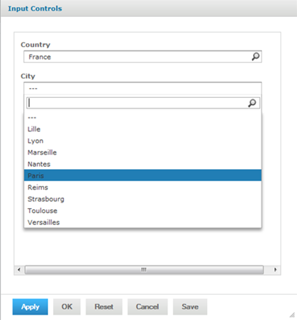

# Cascading Input Controls

A cascading input control is one whose values depend on the selection made in a previous input control. You create a cascading input control using parameters in the query string of a related input control. In other words, the parameter you defined for an input control can be used in another query-based input control.

In a query-based example of cities and states such as:

Los Angeles \| CA 
San Francisco \| CA 
Denver \| CO

The query may still generate a list of hundreds of cities to scroll through. Even though each city is easy to identify with the state, scrolling through a long list is time consuming. With cascading input controls, this example can have two input controls, one for the state and one for the city: The city input control is empty until the user selects a state.

- When input controls are displayed, the query for the state input control returns an alphabetical list of unique state names.

- When the user selects a state, the query for the city input control is triggered and returns the list of cities in that state. When the user selects one and submits it, the city name is passed as a parameter to the report.

For an especially large number of cities, you can use more cascading input controls, such as region of state, to reduce the list.

The parameter values determined by each cascading input control may or may not be used in the report. For example, if the report only shows data about a city, the country input control exists only to speed up the choice of city. However, if the report also shows information such as city average compared to country average for a given measure, the country parameter is also used in the report.

## Parameters in Input Control Queries

Parameter substitution in query input controls follows the same approach as for JasperReports queries. Queries of all types of data sources can use parameter substitution, and \$P, \$P! and \$X (for SQL queries) parameters are supported. The \$X notation has two principal forms explained in the following list:

- `$P{parameter_name}` 
  The value of the parameter is substituted into the query. In cases where the parameter contains a string, the substitution inserts the proper escape characters to create valid SQL. Use this for single-select input controls and simple comparison operators such as greater-than or less-than. For example: 
  `select name from EMPLOYEES where deals_closed > $P{DEALS}` 
  Do not use \$P{parameter_name} with equality because the parameter value can be null, and `field = NULL` is not valid SQL. Instead use `$X{EQUALS, ...}` as explained below.

- `$P!{parameter_name}` 
  The value of the parameter is treated as raw text. The server replaces the parameter with the value of the input control without performing extra checking or value escaping. This is used in complex cases where the input control provides a piece of the query or sometimes the entire query.

- `$X{EQUALS, column, parameter_name}` or `$X{NOTEQUAL, column, parameter_name}` 
  This syntax performs equality verification and handles the case when the parameter value is null. Use this everywhere instead of the old `column = $P{parameter_name}` syntax. The \$X{EQUALS...} syntax performs the following substitution before submitting the query:

  `column = parameter_value -- when parameter_value is non-null`

  `column IS NULL -- when parameter_value is NULL`

- `$X{IN, column, parameter_name}` or `$X{NOT IN, column, parameter_name}` 
  Use this parameter for cascading with multiple-select input controls. The `$X{IN...}` operator is true when the field value matches any one of the multiple values of the input control. In the country/cities example, we can allow the user to pick any number of countries, and show all the cities in the selected countries. The query-based input control would have the following query: 
  `select city from ACCOUNTS where $X{IN, country, COUNTRIES}` 
  If the user selects the values Canada, Mexico, and USA in the COUNTRIES multi-select input control, the `$X` syntax translates into the following query for the CITIES input control: 
  `select city from ACCOUNTS where country IN ('USA','Canada','Mexico')`

!!! note

    When defining these parameters in a report, don't use a `defaultValueExpression` element. Due to a limitation in JasperReports Server, these parameters are null when a `defaultValueExpression` is provided.

The `$X` syntax also supports the following operators. They are all designed to handle null input by generating 0 = 0 when the parameter value is null:

| Parameter Syntax | Meaning |
|----|----|
| `$X{GREATER, column, parameter}` | column \> parameter |
| `$X{[GREATER, column, parameter}` | column \>= parameter |
| `$X{LESS, column, parameter}` | column \< parameter |
| `$X{LESS], column, parameter}` | column \<= parameter |
| `$X{BETWEEN, column, start_param, end_param}` | start_param \< column \< end_param |
| `$X{BETWEEN], column, start_param, end_param}` | start_param \< column \<= end_param |
| `$X{[BETWEEN, column, start_param, end_param}` | start_param \<= column \< end_param |
| `$X{[BETWEEN], column, start_param, end_param}` | start_param \<= column \<= end_param |

For more information on using \$P, \$P! and \$X to build dynamic queries, see the JasperReports Library Ultimate Guide and the Jaspersoft Studio User Guide.

Any number of parameters can be used in a query, just as any number of input controls can be defined in a JasperReport. In addition to the standard input control parameters, a cascading input control query can use the built-in parameters described in [Built-in Parameters for Query-based Input Controls](query-based_input_controls.md).

## Creating a Cascading Input Control

In this example, we'll create a cascading input control to allow users to report on orders for a specific city by selecting a country and then a city within that country. Our example uses Jaspersoft Studio to edit a JasperReport on the server. The report uses sample data from the SugarCRM database shipped with JasperReports Server.

*Figure 1: Simple Report Filtered by City*

!!! note

    You can connect Jaspersoft Studio to JasperReports Server. Once connected, the reports on the server will appear in the repository tree in Jaspersoft Studio. For more information see the *Jaspersoft Studio User Guide*.

We'll start with a report containing the following dataset fields: `ORDERED`, `CUSTOMERID`, `EMPLOYEEID`, `SHIPCITY`, and `SHIPCOUNTRY`.

Our sample report is based on the following query that requires the user to enter a city: 
`select * from orders where SHIPCITY=$P{City}`

Creating the Country input control

1.  On the repository tab, right click your report's folder and select **New** from the context menu. The **Add JasperReports Server Resource** wizard appears.
2.  Select **Input Control** and click **Next**.
3.  Enter Country for the **Name** of the input control and click **Next**.
4.  Select the query type **Single Select Query**.
5.  Click the ellipsis button next to the **Local Resource** field. The **Query** window opens.
6.  Enter the SQL query: 
    **select distinct SHIPCOUNTRY from orders order by SHIPCOUNTRY**

*Figure 2: Query for the Country Input Control*

7.  Click **Next**. The Data Source window opens.
8.  Click the **Data Source from Repository** option, select your data source, then click **Finish**.
9.  On the **Value and Visible Columns** tab, enter `SHIPCOUNTRY` in the **Value Column** field and click **Add**. This is the column whose value is returned as the value of the Country input control.
10. Under **Visible Query Columns**, enter `SHIPCOUNTRY`. This is the column whose values populate the list of cities the user can choose from. In our case it is the same as the value column.
11. Click **Finish**.

*Figure 3: Country Control Value and Visible Columns*

Creating the City input control

1.  Create a new City input control the same way you created the Country input control, using **Single Select Query** type.

2.  Define an SQL query that uses the value of Country to derive valid values for City.

    `Select distinct SHIPCITY from orders where SHIPCOUNTRY = $P{Country} order by SHIPCITY`

*Figure 4: Query Using Country to Select Cities*

3.  Click **Next**. The Data Source window opens.
4.  Click the **Data Source from the Repository** option, select your data source, then click **Finish**.
5.  On the **Value and Visible Columns** tab, enter `SHIPCITY` in the **Value Column** field and click **Add**. This is the column whose value is returned as the value of the City input control.
6.  Under **Visible Query Columns**, enter `SHIPCITY`. This is the column value used to create the list of cities the user can choose from.
7.  Click **Finish**.

*Figure 5: City Control Value and Visible Columns*

8.  Publish your report to JasperReports Server. 
    Now when you run your report in JasperReports Server, You'll see an input control for country and another for city. After you select the country, the values available for city are those within that country. Notice that the Country value is not passed to the report. It is used only to help the user select a city.

    

    *Figure 6: A Report with a Cascading Input Control*
