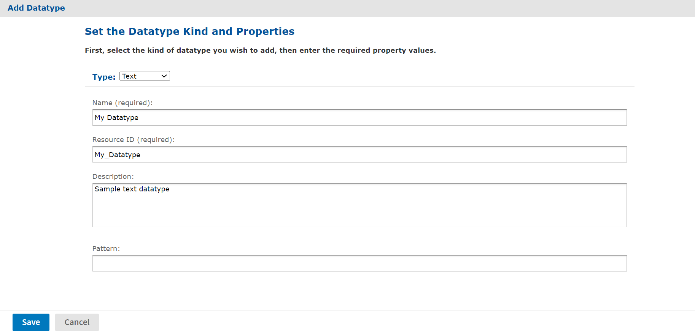

# Datatypes

A datatype defines the format of a single-value input control, for example text or numerical. Datatypes determine what users can enter in the input fields that correspond to parameters in a report:

-   Text

-   Number

-   Date

-   Date/time

To create a datatype:

1.  Log on as an administrator.

2.  Click **View &gt; Repository** and locate the folder for the datatype.

3.  Right-click the folder's name and select **Add Resource &gt; Datatype** from the context menu. The **Add Datatype** page appears.

    

    *Figure 1 Add Datatype Page*

4.  Enter a name and optional description for the datatype. The resource ID is filled in automatically.

5.  Select the datatype and provide related information. Your options are:

    -   **Text**: You can specify a regular expression in the **Pattern** field. The expression is used to validate the text the user submits. For instance, you could enter an expression that tests for email addresses.
    -   **Number**: With numerical datatypes, you can control the range of acceptable values by specifying minimum and maximum values and whether the specified values are themselves acceptable (**Minimum is Strict** and **Maximum is Strict** check boxes). If you select a **Strict** check box, the specified value is not acceptable. 
        For instance, for a percent field, you might specify a minimum of `0` and a maximum of **100**. If you do not want to accept 0 percent, you would check **Minimum is Strict**. If you want to accept 100 percent, you would clear **Maximum is Strict**.
    -   **Date and DateTime**: Click the calendar icon to the right of the Minimum and Maximum date or date time fields to choose their values.

6.  Click **Save**. The datatype resource appears in the repository.
