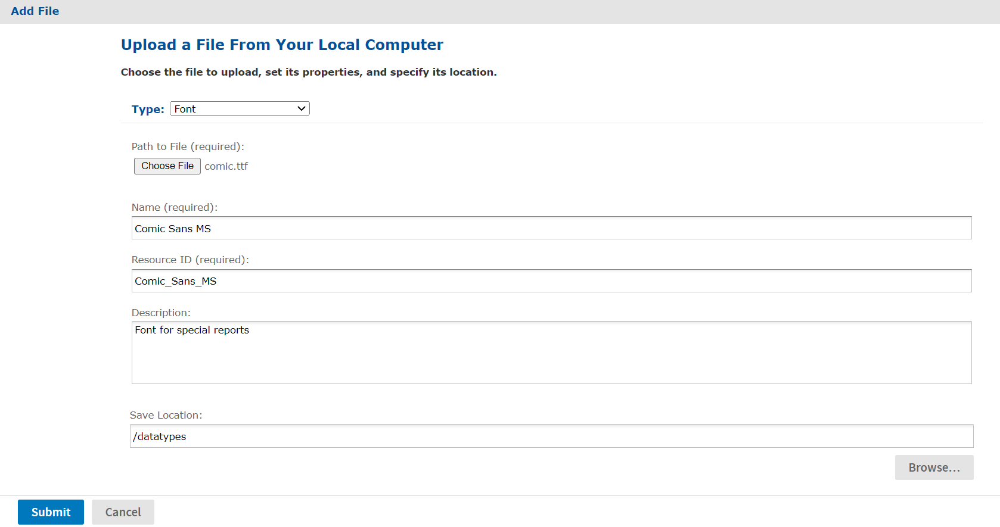
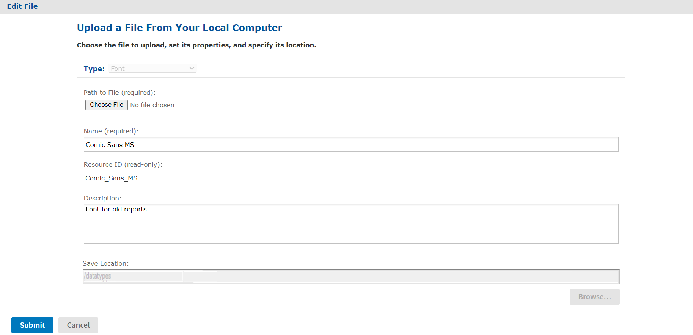

# File Resources

You create file resources by uploading files so they can be referenced by Jasper Reports. JasperReports Server supports the following file types:

| File Type | Description |
|----|----|
| Access Grant Schema | Please provide description for Access Grant Schema. |
| CSS | Cascading Style Sheet file that helps define the user interface as part of a theme. |
| Font | True Type font (.ttf) file to extend the set of fonts available in a report and allow embedding of fonts in the PDF output, if needed (see Fonts). |
| Image | Any image format supported by the JVM (Java Virtual Machine), such as JPEG, GIF, and PNG. Image files can be referenced in JasperReports, and also in CSS files. |
| JAR | Libraries that provide functionality for your reports (see JAR Files). |
| JRXML | The definition of a report in JasperReports' XML-based report definition language. A JRXML file can be uploaded separately for use in multiple JasperReports. |
| Resource Bundle | A Java .properties file containing key-value pairs for localization of reports (see Resource Bundles). |
| Style Template | A JRTX file containing a style template that can be shared among JasperReports. |
| XML | XML file used in Domains and analysis (XML/A) to define data-level security. Can also be used for XML and JSON data files (see [File Data Sources](../datasources/file_data_sources.md)). |
| MongoDB JDBC Schema | JSON object that defines the structure and contents of your data. For more information, see [MongoDB Schemas](https://docs.mongodb.com/realm/schemas/). |
| Azure Certificate | An `x.509` server certificate (`.cer`) or key exchange (`.pfx`) file used to authenticate JasperReports Server with Microsoft Azure (see [Uploading an Azure Certificate File to the Repository](../datasources/azure_data_sources.md)). |
| Secure File | An SSH private key file for `SFTP` file transfers that require an SSH key (see Uploading an SSH Private Key File to the Repository). |

File Resource Types

The way in which fonts, JAR files and resource bundles are associated with reports is further explained in the following sections.

## Fonts

The server relies on the JasperReports Library as its content rendering engine, which enables it to produce high-quality, pixel-perfect documents. The server can use any of the fonts available to its JVM as logical or physical fonts. This solution is perfect for HTML reports that are stored in the server.

However, when exporting the report to PDF, you may need to take additional steps if the report includes fonts that the PDF viewer doesn't recognize, or if the report requires fonts that your users do not have on their computers. In this case, you must embed the font in the PDF file itself. To embed a font, you must edit the report's main JRXML file; the TTF (True Type Font) file that the report references must be available to the server at run time. One way to ensure that the server has the correct font is to upload it to the repository by creating a file resource. Then, the report can refer to the font's URI in the repository.

In the same way, you can export the dashboard to PDF when the report used in the dashboard is using external fonts. However, when custom fonts are used in the dashboard like text dashlets, you need to deploy related TTF files to the server environment if its operating system does not have the font that is used in the dashlets.

For details about working with fonts and PDF export, refer to the JasperReports documentation.

## JAR Files

JasperReports can leverage third-party APIs. When run, reports can make direct API calls to third-party code using JRXML expressions. This provides enormous flexibility for incorporating business logic or other utility code into report generation.

In some cases, you can make the third-party code available to the report generating process by adding the necessary libraries to the server's application classpath when it's deployed. In other cases, upload the third-party or additional JAR files to the repository by creating a file resource. Then the report can refer to the code by referencing them as additional file resources.

## Resource Bundles

When a single JRXML template is used to generate documents in multiple languages, it needs a resource bundle to accommodate the locale-specific content. If you upload such resource bundles by creating a file resource, your JRXML files can refer to them.

The name of the resource bundle created as a file resource in the repository must have .properties as its file extension. For example, the default resource bundle might be named `MyReport.properties`, and its French translation `MyReport_fr.properties`. For more information about resource bundles for reports, refer to the JasperReports Server User Guide.

## Creating a File Resource

Administrators should organize file resources into folders in the repository to make them easier to find when creating references.

To add a file resource

1.  Log in as an administrator and select **View &gt; Repository**.

2.  In the Folders panel, right-click the parent folder's name and select **Add Resource &gt; File** from the context menu , and select a resource type. In this example, **Font**. The **Add File** dialog appears.

3.  Enter the required information for the file resource. In additions to the name and ID, file resources only require you to enter the path to a file. Click **Browse** to locate a file on your file system. 
    The figure below shows the dialog for adding a Font file. All file resources are created by uploading a file in this way.

    

    *Figure 1: Adding a File Resource*

4.  When done, click **Submit**. The new file resource appears in the selected folder in the Repository panel.

## Editing a File Resource

The following example shows how to edit a file resource.

To edit a file resource

1.  Log on as an administrator.

2.  In the repository, browse or search for the resource.

3.  Right-click the resource and select **Edit** from the context menu. In this example, we edit the font resource created in Creating a File Resource.

    

    *Figure 2: Editing a File Resource*

4.  Use the **Edit** dialog to view or modify the resource definition and its values. In the figure above, you can see how the Description field was changed. You can also change the contents of the file resource by specifying another file to upload. The **Path to File** field is not required unless you want to reload the file from disk.

5.  Click **Submit** to save any changes.

## Uploading an SSH Private Key File to the Repository

JasperReports Server allows you to export scheduled reports or dashboards over `SFTP` to an FTP server. If the FTP server uses SSH key authentication, you will need to upload a SSH private key file to the repository as a Secure File resource.

While the SSH private key is being used in a scheduled report or dashboard job, it cannot be deleted from JasperReports Server.

To upload an SSH key file to the repository

1.  Log into JasperReports Server as an administrator.
2.  Click **View &gt; Repository** and expand the folder tree.
3.  Browse to the folder where you want to save the SSH key.
4.  Right-click the folder and select **Add Resource &gt; File &gt; Secure File** from the context menu.
5.  Click **Choose File** to locate and upload the SSH key file.
6.  Enter a name and resource ID for the file.
7.  Click **Submit** to save the file to the repository.
