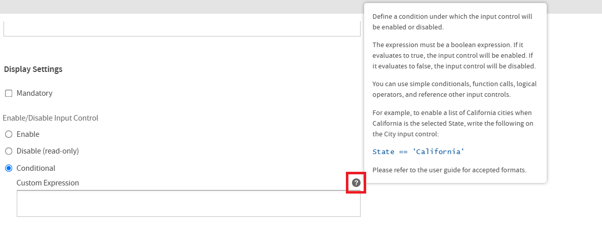
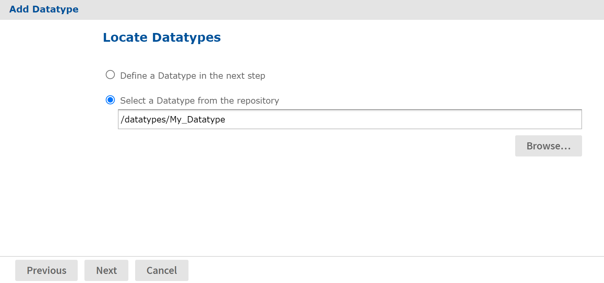

# Input Controls

Any JasperReport can be parameterized so that its generated output is a function of values given at run time (query filters), or so that its layout is changed to accommodate different users (such as changing the title).

-   The range of possible values or list of discrete values allowed.

-   The type of input, for example single-select or multi-select, and the widget to display the possible values, for example drop-down list or check boxes.

-   Display options such as labels and whether the value is required.

-   The name of the corresponding parameter in the JRXML.

When a user runs the report, the server uses this information to prompt the user for a value and to validate that input. For example, consider a report that returns sales data for all of a company's products; the user might input a product to view by selecting a product name in a list.

JasperReports Server supports several types of input controls, each of which can map to certain types of parameters in the report's JRXML. The input control also determines the kind of widget the user interacts with:

-   Boolean: Presented as a check box. These input controls return a `java.lang.Boolean` object to the report engine in response to the user's selection. Boolean input controls return TRUE or FALSE as values, depending on whether the box is checked.

-   Single value: Presented as a free-form text box. You must specify a datatype, for example a text or numerical value, and the user's entry is validated against this datatype.

-   Single-select: Presented as either a drop-down list or a set of radio buttons. A single-select input control returns a single value.

-   Multi-select: Presented as a scrollable list of values or a set of check boxes. A multi-select input control returns a collection of values.

One advanced feature of single-select or multi-select input controls is that the values they present can be the result of a dynamic query. The query retrieves actual values from the data source before presenting them as choices to the user. These queries can contain parameters themselves, for example based on the logged-in user or the selection of a previous input control. Query parameters are described in [Query-based Input Controls](query-based_input_controls.md) and [Cascading Input Controls](cascading_input_controls.md).

Input controls rely on other resources in the repository, such as datatypes, static lists of values, or queries. You can manage these resources the same way you manage other resources. You can define them locally (available only to the input control) or reference them externally (using a resource in the repository). For more information, see [Local Resources and External References](../repository/jasperreport_structure.md).

!!! note

    Ad Hoc views based on Domains and Domain Topics always use locally defined input controls that are created automatically based on the chosen filters. They cannot refer to input controls stored in the repository, and you should not modify them. For more information, see the JasperReports Server User Guide.

    Some input controls rely on queries to populate their options. These more complex controls are described in [Query-based Input Controls](query-based_input_controls.md).

As with other resources, input controls can be created locally as part of a JasperReports, in which case they cannot be seen outside that JasperReport, or they can be created separately in the repository and referenced in multiple reports.

To use an input control in a report, the control must meet two conditions:

-   The parameter name in the input control must correspond to the name of the parameter in the report. No error occurs for a mismatch, but at run time `NULL` is passed instead of the actual value of the parameter.

-   The input control and its corresponding parameter must be of compatible datatypes (for example, both must be text types or date types). If there is a mismatch, the report fails and an exception is returned.

This section explains how to create an input control in the repository. To reference input controls in a JasperReport, see the JasperReports Server User Guide.

To create an input control:

1.  Log on as an administrator.

2.  Click **View &gt; Repository** and locate the folder for the input control.

3.  Right-click the folder's name and select **Add Resource &gt; Input Control** from the context menu. The **Add Input Control** page appears.

    

4.  Select the type of input control from the **Type** list. In this example, **Single Value** is selected.

5.  Enter the **Prompt Text** to tell users how to use the control. This example uses the prompt **Select the text for the report title**.

6.  The **Custom Prompt Text** is optional and can be used to explain users how to use the Input Control. It can also be used to provide a customized label for the Input Control instead of **Prompt Text**. 
    A tooltip appears when you hover over the question mark icon.

    

7.  In practice, the **Parameter Text** is often the same as the parameter, so the **Parameter Name** is automatically filled in. If you have used a different prompt, edit the **Parameter Name** field and enter the exact name of the parameter for your control. Remember, the parameter name must be the same here as in the reports that use this input control. 
    For this example, the parameter name is **title**.

8.  **Description** is optional.

9.  Select options for the control. Your options are:

    -   **Mandatory**: Forces the end user to supply a value.

    -   **Enable/Disable Input Control**: Controls whether you can edit the value of the Input Control. You can choose from the following three options:

        -   **Enable**: Displays the value of the parameter while allowing you to edit it. By default, **Enable** is selected.

        -   **Disable**: Displays the value of the parameter while restricting you from editing it.

        -   **Conditional**: Based on the condition defined, the Input Control may be enabled or disabled. When selected, the associated **Custom Expression** field is enabled.

            You can find the list of accepted expression formats in the Expression Formats Accepted section of the JasperReports Server User Guide.

            For information about how to create an input control for custom functions, see [Input Controls for Custom Functions](input_controls_for_custom_functions.md).

            A tooltip appears when you hover over the question mark icon next to the **Conditional &gt;** **Custom Expression** input field.

            

    -   **Show/Hide Input Control**: Determines the visibility of the Input Control. You can choose from the following three options:

        -   **Show**: Makes the Input Control visible in the **Input Controls** dialog. By default, **Show** is selected.

        -   **Hide**: Restricts the visibility of the Input Control in the **Input Controls** dialog.

        -   **Conditional**: Based on the condition defined, the Input Control may be shown or hidden. When selected, the associated **Custom Expression** field is enabled.

            You can find the list of accepted expression formats in the Expression Formats Accepted section of the JasperReports Server User Guide.

            For information about how to create an input control for custom functions, see [Input Controls for Custom Functions](input_controls_for_custom_functions.md).

            The tooltip is also displayed when you hover over the question mark icon next to the **Conditional &gt;** **Custom Expression** input field.

10. Click **Next**. 
      Subsequent pages depend on what type of input control you chose:

    -   Boolean types do not require any further information.

    -   Single-value types require a datatype the user can enter.

    -   Single-select and multi-select types based on static lists require a list of values.

    -   Single-select and multi-select types based on queries require a query.

11. For information about how to create an input control for custom functions, see [Input Controls for Custom Functions](input_controls_for_custom_functions.md).

12. In this single-value example, the **Locate Datatype** page appears. Choose the option to select a datatype from the repository and click **Browse**. In the **Repository** dialog, select `/datatypes/TextGeneralDatatype`, which is similar to the datatype we created in [Datatypes](datatypes.md).

    !!! note

        If you choose to define a datatype, the wizard takes you through the same procedure as in section [Datatypes](datatypes.md). You can then define any datatype you need, but it is local to the input control and not reusable in other input controls.

    

    *Figure 1: Locate a Datatype for an Input Control*

13. Click **Next**. The input control resource is created in the repository.

14. Locate the input control in the repository manager. Notice that the text of the prompt that you entered in Step 5 is also used as the name for the resource.
