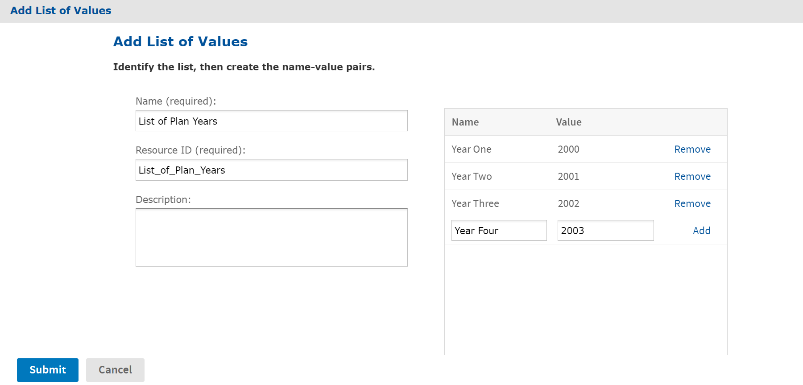

# Lists of Values

A lists of values resource is a static list of values for single-select or multi-select input controls. Depending on the type of input control, the user selects one or more of these labels using radio buttons, check boxes, or drop-down lists.

To create a list of values

1.  Log on as an administrator.

2.  Click **View &gt; Repository** and locate the folder for the new list of values.

3.  Right click the folder's name and select **Add Resource &gt; List of Values** from the context menu. The **Add List of Values** page appears.

    

    *Figure 1: Add List of Values Page*

4.  Enter a name for the list of values. Resource ID is filled in automatically, and the description is optional.

5.  Enter the name and value for each item in the list and click **Add**. 
    The name and value are both treated as strings. Users see the label only in an input control that uses the list, and the report receives only the value. To remove an item, click **Remove** beside the value.

6.  Click **Submit**. The list of values resource appears in the repository.
