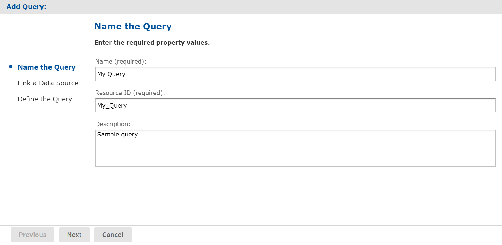
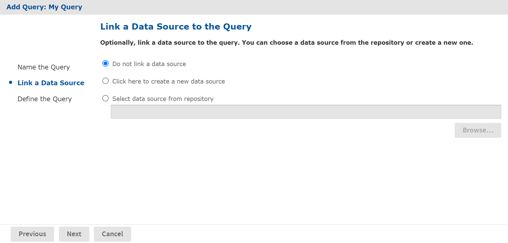
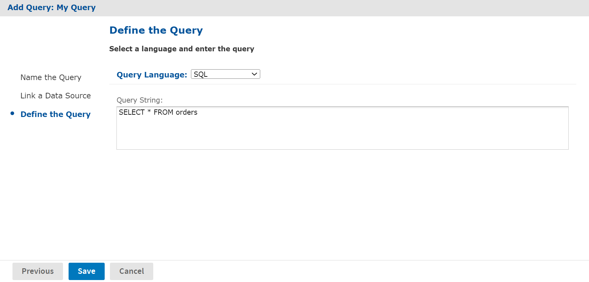

# Queries

A JasperReport uses a query to select the data to be returned from the data source. You can define the query in the JRXML itself, but you can also create and save queries in the repository. A query saved in the repository can be re-used by multiple JasperReports.

Reusing a query enables you to adapt reports to different audiences. The query returns the same data from the same data source every time, but each report presents the data in a different way. Also, separating the query from the JRXML makes it easier to maintain large numbers of reports when the data source changes and the query needs to be updated.

You can also use queries to populate list input controls, as described in [Query-based Input Controls](query-based_input_controls.md) and [Cascading Input Controls](cascading_input_controls.md).

To create a reusable query:

1.  Login as an administrator.

2.  Click **View &gt; Repository** and locate the folder for the query.

3.  Right-click the folder's name and select **Add Resource &gt; Query** from the context menu. The **Add Query** page appears.

    

    *Figure 1 Add Query - Name the Query Page*

4.  Enter a name for the query. Resource ID is filled in automatically, and the description is optional. Click **Next**. The **Link a Data Source** page appears.

    

    *Figure 2 Add Query - Link a Data Source Page*

5.  Select the data source and click **Next**. Your options are:

    -   **Do not link a data source**: If no data source is associated with the query, the server uses the data source associated with the report that references the query.
    -   **Create a new data source**: You can define a local data source within this query resource that is not accessible to any other resource. Click the link to create any data source as described in [Data Sources](../datasources/datasources_intro.md). This new data source overrides any data source specified in reports that use the query.
    -   **Select data source from repository**: This creates a reference to a data source in the repository. Click **Browse** to select an existing data source. The data source that you select overrides any data source specified in reports that use the query.

    

    *Figure 3 Add Query - Define the Query Page*

    Click **Next**. The **Define the Query** page appears.

6.  Select a **Query Language**. For this example, choose **SQL**.<br>
    The query language Domain (sl) is selected when opening Domain-based queries created in versions of the server before 3.7. It is used only for backward compatibility and should not be selected for new domain-based queries.

7.  Enter the text of your query in the **Query String** field, for example:

    ``` sql
    SELECT * FROM orders
    ```

8.  Click **Save**.

By default, JasperReports Server supports SQL, HQL (Hibernate), HiveQL (Hadoop-Hive), MongoDB, CQL (Cassandra), JasperQL, and Domain queries, while JasperReports Library supports several more (such as EJBQL, xPath, and MDX). However, JasperReports Server can support additional query languages if a query executor implementation is properly configured for each additional language when the server is deployed.

You can use a specialized bean data source to support multiple query languages. For information about bean data sources, refer to [Bean Data Sources](../datasources/bean_data_sources.md). Another option to add new types of data sources to the server to extend the reach of the JasperReports Server platform. Custom data sources are described in the JasperReports Server Ultimate Guide.
