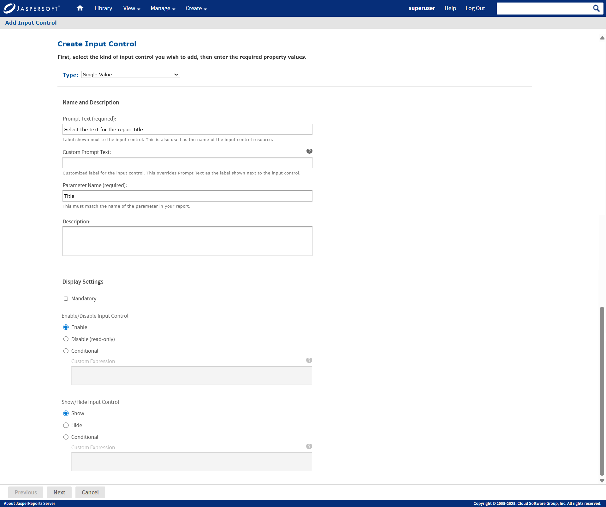
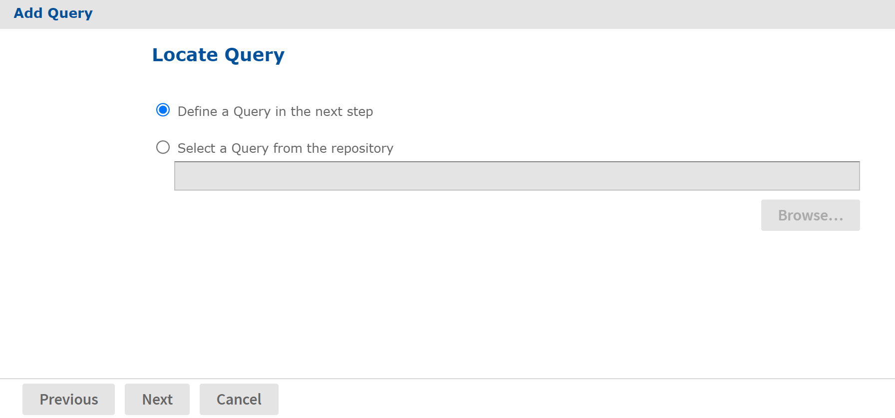
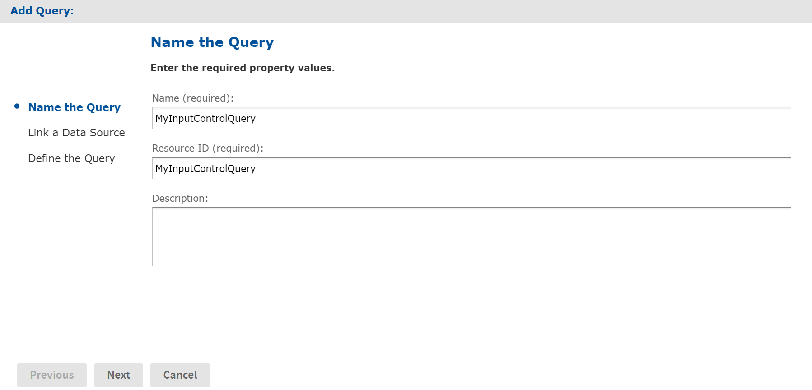
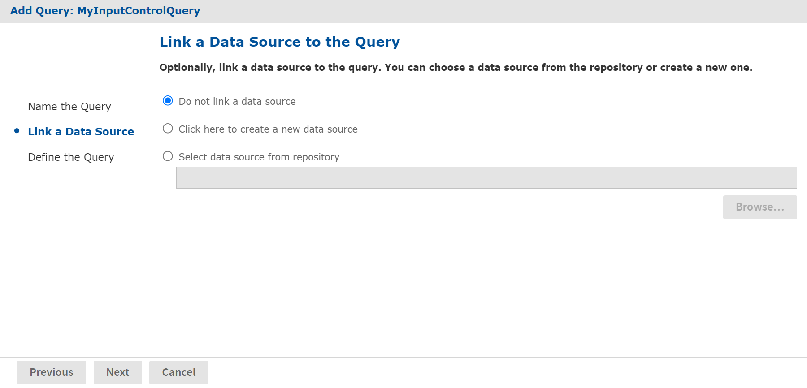
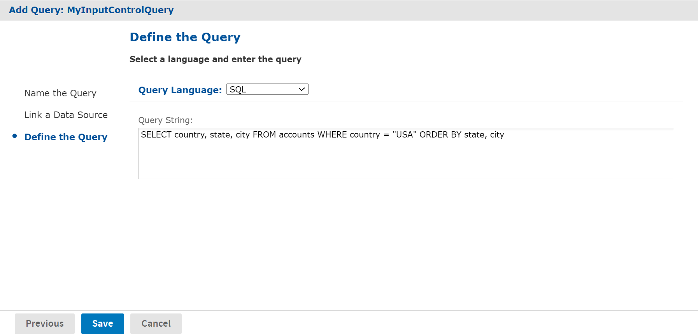
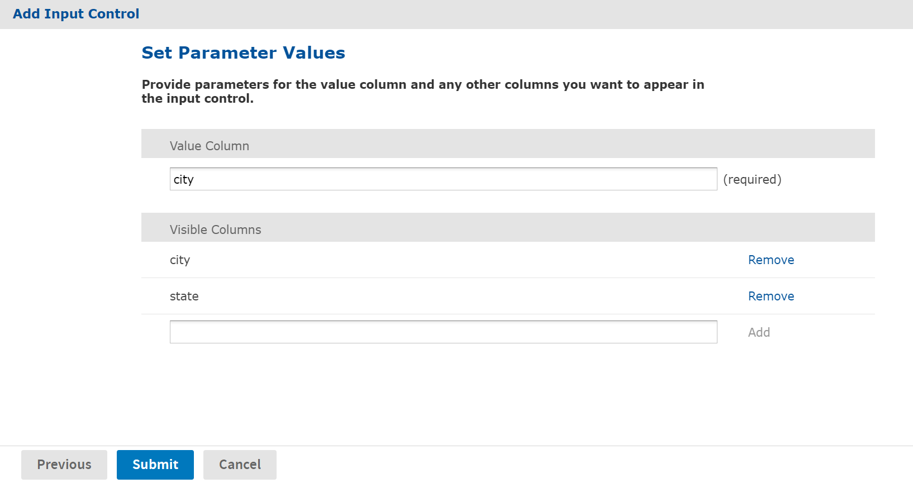
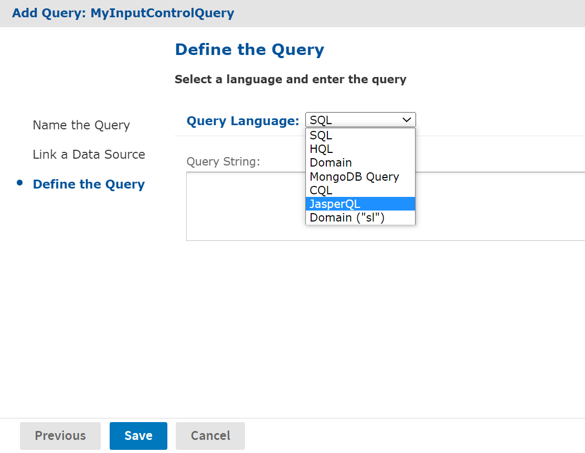

# Query-based Input Controls

Query-based input controls display a dynamic set of values for the user to choose from. They are input control resources in the repository, but instead of being based on a datatype or a static list of values, they perform a query to retrieve a list of values. For example, a report could have a city parameter, and the query-based input control could display the list of cities in your data. Because the queries use standard syntax, you can include filters in a `WHERE `clause, for example, to restrict the list of cities to a certain country.

## Creating a Query-based Input Control

In this first example, we create a query-based input control that returns a list of all cities the user can choose from.

1.  Log in as an administrator.

2.  Browse the repository and select the folder for the query-based input control.

3.  Right click the folder's name and select **Add Resource &gt; Input Control**. The **Add Input Control** dialog appears.

    

    *Figure 1: Adding an Input Control - Naming*

4.  Select the type of query-based input control from the type drop-down list. This determines how the input control appears to users, either as a drop-down list, a set of radio buttons, a multi-select list, or a set of check boxes. In this example, we choose a single-select query-based input control type.

5.  Specify the prompt text, parameter name, optional description, and appearance options in the same manner as when defining a regular input control.

6.  Click **Next**. Because we selected one of the query-based types, the **Locate Query** page appears:

    

    *Figure 2: Adding an Input Control - Locating the Query*

    If you have a suitable query defined in the repository, you can select it here as an external reference. In this example, we'll define a query locally inside the input control.

7.  Click **Next** to define the local query resource. The query naming dialog appears:

    

    *Figure 3: Adding an Input Control - Naming the Query*

    Although the query resource is not visible in the repository, it may still have a name, ID and optional description within the query resource. However, the values for these fields are not important.

8.  Enter any name, and the ID is filled in automatically. Then click **Next**. The **Link a Data Source to the Query** page appears:

    

    *Figure 4: Adding an Input Control - Linking to a Data Source*

    Like all queries, the query inside the input control may optionally link to a data source, either in the repository or its own internally defined one. If no data source is linked, the query in the input control uses the same data source as the report. In this example, we use the default of not linking to a data source.

9.  Click **Next**. The **Define the Query** page appears:

    

    *Figure 5: Adding an Input Control - Defining the Query*

10. Select the query language, in this example SQL, and enter a query string. The `SELECT` statement should contain the names of all fields used in the display, value, or filter for the input control. In this example, the query returns three fields, country, state, and city. Country limits the values to a single country. The `ORDER BY` clause ensures that the values from the query are sorted alphabetically when they appear in the input control.<br>
    For an example in a different query language, see Domain-based Queries.

11. Click **Save** to complete the query definition. The **Set Parameter Values** page appears:<br>

    

    *Figure 5: Adding an Input Control - Setting Parameter Values*

    On the parameter values page, you specify which fields in the query result are displayed, and which field contains values that become the parameter value. When chosen.

    1.  First, specify the value column. This is the field whose value is passed to the report. The datatype of the field must match the type of the corresponding parameter in the report.

    2.  Next, specify the visible columns. These are the fields whose values appear in the input control the user chooses from. In the simplest case, enter the same field as the value column. If you add multiple fields to the visible columns, the input control displays the fields together, in the order listed, separated by a vertical bar (\|). In this example, the user can see and choose from:

        Los Angeles \| CA

        San Francisco \| CA

        Denver \| CO

        Only the city value (without the state) is passed to the report. Showing additional fields in this way can help users find the value they want in long lists of results.

        The value and display columns may also be entirely different, for example, displaying the full name of a sales representative, but using the employee ID as the value returned by the input control. The only restriction is that all fields used in the value or display list must be selected by the query.

## Built-in Parameters for Query-based Input Controls

The `LoggedInUser` and `LoggedInUsername` parameters are always available for query input controls. They are always available to reports even if an input control isn't defined for them. The standard parameters are also provided for reports if they're defined as parameters in the JRXML.

<table>
<caption><p>Built-in Parameters for Query-based Input Controls</p></caption>
<colgroup>
<col style="width: 33%" />
<col style="width: 33%" />
<col style="width: 33%" />
</colgroup>
<thead>
<tr>
<th><p>Parameter Name</p></th>
<th><p>Type</p></th>
<th><p>Notes</p></th>
</tr>
</thead>
<tbody>
<tr>
<td><p><code>LoggedInUser</code></p></td>
<td><p>User</p></td>
<td><p>The currently logged in user. This parameter isn't available in query input controls, but is used as a parameter to the report.</p></td>
</tr>
<tr>
<td><p><code>LoggedInUsername</code></p></td>
<td><p>String</p></td>
<td><p>The user name of the current user.</p></td>
</tr>
<tr>
<td><p><code>LoggedInUserFullName</code></p></td>
<td><p>String</p></td>
<td><p>The full name of the current user.</p></td>
</tr>
<tr>
<td><p><code>LoggedInUserEmail</code><br />
<code>Address</code></p></td>
<td><p>String</p></td>
<td><p>The email address of the current user.</p></td>
</tr>
<tr>
<td><p><code>LoggedInUserEnabled</code></p></td>
<td><p>Boolean</p></td>
<td><p>Indicates whether the current user is enabled.</p></td>
</tr>
<tr>
<td><p><code>LoggedInUserExternally</code><br />
<code>Defined</code></p></td>
<td><p>Boolean</p></td>
<td><p>Indicates whether the current user is authenticated externally.</p></td>
</tr>
<tr>
<td><p><code>LoggedInUserTenantId</code></p></td>
<td><p>String</p></td>
<td><p>The current user's organization.</p></td>
</tr>
<tr>
<td><p><code>LoggedInUserRoles</code></p></td>
<td><p>Collection<br />
&lt;String&gt;</p></td>
<td><p>The roles assigned to the current user. This is helpful for parameters that use $X.</p></td>
</tr>
</tbody>
</table>

Attributes defined on users, organizations, or at the server-level can also be used in reports and query-based input controls. For more information, see [Managing Attributes](../management/managing_attributes.md).

<table>
<caption><p>Attribute-based Parameters for Queries and Reports</p></caption>
<colgroup>
<col style="width: 33%" />
<col style="width: 33%" />
<col style="width: 33%" />
</colgroup>
<thead>
<tr>
<th><p>Parameter Name</p></th>
<th><p>Type</p></th>
<th><p>Notes</p></th>
</tr>
</thead>
<tbody>
<tr>
<td><p><code>LoggedInUserAttributes</code></p></td>
<td><p>Map&lt;String, String&gt;</p></td>
<td><p>The attributes of the logged-in user. This parameter isn't usable in query input controls, but it is used as a parameter to the report. If the user has no attributes, the parameter is an empty map.</p></td>
</tr>
<tr>
<td><p><code>LoggedInUserAttribute</code><br />
<code>Names</code></p></td>
<td><p>Collection<br />
&lt;String&gt;</p></td>
<td><p>The names of the attributes of the logged-in user. This is helpful for parameters that use $X. If the user has no attributes, the parameter is an empty map.</p></td>
</tr>
<tr>
<td><p><code>LoggedInUserAttribute</code><br />
<code>Values</code></p></td>
<td><p>Collection<br />
&lt;String&gt;</p></td>
<td><p>The values of the attributes of the logged-in user. This is helpful for parameters that use $X. If the user has no attributes, the parameter is an empty map.</p></td>
</tr>
<tr>
<td><p><code>LoggedInUserAttribute_</code><br />
<code>&lt;attribute-name&gt; </code></p></td>
<td><p>String</p></td>
<td><p>For the logged-in user, the value of the attribute matching the name passed as <code>&lt;attribute-name&gt;</code> (such as <code>att1</code>). If there's no attribute with this name for this user, the parameter is empty.</p>
<p>This parameter is available only if it's defined in a query or as a report parameter.</p></td>
</tr>
<tr>
<td><p><code>LoggedInTenantAttribute_</code><br />
<code>&lt;attribute-name&gt; </code></p></td>
<td><p>String</p></td>
<td><p>The value of the named attribute defined in the organization of the logged-in user. If there's no attribute with this name for this organization, the parameter is empty.</p>
<p>This parameter is available only if it's defined in a query or as a report parameter.</p></td>
</tr>
<tr>
<td><p><code>ServerAttribute_</code><br />
<code>&lt;attribute-name&gt; </code></p></td>
<td><p>String</p></td>
<td><p>The value of the named attribute defined at the server level. If there's no attribute with this name at the server-level, the parameter is empty.</p>
<p>This parameter is available only if it's defined in a query or as a report parameter.</p></td>
</tr>
<tr>
<td><code>Attribute_</code><br />
<code>&lt;attribute-name&gt; </code></td>
<td>String</td>
<td><p>The value of the named attribute is determined hierarchically. The first value found for the named attribute in the following order:</p>
<ul>
<li>On the logged-in user.</li>
<li>On the organization of the logged-in user, then in any parent organizations.</li>
<li>At the server level.</li>
</ul>
<p>If there's no attribute with this name defined in those locations, the parameter is empty.</p>
<p>This parameter is available only if it's defined in a query or as a report parameter.</p></td>
</tr>
</tbody>
</table>

## Domain-based Queries

For reports that use a Domain as the data source, a query-based input control must contain a query against the Domain. When defining the query as shown in Adding an Input Control - Defining the Query, set the query language to `Domain`.

!!! note

    The query language **Domain ("sl")** is selected when opening Domain-based queries created in JasperServer 3.5 or earlier. It's used only for backward compatibility and should not be selected for new Domain-based queries

Domain queries have their own special syntax, the same one that's used in the Domain design. A Domain-based query references fields, called items, by their item IDs, along with any set IDs that determine the path of the item within the Domain. For example, if you want your query input control to return a list of store cities, where the field with ID `ej_store_store_city` is nested in the set with ID `expense_join_store`, you would use the following Domain query:

``` xml
<query>
  <queryFields>
    <queryField id="expense_join_store.ej_store_store_city" />
  </queryFields>
</query>
```

The list contained inside the `<queryFields>` tag in a Domain query is equivalent to the fields given in the `SELECT` statement of an SQL query. Given the query above, you can create an input control for a Domain-based report that lets the user select a city as a parameter to the report.

Sometimes, you may want the input control to display more information than the actual value returned. As with standard query-based input controls, you can select more fields, and then display those fields in your input control. For example, to make the list of cities unambiguous, you could include the state and country in your display. In that case, the Domain-based query must also retrieve those items:

``` xml
<query>
  <queryFields>
    <queryField id="expense_join_store.ej_store_store_city" />
    <queryField id="expense_join_store.ej_store_store_state" />
    <queryField id="expense_join_store.ej_store_store_country" />
  </queryFields>
</query>
```

Then, when specifying your visible query columns, as shown in [Query for the Country Input Control](cascading_input_controls.md), you would add the 3 fields to the list in the order you want them to appear. When specifying fields in the list of visible query columns, use the full ID of the field, including any set IDs. For example, the following list of fields:

``` text
expense_join_store.ej_store_store_countryexpense_join_store.ej_store_store_stateexpense_join_store.ej_store_store_city
```

creates a list of values such as the following for users to choose from (the separator \| is added automatically):

USA \| CA \| Los Angeles

USA \| CA \| San Francisco

USA \| OR \| Portland

USA \| WA \| Redmond

The Domain-based query also has the option to filter the query results, as shown in the following example:

``` xml
<query>
  <queryFields>
    <queryField id="expense_join_store.ej_store_store_city" />
    <queryField id="expense_join_store.ej_store_store_country" />
    <queryField id="expense_join_store.ej_store_store_state" />
  </queryFields>
  <queryFilterString>expense_join_store.ej_store_store_country == 'USA' and
        expense_join_store.ej_store_store_state == 'CA'
  </queryFilterString>
</query>
```

The `<queryFilterString>` tag contains a DomEL (Domain Expression Language) expression that references the full ID of the fields, including any set IDs. For more information about DomEL, see the JasperReports Server Data Management Using Domains. The `<queryFilterString>` tag in a Domain query is equivalent to the WHERE clause of an SQL query. The list of fields in the `<queryFields>` tag must include all fields being referenced in the filter string.

The filter string of the Domain-based query may also reference hierarchical attributes. In the following example, the query will return the products with the brand name matching the value of the `brand` attribute:

``` xml
<query>
  <queryFields>
    <queryField id="sales_fact_ALL.sales__product.sales__product__brand_name"/>
  </queryFields>
  <queryFilterString>sales_fact_ALL.sales__product.sales__product__brand_name
                    == attribute('brand')</queryFilterString>
</query>
```

Finally, you can specify sort columns to arrange your query results using the `sortList` element, as shown in this example:

``` xml
<queryFields>
  <queryField id="ShipRegion" />
    <queryField id="RequiredDate" />
    <queryField id="OrderId" />
    <queryField id="ShipCity"/>
  </queryFields>
  <sortList>
  <sortColumn columnName="ShipCity" />
  <sortList>
</query>
```

## JasperQL Query Language

The **JasperQL** is a JSON-based Query Language for defining a query to access data from a domain on JasperReports Server. However, unlike **Domain ("sl")**, **JasperQL** is selected for new domain-based queries. When defining the query for new domain-based queries, set the query language to **JasperQL**.



*Figure 6: Setting Query Language to JasperQL*

!!! note

    The **JasperQL** query language is only supported in JasperReports Server 7.8 or higher versions.

JasperQL Query Language supports advanced features such as aggregation, filtering, aliasing, and DomEL function to create calculated fields. In the following example, the JasperQL input query will return a table with two fields **store_sales_98** and **product_name**. You can use `distinctFields` to eliminate the duplicate information. Also, you can filter the information you want to display, rearrange the information in a group using `groupBy`, sort the records using `orderBy`.

``` json
{
  "select" : {
    "fields" : [ {
      "field" : "sales_fact_ALL.sales_fact_ALL__store_sales_98"
    }, {
      "field" : "sales_fact_ALL.sales__product.sales__product__product_name"
    } ],

    "distinctFields" : [ ],
    "aggregations" : [ ]
  },
    "where" : {
       "parameters" : [ ]
    },
   "groupBy" : [ ],
   "orderBy" : [ ]
}
```

In JasperQL, if you want your query input control to return a limited number of records, you can set a record limit using **Limit**.
