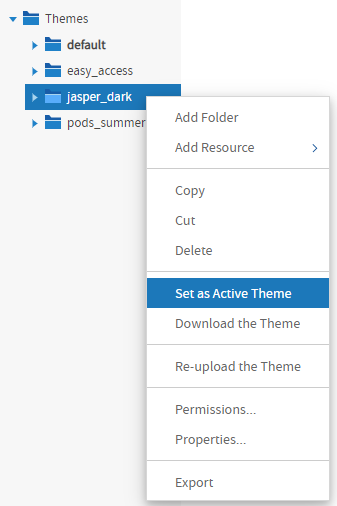
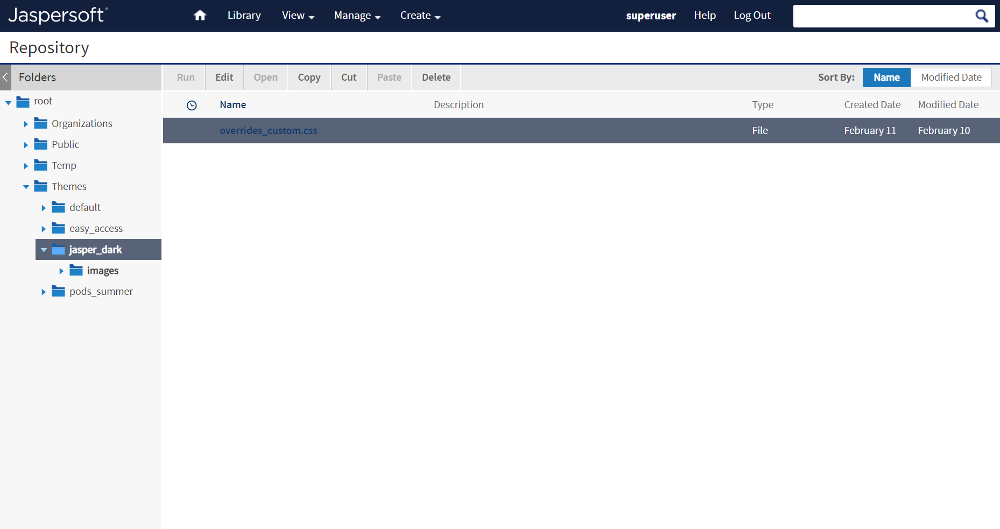
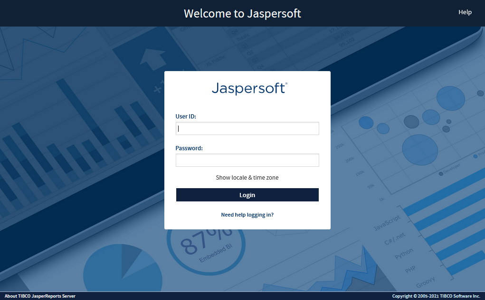
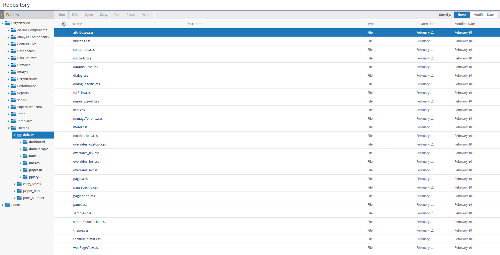
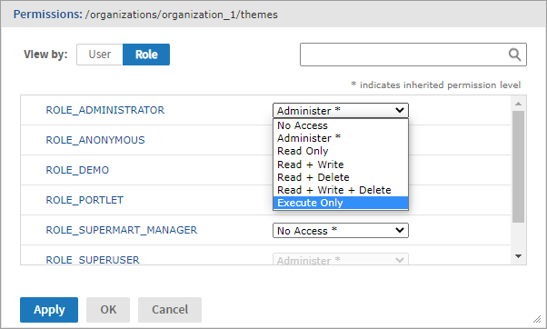

# Administering Themes

Themes are sets of CSS and image files stored in a folder in the repository. The root of the repository has a Themes folder where active and inherited themes are stored. In the repository browser, the Themes folder and individual theme folders have special actions for administrators to manage them. You can also use the repository search to find CSS and image files.

The folders and actions for managing themes are visible only to administrators. The Themes folder has execute-only permission for ROLE_USER so that all users can load the theme files and see the user interface, but not access the folders and files in the repository.

This section gives the basic procedures for administering existing themes. To create theme folders and files, see [Creating Themes](creating_themes.md). For information about how to work with CSS in themes, see [Working With CSS Files](working_with_css_files.md).

!!! note

    The Easy Access theme is specifically intended to improve the web UI's accessibility. It increases color contrast and highlighting in the web UI. It can improve the user experience of those with visual impairment.

## Setting the System Theme

This procedure assumes you have already created and uploaded your theme

1.  Log into JasperReports Server as system admin (`superuser`).
2.  Click **View &gt; Repository** and expand the `root/Themes` folder if necessary.
3.  Right-click the chosen theme folder and select **Set as Active Theme**. For example, the sample data includes a theme called **jasper_dark** that you can set as active.

*Figure 1: Setting a System Theme*

As soon as the screen is refreshed, you see the effect of the new theme. Notice how the **jasper_dark** theme changes the colors in the user interface with just the `overrides_custom.css` file and some image files.

*Figure 2: The Sample Theme jasper_dark*

Because the system theme is set at the root level, the new theme appears to all users in all organizations, unless the organization has its own theme. When an organization has its own theme, it may still see elements of the system theme through inheritance. Also, the system theme set at the root applies to the login page, as shown in the following figure.

*Figure 3: The Login Page as Seen With a New System Theme*

The following procedures assume that the system theme is still set to the default theme.

## Setting an Organization Theme

Professional edition users can give different themes to their organizations.

1.  Log into JasperReports Server as system admin (`superuser`) or as the organization admin (`jasperadmin`).

2.  Click **View &gt; Repository** and expand the Themes folder if necessary. The organization's **Theme** folder is shown in the following figure.

    

    *Figure 4: Organization Themes Seen by Organization Admin*

3.  Right-click the new theme folder name and select **Set as Active Theme**. 
    As soon as the screen is refreshed, you see the effect of the new theme. The new theme applies to all organization users and is inherited by all suborganizations, if any.

    Organization admins can thus customize the user interface by creating and activating new themes within their organization.

## Restricting Access to Themes

System admins may want to restrict access to themes, so that all themes are controlled from the system level.

!!! note

    This procedure applies only to system admins. Organization admins cannot modify the `ROLE_ADMINISTRATOR` permission, even in their suborganizations. They must request that the system admin perform the procedure for them

1.  Log into JasperReports Server as system administrator (`superuser`).

2.  Click **View &gt; Repository**.

3.  Expand the **Organizations** folder.

4.  Locate the name of the organization where you want to restrict access to themes and expand its folder.

5.  Right-click the **Themes** folder name and select **Permissions**.

6.  Change the permission for the **ROLE_ADMINISTRATOR** from **Administer** to **Execute Only**.

    

    *Figure 5: Restricting jasperadmin Access to Organization Themes*

    By setting **Execute Only** access, the organization administrators cannot see the **Themes** folder in the repository, and thus cannot change themes or create a new theme.

    !!! warning

        You shouldn't change any other permissions on themes, even if the permissions dialog allows it. You could inadvertently make the user interface inaccessible.

7.  To restrict access to all organizations, repeat Step 4 to Step 6 for every organization in the server, including suborganizations.

8.  If you want to restrict access in the same way in all future organizations, repeat Step 5 and Step 6 in the Folder Template of every organization and suborganization in the server. Fore more information, see [Placing Themes in the Folder Template](creating_themes.md).
