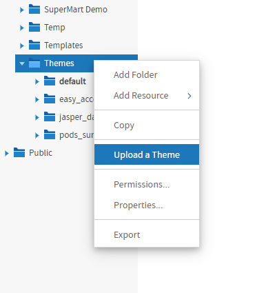

# Creating Themes

There are three ways to create the folders and files that make up a theme:

-   [Creating Theme Folders and File Resources](#creating-theme-folders-and-file-resources) – Create them individually as resources in the repository.
-   [Downloading and Uploading Theme ZIP Files](#downloading-and-uploading-theme-zip-files) – Copy and modify existing themes as ZIP (archive) files.
-   [Placing Themes in the Folder Template](#placing-themes-in-the-folder-template) – Initialize themes automatically in multi-organization deployments.

This section explains only how to store CSS files in the repository. For information about creating CSS file contents, see [Working With CSS Files](working_with_css_files.md).

## Creating Theme Folders and File Resources

A theme is simply a folder in the repository that contains CSS and image files, with optional sub-folders. Administrators can use the repository menus to create theme folders. System admins can create theme folders and files at the system level or in any organization. Organization admins can create theme folders and files in their organization or any suborganization.

To create theme folders and file resources

1.  Log in as an administrator with access to the location where you want to place the theme.

2.  Click **View &gt; Repository** and expand the folder tree to view the **Themes** folder where you want to place the theme.

3.  Right-click the **Themes** folder and select **Add Folder**. Give your folder a name and optional description as you would when creating any folder. The folder name is used as the name of the theme.

    !!! note

        Theme folders and files can be created, copied or moved anywhere in the repository, but they can only be made active, uploaded, or downloaded when properly placed in a Themes folder.

4.  Right-click your new folder and select **Add Resource &gt; File &gt; CSS**, and use the dialog to upload an individual CSS file. In order to be used as part of a theme, it must be one of the file names shown in [Contents of the Root default Theme](how_themes_work.md).

5.  To add images to your theme, create any image folders and upload image files with **Add Resource &gt; File &gt; Image**.

6.  Repeat Step 4 and Step 5 to create all the files and images you need. If several themes use the same files or images, you can copy-paste the file resources or entire image folders from one theme to another.

7.  If you need to change the contents of a CSS or image file, you can right-click it and select **Edit** to specify another file to upload and replace the current file.

    !!! note

        If you upload CSS and image files into the active theme, the changes are visible after reloading the page in your browser.

8.  Interacting with theme folders and files through the repository is a convenient and flexible way to create a theme. However, this method suffers from the limitation that, like other repository resources, you cannot download the files or images to edit them. For this purpose, the repository provides special download and upload actions on theme folders.

## Downloading and Uploading Theme ZIP Files

The process of creating a theme often starts with the files of an existing theme that you modify with CSS and image editors on your computer. To support this workflow, every Themes folder has special commands for downloading and uploading themes.

Because a theme is composed of any number of files and folders, JasperReports Server uses the ZIP archive format to store a theme in a single file.

To download a theme ZIP file

1.  Log in as an administrator with access to the theme you want to download.
2.  Click **View &gt; Repository** and expand the **Themes** folder if necessary.
3.  Right-click the theme folder you want to download and select **Download the Theme**. This menu selection appears only on theme folders inside the **Themes** folder.
4.  The server prompts you to save the file named `<theme-name>.zip`. Save it anywhere on your computer.
5.  Use an archiving or compression utility to extract the files from the ZIP file and save them on your computer.

Once you have the theme files extracted on your computer, you can view the individual CSS and image files that make up the theme. For example, to create your own theme, start by downloading the default theme from the `root/Themes` folder (as `superuser`). Save the extracted file on your computer and create your custom theme in another folder by copying and editing the CSS files and images of the default theme. See [CSS Priority Scheme and Custom Overrides](how_themes_work.md) for an explanation of how to edit theme files.

When you have created all the files you need in your theme, upload it with the following procedure.

To upload a ZIP file as a theme

1.  Place the CSS files, optional folders, and images files that constitute your theme in a folder on your computer.

2.  Use an archiving or compression utility to create a standard ZIP file of the contents of your theme folder.

    !!! note

        The ZIP file should include only the contents of your theme, not the theme folder itself.

3.  Log in as an administrator with access to the location where you want to upload the theme.

4.  Click **View &gt; Repository** and expand the **Themes** folder if necessary.

5.  Right-click the **Themes** folder and select **Upload a Theme**.

    

    *Figure 1 Uploading a Theme ZIP File in an Organization*

6.  In the dialog that appears, enter a name for your theme, and browse to find the ZIP file on your computer. Click **Upload**. The theme name becomes the name of the theme folder.

    !!! note

        You cannot use the ZIP upload dialog to overwrite an existing theme. You must specify a theme name that doesn't already exist in the chosen**Themes** folder.

7.  The server uploads your ZIP file and extracts it contents. Then it creates a folder for the new theme and creates file resources in the folder for each of the CSS and images in your ZIP file. If you had sub-folders in your theme, they are created as well. After uploading your theme ZIP file, you can make it active to see effect of your theme on the user interface.

Creating a theme is an interactive process where you often need to make changes until you have the look and feel you want. To support this process, uploading ZIP files can be combined with the uploading of individual file resources that is described in [Creating Theme Folders and File Resources](#creating-theme-folders-and-file-resources). In fact, after an initial upload, it is much easier to update individual files in this way than to create the ZIP file and upload it again.

## Placing Themes in the Folder Template

In deployments licensed to use multiple organizations, you can place a theme in the Folder Template that is used to create new organizations. The contents of the Folder Template are copied to the folder of any new organization that is created at that level. Upon creation, new organizations always inherit their theme from the parent organization, but having a custom theme already present can save you time when customizing and activating it for the new organization.

The Folder Template in every organization is located in **Organizations/Folder Template** (**organizations/org_template**) and contains a **Themes** folder and a **default** theme folder. Do not modify the empty default folder, but create a new theme folder instead and place your files there. Because the Folder Template does not contain an active theme, there is no Upload Theme menu option on its **Themes** folder. Instead create the folder for your theme and upload files as resources, or copy an entire theme folder from the parent organization's **Themes** folder.

If you want to restrict access to the themes in created organizations, you can also set the permissions on the Themes folder in the Folder Template. To do this, follow the procedure in [Restricting Access to Themes](administering_themes.md).
