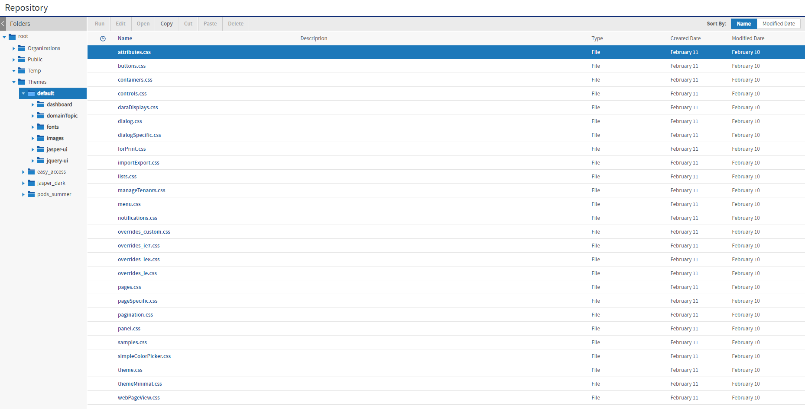

# How Themes Work

Themes are stored in a special folder named Themes at the root of the repository and in every organization. Each Themes folder contains a default theme that can't be edited and any number of custom theme folders. Each theme is stored in its own folder and is known by the name of the folder.

The folder named default in every Themes folder is a special theme whose contents are controlled by the server. In the Themes folder at the root, the default theme contains the complete definition of every style that makes up the default theme shipped with JasperReports Server. In the Themes folder of every organization, the default is a system generated theme that contains all styles inherited by the given organization. None of the default theme folders can be modified, even by administrators.

!!! note

    You cannot modify the files of the default theme through the repository. If you try to do so by circumventing the repository, you could inadvertently change rules and make the UI unusable. If this happens, you'll need to re-install JasperReports Server to recover.

This chapter uses the following terminology to distinguish between root-level and organization-level themes.

| Name | Folder | Description |
|----|----|----|
| Default theme | root \> Themes \> default | The unmodified UI as it appears at installation. The default theme is defined in the default folder in the Themes folder at the root of the repository. |
| System theme | root \> Themes \> active-theme | The active theme set at the root level. All users in all organizations see this theme unless an organization-specific theme is activated. |
| Inherited theme | Organization \> Themes \> default | The combination of all themes applied to the parent organizations and inherited by a suborganization. The organization's inherited theme is stored in the default folder within the organization's Themes folder. |
| Active theme | Organization \> Themes \> active-theme | The theme that's active at the organization or system level. Users see a combination of the active and inherited theme, depending on the files in the active theme and the inheritance rules. |

Every level of organization, including the root, has a designated active theme. If no custom theme is made active, the default theme at every level is the active theme.

The following figure shows the files of the default theme in the Themes folder at the root of the repository. The name of the folder and its subfolders are bold indicating that it's the active theme.

*Figure 1: Contents of the Root default Theme*

## Theme Files

A complete theme consists of the files listed for the default theme, as shown in the previous figure, along with all referenced images. The file `samples.css` is provided for reference when creating themes. The files `overrides_ie7.css` and `overrides_ie8.css` are only loaded with the style sheets when the user's browser is Internet Explorer 7 or 8, respectively.

The images associated with a theme include all the icons in the user interface and backgrounds for buttons and borders. Several icons and backgrounds can be stored in the same file called a sprite. The theme also includes the `favicon.ico` file that appears on browser tabs. There are over 70 image files in the default theme.

The image files for the default theme are stored in a folder named images. In a custom theme, there are two ways to change an image of the default theme:

- Create a folder named images and an image file with the same name as the one you want to replace.

- Modify the corresponding CSS rules to specify the name and location of a different image.

When you modify the CSS rules, you can use any of the following ways to reference image files or any other helper file:

- Directly in the theme folder. In this case the file is referenced without a path, for example `"myfile.png"` in CSS.

- In any folder path located in the theme folder. For example, your custom CSS file could refer to `"MyImages/myfile.png"` if you create a folder named `MyImages` in the theme folder and upload your images there.

- Anywhere on the Internet. Following the CSS standard, your custom CSS can refer to images or any helper file with a regular URL.

## Inheritance

In order to render the user interface, JasperReports Server must load each of the CSS files listed in Contents of the Root default Theme. Because each file can be stored in multiple themes, inheritance determines which file to load. To locate the file, the server looks in the following locations, in the order listed below.

1.  The active theme folder for the user's organization: `<organization>/Themes/<active-theme>`.
2.  The inherited theme stored in the folder named `<organization>/Themes/default`.

When one of the CSS files references an image file or a helper file, including any path to that file, the server looks for that path and filename in the same two locations, in the same order. In this way, each file and image is resolved first in the active theme, and if not found, then in the inherited theme.

The active theme does not need to contain all the files because the inherited theme that is maintained by the server is guaranteed to contain all the files. Maintaining the inherited theme in every organization is the second task of inheritance.

The server maintains the inherited theme in each organization using the same algorithm. Whenever an administrator changes the active theme or modifies a file in the active theme, the server uses the same algorithm to find all files that define the active theme in this organization and makes a copy of them in every child organization. Thus, the active theme at the parent level becomes the inherited theme at the child organization level. For nested levels of organizations, the algorithm repeats on each level after updating the copy of the inherited theme. In this way, any changes are propagated down to every organization, and yet every level can maintain local overrides in its active theme.

!!! note

    Propagating changes to the inherited themes is computationally intensive and can take several moments after making a change to a theme. However, determining inheritance when changes are made is an effective trade-off so that CSS files for rendering client request are resolved nearly instantly.

## CSS Priority Scheme and Custom Overrides

Once inheritance determines which files to load, the standard CSS priority scheme determines which rules are visible, based on the order in which files are loaded.

This leads to two general ways of developing custom themes:

- The quickest way is to copy individual CSS rules from the default theme files, modify the rules to change the UI, and save them in the `overrides_custom.css` file. This is the only file in your new theme. Because `overrides_custom.css` is always the last CSS file to be loaded, its rules override the same rules in other files. This allows you to easily change any number of rules, and manage them all in a single file. 
  For example, if you want to increase the size of text on all the buttons in the default theme, you can do this with a few rules in the `overrides_custom.css` file. You may need to adjust the spacing for certain buttons, but the idea is you only need to change a limited number of rules.

<!-- -->

- If you modify the user interface extensively, you can use the existing structure of CSS files in the default theme. In this case, copy the relevant files from the default theme, make your modifications, and save the files in your new theme. The new files are inherited when you activate the theme.

An example of these extensive changes would be if you want to increase the size of the buttons themselves in the default theme. You would need to rewrite the majority of the rules in the buttons.css file and create images for the new buttons. In this case, it is much easier to copy the `buttons.css` file than to copy dozens of rules into the `overrides_custom.css` file. You could still use the `overrides_custom.css` file to adjust the spacing of elements around the buttons, because there would be fewer of those rules to modify.

 
We recommend using the custom overrides method for most custom themes. A custom theme that changes simple appearances such as colors, fonts, and spacing has relatively few rules and is easily manageable in a single file. And many changes can be made by copying and modifying image files in the custom theme, without writing any CSS rules. Only if you change the fundamental layout or appearance of the user interface, should you consider copying and modifying the other CSS file.

Copying and modifying CSS files is more prone to error, and is slightly less flexible due to file-based inheritance. Your copy of the file must contain all of the CSS rules as the original. If any rules are accidentally deleted or modified, even by a single character, the theme may not work properly. Also, the unmodified rules in the copy of your file now override any updates made to the same file in a parent organization.

For example, if you copy a file that defines gray buttons with plain text and you change the CSS rule to make the text bold, you have created a theme with bold, gray buttons. However, if the theme on the parent organization or system theme is modified so that buttons are blue, your file overrides the new inherited color, and you still have bold, gray buttons. If you had defined the bold text as a single rule in the `overrides_custom.css` file, your theme would show bold, blue buttons now.

## Propagation

The propagation of themes is the internal server mechanism that copies theme files according to the inheritance rules and CSS priority scheme described above, so that they are available in each organization. In general, propagation does not occur until theme files are needed, in order to reduce the performance impact.

By definition, a theme is not displayed until a user of a given organization logs in and the UI needs to be rendered. Thus, when the first user of each organization logs in after a theme change, the server determines the theme inheritance and copies the necessary files to propagate the theme. If a user is already logged in when the administrator activates a theme, propagation occurs the next time that the UI is rendered for the user, such as when running a report or going back to the repository.

For example, when the system administrator sets the root theme, he or she can immediately look at the theme files in other organizations and see that they are unchanged. However, when a user of a given organization logs in, then the files of the inherited theme for that organization will be updated to reflect the theme change. Inherited themes in other organizations will not be updated yet.

Determining theme inheritance and copying theme files will have a performance impact, and the user may have a small delay after login or before the UI is rendered again. Administrators can use the login-as feature to force the propagation of themes in a given organization and also verify the appearance of the theme in that organization.

Administrators may also force the propagation of themes at server start-up with the following configuration setting:

<table>
<colgroup>
<col style="width: 33%" />
<col style="width: 33%" />
<col style="width: 33%" />
</colgroup>
<thead>
<tr>
<th colspan="3">
Forcing Theme Propagation on Server Restart
</th>
</tr>
</thead>
<tbody>
<tr>
<td colspan="3">
Configuration File
</td>
</tr>
<tr>
<td colspan="3">
<code>.../WEB-INF/applicationContext-onStart-web-pro.xml</code>
</td>
</tr>
<tr>
<td>
Property
</td>
<td>
Value
</td>
<td>
Description
</td>
</tr>
<tr>
<td>
<code>forceFullTheme</code> 
<code>PropagationOnStart</code>
</td>
<td>
<code>false</code> 
(default)
</td>
<td>
When set to <code>true</code>, the server will propagate theme files to all organizations during the start-up process. This involves determining inheritance of all theme files and copying the necessary ones into every organization. Due to the overhead, this may affect server start-up times, however the first login into each organization will no longer have the delay from the propagation of themes.

By default, this setting is false and no themes are propagated during start-up, thus avoiding the performance delay.

This setting only affects server start-up. Between server restarts, changes to themes are still propagated only when needed by the first user of each organization.
</td>
</tr>
</tbody>
</table>
