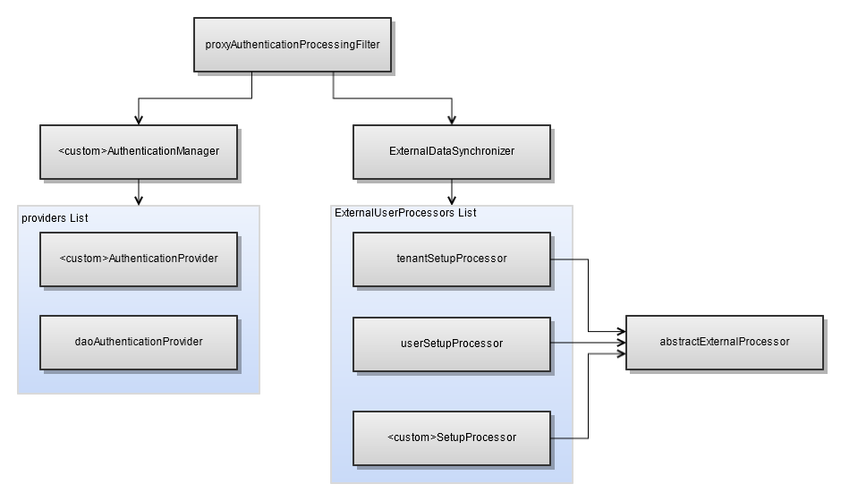

# External Authentication Beans

The external authentication framework consists of the following beans:

1.  `proxyAuthenticationProcessingFilter`: Bean to which the filter chain configured in applicationContext-security-web.xml delegates authentication via `delegatingExceptionTranslationFilter`. When a `proxyAuthenticationProcessingFilter` bean appears in an applicationContext-\<customName\>.xml file in the \<js-webapp\>/WEB-INF directory, `delegatingExceptionTranslationFilter` processes the authentication via the proxy definition instead of the default `authenticationProcessingFilter`.

2.  `customAuthenticationProvider`: Bean for providing custom authentication. This bean takes information from the JasperReports Server login request and authenticates the user; it returns user name, roles, and organizations in a Spring `userDetails` object. `customAuthenticationProvider` is invoked by Spring’s `ProviderManager` class, as specified in the `providers` property.

3.   `externalDataSynchronizer`: Bean whose class creates a mirror image of the external user in the internal jasperserver database. The user synchronization work is performed by a list of processors specified in the `externalUserProcessors` property, called in the order of their appearance. This bean is invoked by the `proxyAuthenticationProcessingFilter` bean's class on successful user authentication. The `externalDataSynchronizer` bean has the following property:

    -  `externalUserProcessors` property: Lists processors implementing the `Processor` interface. These processors run on JasperReports Server after the user has been authenticated. Mandatory processors to implement are:

      - `TenantSetupProcessor`: If you have multiple organizations in your deployment, implement a bean of this class to specify the mapping from organizations in your external data source to organizations in JasperReports Server.
      - `ExternalUserSetupProcessor` or `mtExternalUserSetupProcessor`: Implement a bean of this class to specify how to synchronize external users and roles with the internal JasperReports Server database.

You can also write custom processors as described in [Creating a Custom Processor](creating-custom-processor.md).

*Figure 1: Beans for JasperReports Server External Authentication API*
