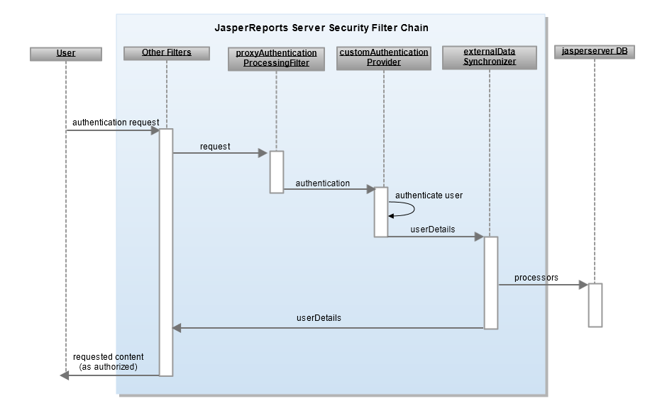

# Authentication Based on Request

When your user request has sufficient information for your custom authentication method to authenticate directly from the request, you can create a custom authentication provider to automatically authenticate the user and create organizations and roles. This corresponds to Spring Security’s pre-authenticated scenario. The exact implementation depends on the external authentication you are using. In some cases, you may need to obtain user roles and organizations from a separate source.

!!! note

    If you're passing information in the HTTP request, as with Siteminder, it's extremely important that your external system is configured properly to prevent an attacker from forging the HTTP headers.

The JasperReports Server deployment includes a sample file for custom authentication in the &lt;js‑install&gt;/samples/externalAuth-sample-config folder: the sample-applicationContext-externalAuth-template-mt.xml file (commercial editions) or sample-applicationContext-externalAuth-template.xml (community editions). This sample takes the IP address from the user’s authentication request, creates a user with the same name in JasperReports Server, and uses the JasperReports Server API to create a user folder in the JasperReports Server Repository and set permissions.



*Figure 1 Sequence Diagram for Authentication Based on the Request*

To set up authentication based on the request:

1.  Modify `CustomAuthenticationProcessingFilter.java` to work with your authentication method. This class takes a single `HttpServletRequest` parameter and returns a Spring `Authentication` object. You can use one of Spring's implementations of `Authentication` or our `CustomAuthenticationToken`. Your user request needs to have sufficient information for your custom authentication method to authenticate using the request.

2.  Create a `myCustomProvider` class implementing `AuthenticationProvider`. In this class you must use the authentication object created in the previous step. For more information, refer to the documentation for Spring Security, as described in [Spring Security](../introduction/spring-security.md).

3.  In sample-applicationContext-template.xml, add `myCustomProvider` to the providers list in `customAuthenticationManager`. Your provider should authenticate using the object returned by `CustomAuthenticationProcessingFilter`.

    ``` xml
    <bean id="customAuthenticationManager" class="com.jaspersoft.jasperserver.api.security.
          externalAuth.wrappers.spring.JSProviderManager">
      <property name="providers">
        <list>
         <ref bean="${bean.myCustomProvider}"/>
         <ref bean="${bean.daoAuthenticationProvider}"/>
       </list>
     </property>
    </bean>
    ```

4.  Comment out or remove the sample provider.

    ``` text
    /* <bean id="customAuthenticationProvider  class="com.jaspersoft.jasperserver.api.security.
          externalAuth.custom.CustomAuthenticationProvider"/> */
    ```

5.  Set up your processors to work with your users and organizations. You can use the processors for LDAP or CAS as examples.

6.  Copy the modified file to the WEB-INF folder and remove the sample- prefix.
