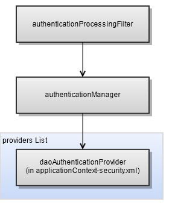

# Internal Authentication Beans

JasperReports Server uses Spring Security for authentication. When JasperReports Server receives a request, from either a person using the web interface or an application using the web services, the Spring Security filter chain processes that request. The filter chains in applicationContext-security-web.xml are based on the standard Spring Security filter chains.

The following figure shows the most important authentication-related beans in the filter chain:

*Figure 1: Beans for Internal Authentication in JasperReports Server*

1.  `authenticationProcessingFilter` — Responsible for authenticating the user and creating the principal object in memory. With default authentication, this filter redirects the user to the login page, then processes the organization ID, username, and password.
2.  `authenticationManager` — Bean of Spring class `ProviderManager` that manages default authentication by invoking a list of providers. JasperReports Server relies on `${bean.daoAuthenticationProvider}` for internal authentication.
3.  `${bean.daoAuthenticationProvider}` — Bean for performing authentication to the `jasperserver` internal database configured in &lt;js-webapp&gt;/WEB-INF/applicationContext-security.xml.

The filter chains for authentication are configured for the following patterns:

-   The `/xmla` pattern represents the XML for Analysis (XML/A) servlet. They are configured with a set of filters designed to receive client SOAP requests. SOAP is implemented in the sample files for LDAP.
-   The `/services/**` pattern represents the XML for SOAP web services. In this filter chain, the `${bean.basicProcessingFilter}` bean initiates internal authentication. SOAP is implemented in the sample files for LDAP.
-   The `/rest/login`, `/rest/**`, and `rest_v2/**` patterns represent the XML for REST web services. In this filter chain, the `restAuthenticationProcessingFilter` and `${bean.basicProcessingFilter}` beans initiate internal authentication. REST is implemented in the sample files for LDAP.
-   The `/**` pattern matches anything that wasn’t caught by another pattern. This pattern is designed for people using web browsers. In this filter chain, the `authenticationProcessingFilter` bean initiates.
