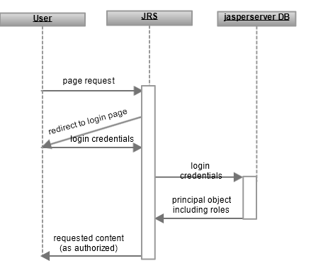

# Default Internal Authentication

The following diagram shows the general steps involved in JasperReports Server’s default internal authentication:

*Figure 1: Steps of Internal Authentication*

The interaction between the user’s browser and JasperReports Server includes these general steps:

1.  An unauthenticated user requests any page in JasperReports Server. 
    Often, users bookmark the login page and begin directly at Step 3, but this step covers the general case and secures every possible access to the server. For example, this step applies when a user clicks the page of an expired session or if a user enters the direct URL to a report in the repository.
2.  JasperReports Server detects that the user is not logged in and replies with a redirect to the login page. 
    For convenience, the server includes the original URL in the login screen request so that the user goes directly to the requested page after logging in.
3.  The user enters a username, password, and possibly an organization ID. 
    JasperReports Server compares these credentials with the existing user accounts in the internal user database, and if they are valid, creates a principal object. The user is now authenticated, and the principal object represents the user session, including any roles found in the user database.
4.  JasperReports Server sends the requested content to the user, or if none was specified, the home page. 
    Content that is sent to the user is subject to authorization. For example the home page has different options for administrators than for end-users, as determined by the roles of the user in the principal object. If the user is viewing the repository, the folders and objects returned depend on the organization ID and roles in the principal object.
