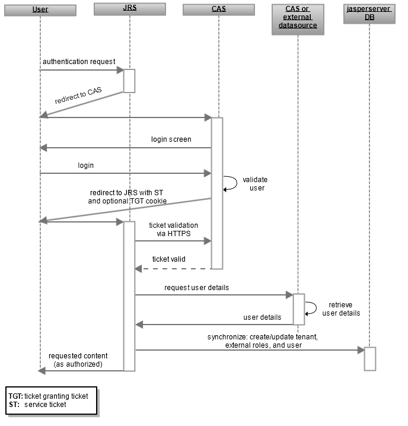

# Overview of External CAS Authentication

This section describes how JasperReports Server integrates Spring Security to perform external CAS authentication, including SSO.

The following figure shows the general protocol during external CAS authentication:

*Figure 1: General Steps of External CAS Authentication*

The overview in this section explains the major steps involved in the protocol between the CAS server and JasperReports Server, as well as the Spring Security beans involved. This chapter does not explain CAS proxies, but it does cover the Spring Security beans used to configure JasperReports Server’s response to CAS proxies.

See <https://www.apereo.org/projects/cas> and <https://apereo.github.io/cas/7.0.x/index.html> for more information.

The interaction between the user’s browser, JasperReports Server, and the CAS server includes these steps:

1.  An unauthenticated user requests any page in JasperReports Server.

    With SSO, JasperReports Server does not have a login page for users to bookmark. Instead, users can bookmark their home page or any page that allows it in JasperReports Server. As a result, every user goes through this step for every page they request from JasperReports Server, thereby securing every possible access to JasperReports Server.

    !!! note

        Internal users, such as jasperadmin or superuser, log in by going directly to the login page, for example, http://host1:8080/jasperserver\[-pro\]/login.html.

2.  JasperReports Server detects that the user is not logged in and replies with a redirect to the CAS login page.

    The redirect URL contains the service parameter that tells CAS where to redirect the user after successful authentication. This URL activates JasperReports Server’s user authentication. For example:

    http://host2:8443/cas/login?service=http://host1:8080/jasperserver\[-pro\]/j_spring_security_check.

    !!! note

        URLs may appear translated when viewed in browsers or in log files. For example, the previous URL might be written http://host2:8443/cas/login?service=http%3A%2F%2Fhost1:8080%2Fjasperserver%2Fj_spring_security_check.

3.  The user’s browser requests the CAS login page from the CAS server. If the user has logged in previously and has a Ticket Granting Ticket (TGT) cookie, the TGT is included in the request.

4.  The CAS server attempts to authenticate the user’s credentials.

    - If the CAS server detects the TGT cookie in the user’s login request, CAS skips verification of the user credentials.
    - If there's no TGT cookie, CAS serves its login page to the user. When the user enters a username and password, CAS verifies them against its own data source.

    After the user authenticates correctly, CAS issues the user a service ticket (for example: http://host1:8080/jasperserver-\[pro\]/j_spring_security_check?ticket=ST-8670-123buTvFFjo980) and a TGT cookie if one is not present. The TGT cookie can be used for single sign-on with other applications that use the same CAS server.

    !!! note

        If the user has disabled cookies, the CAS login protocol still works, but single sign-on fails. When no cookie is detected on the user’s browser, the user is prompted to log into the CAS server every time he accesses a client application.

5.  CAS redirects the user to the JasperReports Server with the service ticket in the redirect URL.

6.  The JasperReports Server authentication request filter is activated by the request for the j_spring_security_check resource. As part of the user authentication process, JasperReports Server establishes a secure HTTP connection (HTTPS) to CAS to validate the service ticket. If the ticket is valid, CAS replies with the username; otherwise, CAS responds with an error.

7.  If an external data source is configured, JasperReports Server connects to the data source and requests the user organization and roles associated with the username returned by CAS. If the organization and roles are configured statically, this step is skipped.

8.  JasperReports Server creates the principal object that establishes the user’s session. The username, roles, and organization are also synchronized with the internal database, where the user account is marked as an external user. For more information, see [Synchronization of External Users](../authentication-in-jrs/synchronization-users.md).

9.  As with the default internal authorization, JasperReports Server now sends the requested content to the user.

Content sent to the user is subject to authorization. For example the home page has different options for administrators than for regular users, as determined by the roles of the user in the principal object.

When comparing these steps with those in [Default Internal Authentication](../authentication-in-jrs/internal-authentication-steps.md), you'll notice several significant differences:

- JasperReports Server must redirect to the CAS login page instead of its own.
- JasperReports Server must receive the service ticket as part of the security check.
- JasperReports Server must process the service ticket and communicate with the CAS server over HTTPS.
- The roles and organization ID in the user’s principal object are mapped from the response to the request for user details.
- The internal database must be synchronized with any new information in the user’s principal object.
