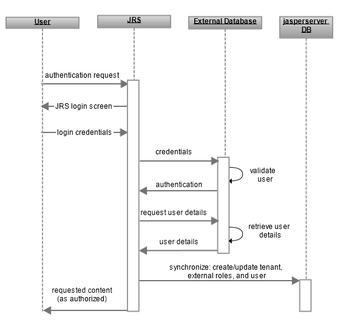

# Overview of External Database Authentication

This section describes how JasperReports Server integrates Spring Security to authenticate users against an external database.

The following figure shows the general steps for external database authentication:

*Figure 1 General Steps of External Database Authentication*

The interaction between the user’s browser, JasperReports Server, and the external database includes these steps:

1.  An unauthenticated user requests any page in JasperReports Server.
2.  JasperReports Server detects that the user is not logged in and replies with the JasperReports Server login page.
3.  The user enters their credentials.
4.  The JasperReports Server establishes a connection to the database server to verify the user's credentials.
5.  If the user submitted a valid username and password, the database server authenticates the user to JasperReports Server.
6.  JasperReports Server requests user details from the database server using a database query specified in the configuration file.
7.  The database server returns the requested details. 
    JasperReports Server maps the username to a predefined set of roles and an organization ID. The username, roles, and organization are also synchronized with the internal database, where the user account is marked as an external user. (Community editions don't need to synchronize the organization.) For more information, see [Synchronization of External Users](../authentication-in-jrs/synchronization-users.md).
8.  JasperReports Server now sends the requested content to the user. Content that is sent to the user is subject to authorization. For example, the home page has different options for administrators than for regular users.

The only difference between these steps and those in [Default Internal Authentication](../authentication-in-jrs/internal-authentication-steps.md), is that instead of searching for the user in the `jasperserver` internal database, JasperReports Server makes a JDBC call to the external database and then synchronizes the user details.
