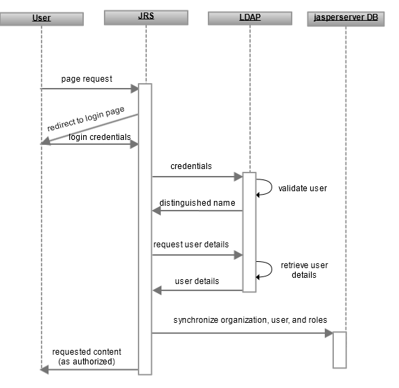

# Overview of External LDAP Authentication

This section explains how JasperReports Server performs external authentication with an LDAP server, highlighting the differences with [Default Internal Authentication](../authentication-in-jrs/internal-authentication-steps.md).

The following diagram shows the general steps involved in external LDAP authentication:

*Figure 1: General Steps of External LDAP Authentication*

The following process explains the interaction of the user’s browser, JasperReports Server, and the LDAP server:

1.  An unauthenticated user requests any page in JasperReports Server. 
    Often, users bookmark the login page and begin directly at Step 3, but this step covers the general case and secures every possible access to the server. For example, this step applies when a user clicks the web interface of an expired session or if a user is given the direct URL to a report within the server.
2.  JasperReports Server detects that the user is not logged in and redirects to the JasperReports Server login page.
3.  The user submits a username and password through the login page, even though the user credentials are not verified internally. 
    In servers with multiple organizations, the organization ID must be left blank because it is supplied by the external LDAP authority, except in the case of an internal login (such as an administrator), then the organization ID must be provided.
4.  JasperReports Server performs a search on the LDAP server with the given credentials. If they are valid, the server creates a principal object to represent the user’s session in memory. In multi-organization environments, the user’s organization ID is mapped from the LDAP entry. The server also performs a second search to map the user’s LDAP groups to server roles.

!!! note

    The beans that perform LDAP authentication do not map information like the user’s full name, email address, or profile attributes that may exist in the LDAP directory. This requires customizing the `JSFilterBasedLdapUserSearch` bean, as described in [Advanced Topics](../advanced-topics/advanced-topics.md).

1.  The username, roles, and organization information are also synchronized with the internal database, where the user account is marked as an external user. The user is now authenticated, the principal object represents the user session, and the environment reflects the user’s roles and organization defined in LDAP. For more information about synchronization, see [Synchronization of External Users](../authentication-in-jrs/synchronization-users.md).
2.  As with the default internal authorization, JasperReports Server now sends the requested content to the user or, if none was specified, the home page appropriate for the user. 
    Content sent to the user is subject to authorization. For example the home page has different options for administrators than for regular users, as determined by the roles of the user in the principal object. Or if the user is viewing the repository, the folders and objects returned are determined by the organization ID and roles in the principal object.

When comparing these steps with those in [Default Internal Authentication](../authentication-in-jrs/internal-authentication-steps.md), there are three significant differences, all in Step 3:

-   JasperReports Server verifies the credentials through LDAP instead of using its internal user database.
-   The roles and organization ID in the user’s principal object are mapped from the LDAP response.
-   The internal database must be synchronized with any new information in the user’s principal object.
