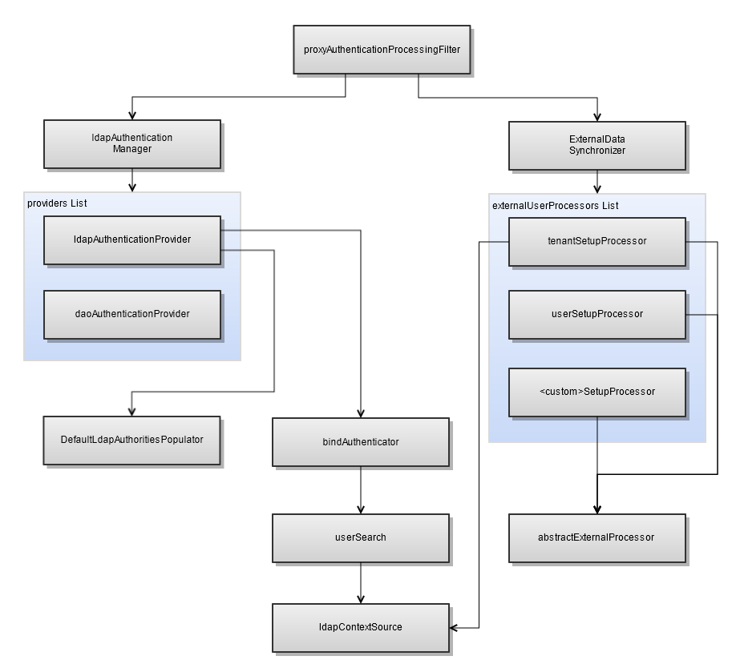

# Overview of LDAP Beans

The sample-applicationContext-externalAuth-LDAP\[-mt\].xml file contains the beans needed to enable and perform LDAP authentication. This section summarizes the most important beans in this file, including the beans you need to modify to configure JasperReports Server to work with your external database.

- `proxyAuthenticationProcessingFilter`: Bean that enables external authentication for direct access. When this proxy bean definition is present in the application context, that is, when it appears in an applicationContext-\<customName\>.xml file in the \<js‑webapp\>/WEB-INF directory, the Spring Security filter chain processes the authentication with the proxy definitions instead of the default internal filter. You do not need to configure this bean.

- `ldapAuthenticationManager`: Lists the available authentication providers. The providers in the list are invoked in the order they appear in the configuration file until one of them authenticates the user. The rest of the providers are then skipped. The final provider in the list, `${bean.daoAuthenticationProvider}` authenticates against the `jasperserver` internal database. You can customize authentication by adding more providers to this bean.

- `ldapContextSource`: Helper bean that defines the LDAP server used by the `ldapAuthenticationProvider` bean. Configure your LDAP connection using this bean, as described in [Setting the LDAP Connection Parameters](ldap-setting-connection-parameters.md).

- `ldapAuthenticationProvider`: Custom authentication provider for LDAP. This bean has two inline sub-beans:

  - Bean of class `JSBindAuthenticator`: `JSBindAuthenticator` is a wrapper class for the Spring Security `BindAuthenticator` class. Configure this bean and its sub-bean `userSearch` to specify the rules for finding user entries in your LDAP directory, as described in [Performing LDAP User Search](ldap-user-search.md).
  - Bean of class `JSDefaultLdapAuthoritiesPopulator`: `JSDefaultLdapAuthoritiesPopulator` is a wrapper class for the Spring Security `DefaultLdapAuthoritiesPopulator` class. Configure this bean to specify the location of group definitions in LDAP, how to find the groups to which the user belongs, and any transformation of group names in LDAP to role names in JasperReports Server, as described in [Mapping the User Roles](ldap-user-role-mapping.md).

- `externalDataSynchronizer`: Bean whose class creates a mirror image of the external user in the internal `jasperserver` database. The sample includes the following processors:

  - `ldapExternalTenantProcessor` (commercial editions only): Bean that maps externally defined tenants to JasperReports Server organizations. For single-organization JasperReports Server deployments, configure this bean to specify the default organization, as described in [Mapping to a Single Organization](ldap-setting-user-organization.md). For multi-organization JasperReports Server deployments, configure this bean to specify the mapping between LDAP RDNs and JasperReports Server organizations, as described in [Mapping to Multiple Organizations](ldap-setting-user-organization.md).
  - `mtExternalUserSetupProcessor` or `externalUserSetupProcessor`: Bean that creates and configures the internal user corresponding to a successfully authenticated external user. Configure this bean to specify the default internal role given to the external users in JasperReports Server and to map external LDAP roles to internal JasperReports Server roles, as described in [Mapping Roles to System Roles](ldap-mapping-system-roles.md).

The following figure shows the beans used in LDAP authentication:

*Figure 1: LDAP Beans*
