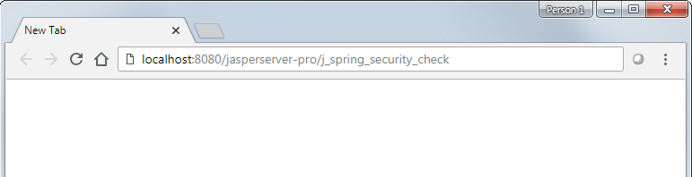

# Troubleshooting LDAP Configurations

This section describes how to diagnose and resolve some common problems with configuring external authentication for LDAP.

## Planning for Troubleshooting

If you have problems configuring external authentication for LDAP, first make sure that you have configured logging and located the files you need to diagnose and resolve the issue. If you need to contact Jaspersoft technical support, they will ask you for this information:

1.  Enable logging, including detailed LDAP logging, as described in [Configuring Logging for Debugging](../authentication-in-jrs/logging.md). For more information about logging in JasperReports Server, see the JasperReports Server Administrator Guide.
2.  Find your application context file for external authentication. The deployed file is named applicationContext-externalAuth.xml; the sample file is named applicationContext-externalAuth-LDAP-mt.xml or applicationContext-externalAuth-LDAP.xml. This file can be modified in any text editor.
3.  Export the LDIF file for your LDAP server. You can view the exported file in an LDIF editor. Most LDAP browsers and/or LDIF editors support export. If you do not have an LDIF editor, you can find a free open-source editor on the web, such as Apache Directory Studio. Many common IDEs, such as Eclipse, also support LDIF plugins.

## "Invalid Credentials Supplied" Errors

One common error you will see when trying to log in to JasperReports Server is an invalid credential error, with the following message:

``` text
Invalid credentials supplied.
Could not login to JasperReports Server.
```

This error can be misleading, because it can come from a wide range of root causes, including problems that are not directly related to the credentials used. These include:

-   Communication issues
-   User search issues

!!! note

    "Invalid credentials supplied" errors can be misleading, as they are not always related to the credentials used.

### Problems Communicating with the LDAP Server

If you receive an invalid credentials error, the first thing to check for is errors connecting to the LDAP server. Search the jasperserver.log file for any stack trace containing the following:

``` text
javax.naming.CommunicationException
```

If you see this in the logs, you need to dig a little further to find the cause of the communication exception.

#### Incorrect Connection URL

##### Problem

If the URL for the LDAP server is incorrect in applicationContext-externalAuth.xml, you will see an error such as the following:

``` text
ERROR EncryptionAuthenticationProcessingFilter,http-apr-8630-exec-6:218 - An internal error occurred while trying to authenticate the user.
org.springframework.security.authentication.InternalAuthenticationServiceException: localhost:10399; nested exception is javax.naming.CommunicationException: localhost:10399 [Root exception is java.net.ConnectException: Connection refused: connect]
```

##### Solution

To fix this error, locate the following lines in applicationContext-externalAuth.xml and verify that `myLDAPServer` is correct hostname for your LDAP server and that and `port` is your LDAP server port:

``` xml
<bean id="ldapContextSource"
            class="com.jaspersoft.jasperserver.api.security.externalAuth.ldap.JSLdapContextSource">
    <constructor-arg value="ldap://myLDAPServer:port"/>
```

Edit this information to point to the correct server and port.

#### Timeout Errors

##### Problem

If the connection is timing out while trying to talk to the LDAP server, you will see a "Connection timed out" error in the log, such as:

``` text
ERROR EncryptionAuthenticationProcessingFilter,http-apr-8630-exec-3:218 - An internal error occurred while trying to authenticate the user.
org.springframework.security.authentication.InternalAuthenticationServiceException: 172.17.10.63:10390; nested exception is javax.naming.CommunicationException: 172.17.10.63:10390 [Root exception is java.net.ConnectException: Connection timed out: connect]
```

##### Solution

To fix this error, ensure that the LDAP server is reachable from the server that is hosting JasperReports Server. Possible causes for connectivity problems include (but are not limited to): firewalls, anti-virus software, or an incorrectly configured DMZ.

### Problems with User Search

"Invalid credentials supplied" errors are frequently caused by problems with the way user search is configured.

#### Unable to Find an LDAP Branch

##### Problem

If JasperReports Server can’t find the user because you have not configured the server to communicate with an existing branch within LDAP, you may see an "Invalid search base" error in jasperserver.log. For example:

``` yaml
org.apache.directory.api.ldap.model.exception.LdapNoSuchObjectException: ERR_648 Invalid search base ou=users,dc=example,dc=com
```

##### Solution

To resolve this, check with your LDAP admin that the search base you are using exists within your LDAP directory. The search base is usually specified in the `<constructor-arg index="0">` parameter in the `userSearch` bean in applicationContext-externalAuth.xml.

#### Incorrect or Missing Partition

##### Problem

If JasperReports Server can’t find the user because the search is not configured to look in the correct partition, you may see a "Cannot find a partition" error in jasperserver.log, for example:

``` text
ERR_268 Cannot find a partition for ou=users,o=mojo55:
org.apache.directory.api.ldap.model.exception.LdapNoSuchObjectException: ERR_268 Cannot find a partition for ou=users,o=mojo55
```

##### Solution

This error can arise if you are importing your LDIF file. In this case, the partitions may not be created automatically, and therefore are not searchable. Check the LDAP connection URL in the `ldapContextSource` bean in applicationContext-externalAuth.xml. If the partition is not present, you can append it to the bean.

#### Invalid Search Filter

##### Problem

If the search filter is not constructed correctly in your applicationContext-externalAuth.xml file your connection will fail. This error can be tricky because it does not always give an error code in the log. Instead, the query is valid, but when it searches your LDAP directory, it simply returns nothing:

``` text
DEBUG FilterBasedLdapUserSearch,http-apr-8630-exec-8:107 - Searching for user 'hwilliams', with user search [ searchFilter: '(sAMAccountName={0})', searchBase: 'ou=users', scope: subtree, searchTimeLimit: 0, derefLinkFlag: false ]
DEBUG SpringSecurityLdapTemplate,http-apr-8630-exec-8:211 - Searching for entry under DN 'o=mojo', base = 'ou=users', filter = '(sAMAccountName={0})'
```

!!! note

    An invalid search filter is a filter that is malformed or cannot be loaded. You can also have a correctly formed search filter that returns incorrect results. See [User Not Found By Valid Search Filter](#user-not-found-by-valid-search-filter) for more information.

##### Solution

If you suspect the search filter might be invalid, run the query in a third-party LDAP client and see if it returns any users. If the query does not return any users, correct the query to retrieve the users you want, then update your applicationContext-externalAuth.xml file with the correct query.

#### Failure to Bind the User

##### Problem

In some cases, the user is found, but the bind process fails. You might see an error in the logs such as the following:

``` text
Failed to bind as uid=myUser,OU=Users,OU=MTC-Users: org.springframework.ldap.AuthenticationException: [LDAP: error code 49 - 80090308: LdapErr: DSID-0C09042A, comment: AcceptSecurityContext error, data 52e, v3839
```

##### Solution

A common reason for this is because of a mismatch in the DN format between what you specify in your search query versus what is acceptable for your specific version of LDAP. The precise solution depends on the implementation and configuration of your LDAP server. For more information, please consult documentation for your LDAP solution.

#### User Not Found By Valid Search Filter

##### Problem

A valid search filter that runs and returns results may not find all intended users. In this case you will see the same failed authentication message in the log as you would for an unauthorized user:

``` text
FilterBasedLdapUserSearch,http-apr-8630-exec-8:107 - Searching for user 'myUser', with user search [ searchFilter: '(uid={0})', searchBase: 'ou=users, o=org1', scope: subtree, searchTimeLimit: 0, derefLinkFlag: false ]
DEBUG SpringSecurityLdapTemplate,http-apr-8630-exec-8:211 - Searching for entry under DN '', base = 'ou=users,o=org1', filter = '(uid={0})'
DEBUG ProviderManager,http-apr-8630-exec-8:152 - Authentication attempt using com.jaspersoft.jasperserver.multipleTenancy.MTDaoAuthenticationProvider
DEBUG SimpleUrlAuthenticationFailureHandler,http-apr-8630-exec-8:67 - Redirecting to /login.html?error=1
DEBUG DefaultRedirectStrategy,http-apr-8630-exec-8:36 - Redirecting to '/jasperserver-pro/login.html?error=1'
```

##### Solution

This can happen for a number of causes. One of the most common is that the search filter is valid but is not returning the set of users you want. You could have misconfigured your query or you could be pointing to the wrong query in your applicationContext-externalAuth.xml file. Test the query shown in the log by running it in a third-party LDAP client and see if it returns the missing user.

To fix an incorrect query, look for the search filter in the applicationContext-externalAuth.xml file. Search filters are declared in the `ldapAuthenticationManager` bean, and the filter definition containing the query string is defined later in the same file. Check to make sure the search string is correct and that `ldapAuthenticationManager` is pointing to the correct search filter.

### Login Page Not Loading

Another common symptom with multiple causes is failure to load the login page.

A blank page is shown instead.

#### Invalid Application Context File

##### Problem

If your application context file, applicationContext-externalAuth.xml, is not a valid XML file, the login page does not load. You may see a stack trace in the logs, specifying the invalid file:

``` text
Context initialization failed
org.springframework.beans.factory.xml.XmlBeanDefinitionStoreException: Line <lineNumber> in XML document from ServletContext resource [/WEB-INF/applicationContext-externalAuth-LDAP-mt.xml] is invalid; nested exception is org.xml.sax.SAXParseException; lineNumber: <lineNumber>; columnNumber: <columnNumber>; The element type "property" must be terminated by the matching end-tag "</property>"
```

##### Solution

Usually the stack trace shows the name of the invalid file, the location in the file that is causing the problem, and the error that triggered the stack trace. The resolution depends on the error. In some cases, the location in the stack trace will not be the location of the root problem in the file.

In the example above, there is a missing ending tag for `property`. To fix this, add the tag at the location specified by `<lineNumber>` and `<columnNumber>`.

#### XML Special Characters in Role Names

##### Problem

Role names can't contain certain special characters, including the XML reserved characters &lt;, &gt;, &, ', ", and \\. If you use a reserved character in a role name in your XML file, JasperReports Server attempts to interpret it as XML, which results in a stack trace. The precise error depends on the special character. For example, if you use an ampersand (&) in a role name, you see an error like this:

``` text
context initialization failed
org.springframework.beans.factory.xml.XmlBeanDefinitionStoreException: Line <lineNumber> in XML document from ServletContext resource [/WEB-INF/applicationContext-externalAuth-LDAP-mt.xml] is invalid; nested exception is org.xml.sax.SAXParseException; lineNumber: <lineNumber>; columnNumber: <columnNumber>; The entity name must immediately follow the '&' in the entity reference.
    at org.springframework.beans.factory.xml.XmlBeanDefinitionReader.doLoadBeanDefinitions(XmlBeanDefinitionReader.java:397)
```

##### Solution

In general, it is safest to restrict role names to alpha-numeric characters. If extended characters are necessary for your naming convention, choose non-reserved characters.

#### Missing Bean Definition

##### Problem

Jasper is trying to read a bean definition that doesn’t exist. In the error message, you see reference to the &lt;type of bean&gt;, which typically refers to the actual java class name for that bean definition. The bean name in the applicationContext-externalAuth.xml file may appear later in the error:

``` text
Caused by: org.springframework.beans.factory.BeanCreationException: Error creating bean with name '<type of bean>' defined in ServletContext resource [/WEB-INF/applicationContext-externalAuth-LDAP-mt.xml]: Cannot resolve reference to bean '<myBean>' while setting bean property 'userSearch'; nested exception is org.springframework.beans.factory.NoSuchBeanDefinitionException: No bean named '<myBean>' is defined
```

##### Solution

Check the following:

1.  Make sure the bean is defined in your application context XML file.
2.  Verify that the name of the bean is correct in your applicationContext-externalAuth.xml. If the bean name is spelled wrong, it won't be found.

### Missing Java Class

##### Problem

JasperReports Server can't find a Java class referenced in the XML file. The stack trace shows the name of the class:

``` text
Caused by: org.springframework.beans.factory.CannotLoadBeanClassException: Cannot find class [className] for bean with name 'ldapAuthenticationProvider' defined in ServletContext resource [/WEB-INF/applicationContext-externalAuth-LDAP-mt.xml]; nested exception is java.lang.ClassNotFoundException: <className>
```

##### Solution

Check the following:

1.  Make sure the jar containing the specified class can be found in the classpath, (for example, \\jasperserver-pro\\WEB-INF\\lib).
2.  Verify that the name of the class is correct in your XML file. If the class name is spelled wrong, it won't be found as the name won't match, even if the class is present in a jar in the classpath.

## Login Displays Security Check Page

##### Problem

JasperReports Server displays the j_spring_security_check page:



*Figure 1 j_spring_security_check Page*

In the jasperserver.log, look for `DefaultLdapAuthoritiesPopulator` and problems locating roles:

``` text
DefaultLdapAuthoritiesPopulator,http-apr-8630-exec-9:211 - Searching for roles for user 'guest01', DN = 'cn=guest 01,cn=Users,dc=test,dc=com', with filter (objectClass=group) in search base 'DC=test,DC=com'
SpringSecurityLdapTemplate,http-apr-8630-exec-9:150 - Using filter: (objectClass=group)
HttpSessionSecurityContextRepository,http-apr-8630-exec-9:304 - SecurityContext is empty or contents are anonymous - context will not be stored in HttpSession.
SecurityContextPersistenceFilter,http-apr-8630-exec-9:97 - SecurityContextHolder now cleared, as request processing completed
```

##### Solution

Errors with `DefaultLdapAuthoritiesPopulator` indicate that no roles could be found for this user. As part of the login process, the user is both authenticated and authorized. JasperReports Server uses LDAP and `DefaultLdapAuthoritiesPopulator` to determine which roles to assign to the user. A user needs at least ROLE_USER to log in. If no roles are assigned to the user, the login fails as above.

Ensure that you've configured role search correctly in the `JSDefaultLdapAuthoritiesPopulator` bean in your LDAP file. Make sure that it is using the correct branch in your LDAP.
