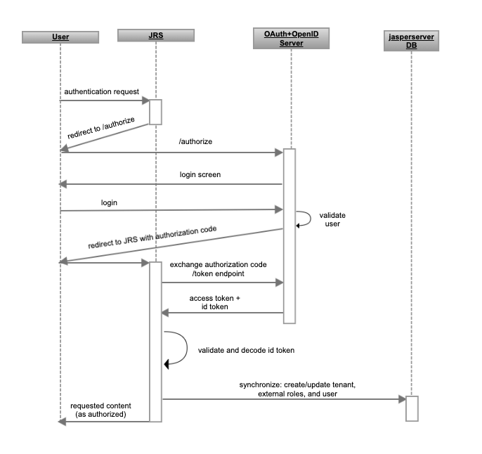

# OAuth Authentication

OAuth (Open Authorization) is an industry-standard protocol that enables secure access delegation. This allows applications to access resources or perform actions on behalf of users without exposing their credentials. OAuth simplifies the process of granting controlled access to resources, enhancing the user experience while maintaining security.

One of the most valuable applications of OAuth is user authentication. Beyond its role in resource access, OAuth serves as a robust and flexible mechanism for verifying and authorizing users. For JasperReports Server to apply this authentication mechanism effectively, it is required that the OAuth provider supports OpenID Connect (OIDC). OIDC extends the authentication process by enabling the retrieval of user details and claims. This enables JasperReports Server integration with third-party services and applications.

## OAuth Authentication Flow in JasperReports Server

This section explains how JasperReports Server performs authentication using OAuth.

The following diagram shows the general steps involved in logging into JasperReports Server using OAuth:

*Figure 1: General Steps for OAuth Authentication*

The following steps explain the interaction between the user’s browser, JasperReports Server, and an OAuth provider:

1.  A user requests any page in JasperReports Server.
2.  JasperReports Server redirects the user to a special, configurable OAuth endpoint that can verify the user session.
3.  The OAuth provider checks if that user's browser has an existing active session in the OAuth server and:

-   If no active session, then a login form on the OAuth Provider side is shown, the user provides credentials, then OAuth redirects the user's browser to JasperReports Server with an authorization code.
-   If there is already an active session, then the user's browser is redirected to JasperReports Server with an authorization code.

1.  JasperReports Server sends an authorization code to OAuth and requests access token and id token.
2.  When a JWT token (JSON Web Token) is received from the OAuth provider, JasperReports Server validates and decodes it.
3.  If the token is valid, then JasperReports Server synchronizes user details in the JasperReports Server repository database.
4.  After synchronization is done, the user is authenticated in JasperReports Server and is authorized based on defined roles.

## Configuring OAuth

The following sections describe how to configure JasperReports Server to use an OAuth provider.

### How to Enable OAuth in JasperReports Server

To enable OAuth in JasperReports Server, edit the *web.xml* file.

In the section:

&lt;context-param&gt;

&lt;param-name&gt;spring.profiles.active&lt;/param-name&gt;

&lt;param-value&gt;default,engine,jrs&lt;/param-value&gt;

&lt;/context-param&gt;

Add *,oauth* after JRS.

For example:

&lt;param-value&gt;default,engine,jrs,oauth&lt;/param-value&gt;

### Configuring JasperReports Server to use OAuth Authentication

On the deployed JasperReports Server, locate the following file:

*jasperserver-pro/WEB-INF/classes/oauth-clientconfig.properties file*, and configure the properties according to your use case.

### OAuth Configuration Properties

The following table describes OAuth Client-related properties found in the oauth-clientconfig.properties file.

| Property Name | Property Description |
|----|----|
| spring.security.oauth2.client.registration.oidc.registration-id | The registration-id property is a unique identifier used in the configuration of OAuth 2.0 client registration within a Spring Security framework. |
| spring.security.oauth2.client.registration.oidc.client-id | The client-id property is a required configuration parameter for OAuth2 client registration when integrating with an OpenID Connect (OIDC) provider. It represents the unique client identifier assigned by the OIDC provider during the application registration process. |
| spring.security.oauth2.client.registration.oidc.client-secret | The client-secret property is a required configuration parameter for OAuth2 client registration when integrating with an OpenID Connect (OIDC) provider. It represents a confidential, client-specific, and secret credential assigned by the OIDC provider during the application registration process. |
| spring.security.oauth2.client.registration.oidc.client_authenticationMethod | The client_authenticationMethod property is used to specify the method by which JasperReports Server authenticates itself to the OpenID Connect (OIDC) provider during the client registration process. |
| spring.security.oauth2.client.registration.oidc.redirect-uri | The redirect-uri property specifies the URI to which the OIDC provider will redirect the user's browser after the user successfully authorizes your application. JasperReports Server already has this endpoint available - oauth, but you must provide the full URL which user's browser can access. For example: *https://my.company/jasperserver-pro/oauth* |
| spring.security.oauth2.client.registration.oidc.scope | The scope property is used to define the access scope for the OIDC client registration within JasperReports Server application. It specifies the level of access that JasperReports Server is requesting when interacting with the OIDC provider. |
| spring.security.oauth2.client.registration.oidc.filterProcessesUrl | The filterProcessesUrl property defines the URL path to which the OIDC provider's authentication and authorization response will be directed for processing by JasperReports Server. |
| spring.security.oauth2.client.registration.oidc.authorization-uri | The authorization-uri property specifies the URI where the OIDC provider's authorization server is located. This URI is used during the OAuth2 authorization code flow to initiate the user authentication and authorization process. |
| spring.security.oauth2.client.provider.oidc.token-uri | The token-uri property specifies the URI where the OIDC provider's token endpoint is located. This URI is required for JasperReports Server to obtain tokens during the OAuth2 flow. |
| spring.security.oauth2.client.provider.oidc.jwk-uri | The jwk-uri property specifies the URI where the OIDC provider's JSON Web Key (JWK) Set is located. The JWK Set contains the public keys that JasperReports Server application can use to verify the authenticity of tokens issued by the OIDC provider. |
| spring.security.oauth2.client.provider.oidc.issuer-uri | The issuer-uri property specifies the URI of the OIDC provider's issuer. The issuer URI serves as a unique identifier for the provider and is required for verifying the authenticity and trustworthiness of OIDC tokens. |

The following table describes OAuth JasperReports Server-related properties found in the oauth-clientconfig.properties file.

| Property Name | Property Description |
|----|----|
| spring.security.oauth2.jrs.entrypoint | The entrypoint property is the URL that is a starting point that initiates an authorization request, and endpoint should end with registration-id. |
| spring.security.oauth2.jrs.logouturl | The logouturl property is the URL that JasperReports Server will direct a user to when a logout action is triggered. Typically, this URL should be a designated logout endpoint on the OpenID Connect (OIDC) side. It can also include a redirect URL, where the user will be sent after a successful logout out from the OAuth server. |
| spring.security.oauth2.user.attributes.mapping.name | The mapping.name property is the JWT attribute that holds information about user which will be used in JasperReports Server as the user id. |
| spring.security.oauth2.user.attributes.mapping.display-name | The mapping.display-name property is the JWT attribute that holds information about user which will be used in JasperReports Server as user name (display name). |
| spring.security.oauth2.user.attributes.mapping.email | The mapping.email property is the JWT attribute that holds information about user which will be used in JasperReports Server as the user's email. |
| spring.security.oauth2.user.attributes.mapping.organization-id | The mapping.organization-id property is the JWT attribute that holds information about user which will be used in JasperReports Server as user's organization id. |
| spring.security.oauth2.user.attributes.mapping.org-delimiter | The mapping.org-delimiter property is the delimiter character that is used to separate organization ids when hierarchy or organizations is provided. |
| spring.security.oauth2.external.tenant.defaultOrganization | The defaultOrganization property is the default organization where the user will be placed. |
| spring.security.oauth2.user.attributes.mapping.roles | The mapping.roles property is the JWT attribute that holds information about user which will be used in JasperReports Server as the user's role. |
| spring.security.oauth2.external.user.organizationRoleMap | The organizationRoleMap property is the mapping of external (OIDC) roles to internal roles in JasperReports Server. |
| spring.security.oauth2.profile.attributes.prefix | The attributes.prefix property is the prefix for any JWT attributes that can be used as user profile attributes in JasperReports Server. |

### Sample Integration with OAuth2 Provider

The following is an example of how to connect JasperReports Server to an OAuth2 provider (Okta).

Edit `jasperserver-pro/WEB-INF/classes/oauth-clientconfig.properties` and set required properties as follows:

spring.security.oauth2.client.registration.oidc.registration-id=oidc

spring.security.oauth2.client.registration.oidc.client-id=&lt;application-client-id&gt;

spring.security.oauth2.client.registration.oidc.client-secret=&lt;application-secret&gt;

spring.security.oauth2.client.registration.oidc.client_authenticationMethod=client_secret_post

spring.security.oauth2.client.registration.oidc.redirect-uri=https://my.company/jasperserver-pro/oauth

spring.security.oauth2.client.registration.oidc.scope=openid,profile,phone,email

spring.security.oauth2.client.registration.oidc.authorization-uri=https://dev.okta.com/oauth2/default/v1/authorize

spring.security.oauth2.client.registration.oidc.filterProcessesUrl=/oauth

spring.security.oauth2.client.provider.oidc.token-uri=https://dev.okta.com/oauth2/default/v1/token

spring.security.oauth2.client.provider.oidc.jwk-uri=https://dev.okta.com/oauth2/default/v1/keys

spring.security.oauth2.client.provider.oidc.issuer-uri=https://dev.okta.com/oauth2/default

spring.security.oauth2.jrs.entrypoint=https://my.company/jasperserver-pro/oauth2/authorization/oidc

spring.security.oauth2.jrs.logouturl=https://dev.okta.com/oauth2/default/v1/logout?id_token_hint=##ID_TOKEN##&post_logout_redirect_uri=https%3A%2F%2Fmy.company.com%3A8080%2Fjasperserver-pro%2F

spring.security.oauth2.user.attributes.mapping.name=preferred_username

spring.security.oauth2.user.attributes.mapping.display-name=name

spring.security.oauth2.user.attributes.mapping.email=email

spring.security.oauth2.user.attributes.mapping.organization-id=organization

spring.security.oauth2.user.attributes.mapping.org-delimiter=\|

spring.security.oauth2.user.attributes.mapping.roles=roles_opt

spring.security.oauth2.profile.attributes.prefix=custom_pa\_

spring.security.oauth2.external.tenant.defaultOrganization=organization_1

spring.security.oauth2.external.user.organizationRoleMap={\\

\\"jrs_admin\\": \\"ROLE_ADMINISTRATOR\\",\\

\\"jrs_user\\": \\"ROLE_USER\\",\\

\\"ext_role\\": \\"ROLE_SUBORG2\|\*\\"\\

}

spring.security.oauth2.external.user.adminUserNames=testExternalAdmin

spring.security.oauth2.external.user.defaultAdminRoles=ROLE_USER,ROLE_ADMINISTRATOR

spring.security.oauth2.external.user.defaultInternalRoles=ROLE_USER

### Mapping External OAuth Roles to Internal JasperReports Server Roles

As mentioned in the previous section, the property *spring.security.oauth2.user.attributes.mapping.roles* can be used to define a JWT attribute that holds user roles or groups for roles, but it can also be used for groups.

For example:

spring.security.oauth2.user.attributes.mapping.roles=groups4roles

On the OAuth provider, it is possible to define an attribute for groups, and then assign role attributes to the group.

Use the variable *spring.security.oauth2.external.user.organizationRoleMap=* to define which internal role should be assigned for the corresponding role in JWT.

For example:

spring.security.oauth2.external.user.organizationRoleMap={\\"EXT_JRS_ADMINS\\": \\"ROLE_ADMINISTRATOR\\",\\"EXT_JRS_USERS\\": \\"ROLE_USER\\",\\"EXT_ROLE\\": \\"ROLE_SUBORG_USER\|\*\\"}

In this case:

-   if JWT contains *EXT_JRS_ADMINS* value in groups4roles attribute, then such a user will get ROLE_ADMINISTRATOR root level role assigned.
-   if JWT contains *EXT_ROLE* value in groups4roles attribute, then such a user will get ROLE_SUBORG_USER tenant level role assigned, because "\|\*" is passed after the role name, which indicates that tenant role will be assigned.

Note that if such a role doesn't exist in JasperReports Server, then it will be created and assigned during user synchronization.

Also, note that when providing a json object for *organizationRoleMap*, then the quotes should be escaped with "\\", and also it's possible to write in multi-line with adding additional "\\" to escape line breaker, for example:

spring.security.oauth2.external.user.organizationRoleMap={\\

\\"EXT_JRS_ADMINS\\": \\"ROLE_ADMINISTRATOR\\",\\

\\"EXT_JRS_USERS\\": \\"ROLE_USER\\",\\

\\"EXT_ROLE\\": \\"ROLE_SUBORG_USER\|\*\\"\\

}

You can also assign default roles for external users by setting:

spring.security.oauth2.external.user.defaultInternalRoles=ROLE_USER,ROLE_EXTERNAL_USERS

It is recommended to keep at least ROLE_USER, so external users can work normally with the JasperReports Server UI.

### Placing a User into an Organizational Hierarchy

OAuth configuration supports placing external users into organization, but with maintaining organization hierarchy. For example, a hierarchy could be:

parent_company -&gt; business_unit -&gt; department

Let's assume in the JWT attribute responsible for this is called "org_hierarchy", and the value of that attribute is, for example "main-org \| unit1 \| department1".

If you need to recreate such a hierarchy with a user getting saved in the department organization, you can use the following configuration:

spring.security.oauth2.user.attributes.mapping.organization-id=org_hierarchy

*spring.security.oauth2.user.attributes.mapping.org-delimiter=\|*

### Mapping User Profile Attributes

You can assign profile attributes to a user during the process of synchronization with repository db, if JWT contains attributes with names that match prefix configured in the property *spring.security.oauth2.profile.attributes.prefix*.

For example, configure it as:

spring.security.oauth2.profile.attributes.prefix=custom_pa\_

Then if JWT contains attributes that start with custom_pa\_, then a profile attribute with the same name and value will be created for this user.

### Defining Administrators

External users can be promoted to administrators if the user id matches the predefined property *spring.security.oauth2.external.user.adminUserNames*.

For example, by setting:

spring.security.oauth2.external.user.adminUserNames=externalAdmin,externalSuperuser

spring.security.oauth2.external.user.defaultAdminRoles=ROLE_USER,ROLE_ADMINISTRATOR

If an external user logs in with user id *externalAdmin*, then this user will get ROLE_ADMINISTRATOR role assigned, as defined in the *defaultAdminRoles* property.
