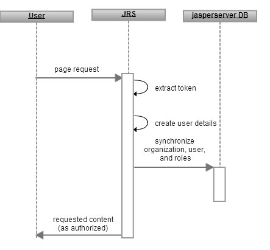

# Token-based Authentication

If you have an application or portal you want to use with JasperReports Server, but no single sign-on environment, you can use the Jaspersoft token-based authentication and user management framework. To work with token-based authentication, your application or portal must do the following:

-   Authenticate the end user according to the standards of your environment or application.
-   Construct and, optionally, encrypt a token based on the authenticated user values within your application or process. The token values can include username, organization (if multi-tenancy is enabled), roles, and profile attributes. You can configure the token based on your needs for reporting and analysis within the JasperReports Server.
-   Send the token to the JasperReports Server as part of an HTTP request.

When JasperReports Server receives the token, it will:

-   Attempt to decrypt the token (if encrypted) and validate the token format.
-   If the token is successfully parsed, use the information in the token to create and update the external user within JasperReports Server automatically.

The JasperReports Server deployment includes a sample file for token-based authentication in the &lt;js‑install&gt;/samples/externalAuth-sample-config folder: the sample-applicationContext-externalAuth-preauth-mt.xml file (commercial editions) or sample-applicationContext-externalAuth-preauth.xml (community editions).

!!! warning

    When using token-based authentication, it's extremely important that your external system is configured properly to prevent an attacker from forging the token. Consider taking security measures like connecting over HTTPS, encrypting the token, and using a time stamp, so the token is not exposed in the browser cache and cannot be easily reused.

## Overview of Token-based Authentication

This section explains how JasperReports Server performs external authentication using a token, highlighting the differences with [Default Internal Authentication](../authentication-in-jrs/internal-authentication-steps.md).

The following diagram shows the general steps involved in logging into JasperReports Server using a token:



*Figure 1 General Steps for Token-based Authentication*

The following steps explain the interaction between the user’s browser, JasperReports Server, and a pre-authenticated user:

1.  A user requests any page in JasperReports Server.

2.  If the user has not previously accessed JasperReports Server, the server looks for the `principalParameter` in the URL or request header. If the token is present and correctly formatted, the user is automatically authenticated.

    !!! note

        In token-based authentication, the JasperReports Server login screen is not displayed to the user and the user does not log in directly.

    After the user has authenticated and a JasperReports Server session has been created, future requests do not require the `principalParameter`.

3.  JasperReports Server decrypts the token in the URL or request header and creates a principal object to represent the user’s session in memory. The username, roles, and organization information are extracted from the token and synchronized with the internal database, where the user account is marked as an external user. The JasperReports Server environment reflects the user’s roles and organization as defined in the token. For more information about synchronization, see [Synchronization of External Users](../authentication-in-jrs/synchronization-users.md).

4.  As with the default internal authorization, JasperReports Server now sends the requested content to the user, or if none was specified, the home page appropriate for the user. An application-server user session is established and the connection between the requesting browser or process is maintained by repeatedly sending session identification information, usually in the form of an HTTP cookie. The token doesn't need to be resent until the user logs out or the session is inactive for a period of time.

When comparing these steps with those in [Default Internal Authentication](../authentication-in-jrs/internal-authentication-steps.md), you'll notice three significant differences:

-   Token-based authentication doesn't use a login screen. Instead, it depends on the `principalParameter` in the URL or request header. As long as the `principalParameter` is present, the request is automatically authenticated.
-   The portal or other external authentication mechanism is responsible for passing the correct username, and any roles, organization, or profile attributes as part of a token in the URL or request header.
-   JasperReports Server decrypts the token, extracts the user details, and uploads the data to the internal database. The internal database is synchronized with any new information in the user’s principal object.

## Configuring JasperReports Server for Token-based Authentication

A sample file for configuring JasperReports Server to work with token-based authentication is included in the JasperReports Server distribution. Sample files are located in the &lt;js‑install&gt;/samples/externalAuth-sample-config directory of your JasperReports Server. The file included depends on your version of JasperReports Server:

-   sample-applicationContext-externalAuth-preauth.xml: Sample file for implementing token-based authentication for a single organization. This file is included in the community edition of JasperReports Server.
-   sample-applicationContext-externalAuth-preauth-mt.xml: Sample file for implementing token-based authentication for multiple organizations. This file is included in commercial editions of JasperReports Server. To use external authentication with a commercial version and a single organization, you need to specify your organization as described in [Specifying a Single Organization](#specifying-a-single-organization).

To configure JasperReports Server to work with your authentication method, modify and deploy the sample configuration file:

1.  Make a copy of the preauth sample file in the &lt;js-install&gt;/samples/externalAuth-sample-config/ directory and rename it to remove the sample- prefix. For example, rename sample-applicationContext-externalAuth-preauth.xml to applicationContext-externalAuth-preauth.xml.
2.  Edit the file you created and configure the beans correctly for your deployment, as described in the following sections.
3.  Place the modified file in the &lt;js-webapp&gt;/WEB-INF directory.

!!! note

    &lt;js-webapp&gt; is the location of the JasperReports Server web application in your application server, or where you're modifying the configuration files. The rest of this chapter refers to file names alone.

## Overview of Token-based Authentication Beans

The sample-applicationContext-externalAuth-preauth\[-mt\].xml file contains the beans needed to enable token-based authentication. This section summarizes the most important beans in this file, including the beans you need to modify to configure JasperReports Server to work with token-based authentication.

-   `proxyPreAuthenticatedProcessingFilter`: Bean that enables token-based authentication. This bean extracts and optionally decrypts the token from the request. When this proxy bean definition is present in the application context, the Spring Security filter chain processes the authentication via the proxy definitions instead of the default internal filter. See [Configuring the Token](#configuring-the-token) for more information.
-   `preAuthenticatedManager`: Lists the available authentication providers. In token-based authentication, there's a single provider, the `JSPreAuthenticatedAuthenticationProvider`. This bean doesn't have to be configured.
-   `JSPreAuthenticatedAuthenticationProvider`: Custom authentication provider for token-based authentication. This bean has a constructor argument, `preAuthenticatedUserDetailsService`, which it uses to create the user details from the values passed in the token. See [Configuring the Token](#configuring-the-token).
-   `externalDataSynchronizer`: Bean whose class creates a mirror image of the external user in the internal `jasperserver` database.
-   `mtExternalUserSetupProcessor` or `externalUserSetupProcessor`: Bean that creates and configures the internal user corresponding to a successfully authenticated external user. Configure this bean to specify the roles given to external users. See [User Roles](#user-roles).
-   `externalTenantSetupProcessor`: For multi-tenant deployments, this bean creates and configures the internal organization for a successfully authenticated external user. See [Mapping the User Organization](#mapping-the-user-organization).
-   `externalProfileAttributeProcessor`: Optional processor that sets up user profile attributes. You don't need to configure this processor; the mapping is set up in the token configuration. Comment this bean out if not used.

## Configuring the Token

To use your authentication provider with JasperReports Server's token-based authentication, you must pass a correctly formatted token in the HTTP header or the URL of the request. A token is a string of key/value pairs separated by a character specified in the configuration file.

### Security of the Token

JasperReports Server will accept any properly formatted token; therefore, you need to protect the integrity of the token using measures such as:

-   Use SSL to Connect to JasperReports Server to protect against token interception.
-   Encrypt the token to protect against tampering. See [Setting Token Decryption](#setting-token-decryption) for more information.
-   Configure the token to use a timestamp to protect against replay attacks. Without a timestamp, when you include the token in a web page or REST web service URL, the URL can be copied and used by unauthorized people or systems. Setting the expire time for the token will prevent tokens/URLs from being used to authenticate beyond the indicated time. You can set the expiry time depending on your use case. For a user who is logged into the application/portal and requesting access to JasperReports Server, expiry time of a minute or less from the request time is appropriate. See the descriptions for `expireTime` and `tokenExpireTimestampFormat` in [preAuthenticatedUserDetailsService](#preauthenticateduserdetailsservice).

### proxyPreAuthenticatedProcessingFilter bean

Some token configuration is specified in the `proxyPreAuthenticatedProcessingFilter` bean using the following properties:

-   `principalParameter`: A fixed string at the start of the token that triggers token-based authentication. The first time the user accesses JasperReports Server, the `principalParameter` must be present in the request. `principalParameter` can be any URL-safe string that's different from all other JasperReports Server request parameter names.

-   `tokenInRequestParam`: Boolean that specifies the location of `principalParameter` as follows:

    -   `true`: JasperReports Server looks for `principalParameter` in the request URL only.
    -   `false`: JasperReports Server looks for `principalParameter` in the request header only.
    -   absent: JasperReports Server checks the request header first and then the URL.

-   `tokenDecryptor`: Specifies the class to use to decrypt the token. For security reasons, you should encrypt the token to keep its payload from being intercepted when it's exposed in the browser's cache or when SSL is not enabled. If the token is encrypted, you must provide an implementation of Jaspersoft's token decryptor interface `CipherI`. The default assumes the token is unencrypted and passes the token through as plaintext.

#### Setting Token Decryption

If you want to encrypt the token, you need to select the encryption you'll use to encrypt the token in the calling application and decrypt the token in the JasperReports Server. To implement the token decryption algorithm in JasperReports Server, you must write Java code that implements Jaspersoft's `CipherI`interface and include it in the Spring configuration for security. `CipherI` is located in the com.jaspersoft.jasperserver.api.common.crypto package in the jasperserver‑api.common.\[version\].jar jar file.

`CipherI` is a stub interface that allows you to define two methods:

-   `encrypt`: Takes a text string and returns a text string encrypted according to the specified algorithm.
-   `decrypt`: Takes a text string and returns a text string decrypted according to the specified algorithm.

You can implement any encryption method you choose.

``` java
package com.mycompany;

public class MyCipher implements CipherI {
    @Override
    public String encrypt(String plainText) {
               ...
        return cipherText;
    }

    @Override
    public String decrypt(String cipherText) {
               ...
        return plainText;
    }
}
```

Once you've created your implementation of `CipherI`, you need to incorporate it in a jar file and reference it in the `tokenDecryptor` property of `proxyPreAuthenticatedProcessingFilter`:

``` xml
<bean id="proxyPreAuthenticatedProcessingFilter"  class="com.jaspersoft.jasperserver.api.security.
    externalAuth.preauth.BasePreAuthenticatedProcessingFilter">
        ...
  <property name="tokenDecryptor">
    <bean class="com.mycompany.MyCipher"/>
  </property>
        ...
</bean>
```

### preAuthenticatedUserDetailsService

Specify the token format using the `preAuthenticatedUserDetailsService` constructor argument in the `preAuthenticatedManager` bean. An inline bean in `preAuthenticatedUserDetailsService` lets you specify the token properties. The following example shows one way you might configure this bean:

Sample Code Configuration

``` xml
<bean class="com.jaspersoft.jasperserver.api.security.externalAuth.wrappers.spring.preauth.
        JSPreAuthenticatedAuthenticationProvider">
  <property name="preAuthenticatedUserDetailsService">
    <bean class="com.jaspersoft.jasperserver.multipleTenancy.security.externalAuth.preauth.
          MTJSPreAuthenticatedUserDetailsService">
      <property name="tokenPairSeparator" value="|"/>
        <property name="tokenFormatMapping">
          <map>
            <entry key="username" value="u" />
            <entry key="roles" value="r" />
            <entry key="orgId" value="o" />
            <entry key="expireTime" value="exp" />
            <entry key="profile.attribs" >
              <map>
                <entry key="profileAttrib1" value="pa1" />
                <entry key="profileAttrib2" value="pa2" />
              </map>
            </entry>
          </map>
        </property>
      <property name="tokenExpireTimestampFormat" value="yyyyMMddHHmmssZ"/>
    </bean>
  </property>
</bean>
```

The inline bean has the following properties:

-   `tokenPairSeparator`: A single character used as the separator for key-value pairs in the token, for example, pipe (\|, encoded in URLs as %7C) (default). Cannot include comma (,), question mark (?), or equals sign (=), as these are used elsewhere in the token.

!!! warning

    If you're passing the token in the URL, you need to encode all equal signs (=, encoded as %3D) and pipe symbols (\|, encoded as %7C) in the token to make the token URL-safe.

-   `tokenFormatMapping`: The mapping between parameters in the token and attributes of the principal object in JasperReports Server, like roles and profile attributes. Entries in the mapping have the format &lt;entry key ="JRS" value="keyintoken"&gt;, for example, &lt;entry key="username" value="u" /&gt;. The key, such as username, is a fixed value used in the JasperReports Server code. The value is a parameter in the token mapped to the key in JasperReports Server.

-   tokenFormatMapping supports the following JasperReports Server fixed values:

    -   `username`: The external user's username.
    -   `roles`: The external user's roles.
    -   `orgId`: (optional, multi-tenant implementations only) In a multi-organization deployment, the external user's organization. In a single-tenant deployment, or in a deployment that maps all users to the same organization using `defaultOrganization`, you can comment out this property.
    -   `expireTime`: The key for the token expiration time. A time formatted as configured in the `tokenExpireTimestampFormat` property.
    -   `profile.attribs`: (optional) This lets you specify a map of key-value pairs for profile attributes. Comment this out if you don't want to map profile attributes. You must also comment out the reference to `externalProfileAttributeProcessor` in the `externalUserProcessors` property of the `externalDataSynchronizer`.

    !!! note

        The user password does not appear as a standard parameter in the token format. Passwords don’t need to be passed in the token in most cases, because JasperReports Server doesn't store passwords for externally-defined users. If you want to store passwords, you can pass them in using profile attributes.

-    `tokenFormatMapping` also supports the following property:

    -   `tokenExpireTimestampFormat`: The format of the token expiration time, `expireTime`, based on the `java.text.SimpleDateFormat`. Valid patterns for timestamps can contain only letters, numbers, dashes, underscores, and periods. The default pattern is `yyyyMMddHHmmssZ`, for example `20140415060121Z`.

    !!! note

        Z represents the UTC timezone. It denotes a UTC offset of 00:00.

For more information about the valid patterns for this field, refer to:<br>
[http://download.oracle.com/javase/6/docs/api/java/text/SimpleDateFormat.html.](http://download.oracle.com/javase/6/docs/api/java/text/SimpleDateFormat.html)

The token has to match the configuration you specify in `preAuthenticatedUserDetailsService`. With the configuration shown in Sample Code Configuration, you would use the following token syntax in the page header:

``` properties
pp=u=user|r=role1,role2,...|o=org1[,org2,...]|pa1=PA11,PA12,...|pa2=PA21,PA22,...|exp=time
```

In this example, `pp` (`principalParameter`) is the name of the header attribute or the URL token parameter name.

!!! warning

    If you're passing the token in the URL, you need to encode all equal signs (=, encoded as %3D) and pipe symbols (\|, encoded as %7C) in the token to make the token URL-safe.

The key-value pairs can appear in the token in any order, but must be delineated by the separator specified in the `tokenPairSeparator` property:

-   `u`: Takes a single value that maps to the username in JasperReports Server.
-   `r`: Takes as values a comma separated list of roles, each mapped to a separate role in JasperReports Server. If you have defined default internal roles, this parameter is optional. See [User Roles](#user-roles).
-   `o`: Takes as values a comma separated list that maps to an organization in the JasperReports Server. If more than one organization is listed, it's interpreted as an organization hierarchy. For example, `o=A,B` maps the user to the B suborganization of A.
-   `exp`: Takes a single time value formatted as configured in the `tokenExpireTimestampFormat` property. If `exp` is earlier than current time, authentication is denied. if `exp` is absent, the token never expires.
-   `pa1`: Profile attribute that maps to `profileAttrib1` in the JasperReports Server repository.
-   `pa2`: Profile attribute that maps to `profileAttrib2` in the JasperReports Server repository.

With this configuration, the following would be a valid token. The user would be placed in the Sales suborganization of the EMEA organization:

``` properties
pp=u=Sven|r=Manager|o=EMEA,Sales|pa1=Sweden
```

If you're passing the token in the URL, you need to encode all equal signs (=) (as %3D) and pipe symbols (\|) (as %7C) in the token to make the token URL-safe:

``` text
http://localhost:8080/jasperserver?pp=u%3DSven%7Cr%3DManager%7Co%3DEMEA,Sales%7Cpa1%3DSweden
```

## User Roles

User roles are mapped using the `externalUserSetupProcessor` or `mtExternalUserSetupProcessor` bean. See the configuration file for your deployment to see which bean applies in your case. For token-based authentication, you can define user roles in the following ways:

-   Map the user roles received from the token: Define a mapping between roles in the external authority and roles in JasperReports Server. See [Mapping User Roles](#mapping-user-roles).
-   Define user roles statically: If you don't have user roles in the token, you can define static roles for administrative and non-administrative users. See [Defining Static Roles](#defining-static-roles).

### Mapping User Roles

If you have user roles in the token, you can map them to roles in JasperReports Server using the `organizationRoleMap` property of the `externalUserSetupProcessor` or `mtExternalUserSetupProcessor` bean.

The `organizationRoleMap` property contains key/value pairs that map external role names to internal ones. For commercial JasperReports Server deployments, you need to choose the level at which the role is assigned:

-   To map to an internal role at the organization level, append \|\* to the name of the internal role, for example, ROLE_USER\|\*. Roles mapped at the organization level don't have administrative privileges.
-   To map to an internal role at the system (null) level, don't modify the internal role name, for example, ROLE_ADMINISTRATOR. Roles at the system level are usually reserved for special users like the system administrator and allow access to the repository folder of all other organizations.

The following example shows how you might configure the `externalUserSetupProcessor` bean to map roles from the external authority to roles in JasperReports Server:

``` xml
<bean id="mtExternalUserSetupProcessor" class="com.jaspersoft.jasperserver.multipleTenancy.security.
    externalAuth.processors.MTExternalUserSetupProcessor"  parent="abstractExternalProcessor">
<property name="organizationRoleMap">
   <map>
    <!-- Example of mapping customer roles to JRS roles -->
    <entry key= ROLE_ADMIN_EXTERNAL_ORGANIZATION value=ROLE_ADMINISTRATOR />
  </map>
</property>
```

#### Setting Default Roles

You can assign roles to all users using the `defaultInternalRoles` property of `externalUserSetupProcessor` or `mtExternalUserSetupProcessor`. The following example shows how to use this property in `externalUserSetupProcessor` to assign `ROLE_USER` to all users, in addition to the roles assigned by mapping:

``` xml
  <property name="defaultInternalRoles">
    <list>
      <value>ROLE_USER</value>
    </list>
  </property>
```

#### Avoiding Role Collisions

If an external role has the same name as an internal role at the same organization level, JasperReports Server adds a suffix such as \_EXT to the external role name to avoid collisions. For example, a user with the externally defined role ROLE_ADMINISTRATOR is assigned the role ROLE_ADMINISTRATOR_EXT in the JasperReports Server database. This ensures that internal administrator accounts like jasperadmin and superuser can still log in as internal administrators with the associated permissions.

You can set the extension in the `conflictingExternalInternalRoleNameSuffix` property in the `externalUserSetupProcessor` or `mtExternalUserSetupProcessor` bean. If the property doesn't appear in the bean, the extension is still implemented but defaults to \_EXT. The following example shows how to configure this property:

``` xml
<bean id="mtExternalUserSetupProcessor" class="com.jaspersoft.jasperserver.multipleTenancy.security.
    externalAuth.processors.MTExternalUserSetupProcessor"
    parent="abstractExternalProcessor">
  <property name="conflictingExternalInternalRoleNameSuffix"
        value="_EXTERNAL"/>
  <property name="organizationRoleMap">
      ...
     <!-- Example of mapping customer roles to JRS roles -->
      ...
  </property>
```

#### Restricting the Mapping to Whitelisted Roles

You may not want every role in your external authority to appear as a role in JasperReports Server. Use the `permittedRolesRegex` property of the `externalUserSetupProcessor` bean or `mtExternalUserSetupProcessor` bean to specify which external roles become roles in JasperReports Server. You can use regular expressions to specify multiple roles that match the expression.

For example, to restrict the roles you create in JasperReports Server to roles that begin with JRS\_ or EXT\_ in your external authority, you would configure `permittedRolesRegex` in a way similar to the following:

``` xml
        <property name="permittedRolesRegex">
            <list>
                <value>JRS_.*</value>
                <value>EXT_.*</value>
            </list>
        </property>
```

To allow all roles, use .\* or comment out the property. If the property is omitted, all roles in the external authority are synchronized with roles in JasperReports Server.

#### Supporting Additional Characters in Role Names

The default mapping from attributes in your external authentication server to roles in JasperReports Server supports only alphanumeric characters and underscores. If a role in your external authority contains unsupported characters, each sequence of unsupported characters is replaced with a single underscore. For example, ROLE$-DEMO)EXT maps to ROLE_DEMO_EXT.

You can extend the supported character set by modifying the `permittedExternalRoleNameRegex` property of the `externalUserSetupProcessor` bean or `mtExternalUserSetupProcessor` bean. Check the sample configuration file for your deployment to determine which bean to modify.

The default value of the `permittedExternalRoleNameRegex` property is the regular expression \[A-Za-z0-9\_\]+. Edit this expression to add supported characters. For example, the following syntax allows alphanumeric characters, underscores, and the Cyrillic letter Я (Unicode 042F):

``` xml
<bean id="mtExternalUserSetupProcessor"  class="com.jaspersoft.jasperserver.api.security.
        externalAuth.processors.MTExternalUserSetupProcessor"
    parent="abstractExternalProcessor">
 <property name="userAuthorityService">
   <ref bean="${bean.internalUserAuthorityService}"/>
 </property>
  .....
 <property name="permittedExternalRoleNameRegex"
     value="[A-Za-z0-9_\u042F]+">
</bean>
```

!!! warning

    Do not allow the following in role names: spaces, periods or \|, \[ \], \`, ", ', \~, !, #, $, %, \^, &, \[,\], \*, +, =, ;, :, ?, &lt;, &gt;, }, {, ), (, \], \[, /, or \\. Adding these characters in the `permittedExternalRoleNameRegex` property may cause unexpected behavior, such as the inability to delete or edit roles containing those characters.

### Defining Static Roles

If you're mapping all your external users to a single organization, you can assign static roles to users. This lets you specify a list of administrative users and roles, and a list of roles for non-administrative users. To define static roles, use the `externalUserSetupProcessor` or `mtExternalUserSetupProcessor` bean. To set up static roles, locate the version of the bean used in your sample file and configure the following properties:

-   `adminUserNames` property: A list of usernames granted internal administrator privileges in JasperReports Server. The username values must exactly match the usernames authenticated and returned by the external authority.
-   `defaultAdminRoles` property: A list of JasperReports Server internal roles. These are assigned to every user in the list of administrators.
-   `defaultInternalRoles` property: A list of JasperReports Server roles assigned to every user not in the list of administrators.

The following example shows how to use the `mtExternalUserSetupProcessor` bean to define static roles. The configuration for `externalUserSetupProcessor` is similar:

``` xml
<bean id="mtExternalUserSetupProcessor" class="com.jaspersoft.jasperserver.multipleTenancy.security.
    externalAuth.processors.MTExternalUserSetupProcessor"
    parent="abstractExternalProcessor">
    ...
  <property name="adminUsernames">
    <list>
      <value>myorgadmin</value>
    </list>
  </property><property name="defaultAdminRoles">
    <list>
      <value>ROLE_USER</value>
      <value>ROLE_ADMINISTRATOR</value>
    </list>
  </property>
  <property name="defaultInternalRoles">
    <list>
      <value>ROLE_USER</value>
    </list>
  </property>...
```

## Mapping the User Organization

There are two ways to set the user organization:

-   If you have multiple organizations in your deployment, set up the token to contain organization information as above. If you want organization names in JasperReports Server to be different from the ones in the external authority, use the organizationMap property, as described in [Mapping Organization Names](#mapping-organization-names).
-   If your JasperReports Server has multiple organizations, but you want all users to be in the same organization, use the externalTenantSetupProcessor bean to specify the organization, as described in [Specifying a Single Organization](#specifying-a-single-organization); in this case you don't need to include organization information in the token.

If your JasperReports Server deployment supports only a single organization (all community deployments and some professional editions), you don't need to set organization information.

### Setting Up Default Admins for Organizations

In a multi-organization deployment, JasperReports Server creates a `jasperadmin` user whenever you create a new organization. The `jasperadmin` user is also given a standard default password. When creating multiple organizations using external authentication, you can set a different default password for jasperadmin, remove the jasperadmin user, and/or create additional default users in each new organization created by external authentication. Optionally, you can encrypt the password in the configuration files. See the JasperReports Server Security Guide for more information on default users in every organization.

!!! warning

    For security reasons, you should change the default password of any organization admin. See [Initialization of JasperReports Server for External Users](../authentication-in-jrs/initializing-external-users-in-jrs.md) for a process to initialize the server, including organization admins, before going into production with external authentication.

To set up admin users

1.  Open your sample-applicationContext-xxx-externalAuth.xml file in a text editor.

2.  Locate the `externalTenantSetupUsers` property in the `ldapExternalTenantProcessor``externalTenantSetupProcessor` bean.

3.  The sample contains a bean of class `ExternalTenantSetupUser` already configured for `jasperadmin`.

    ``` xml
    <property name="externalTenantSetupUsers">
      <list>
        <bean class="com.jaspersoft.jasperserver.multipleTenancy.security.
                     externalAuth.processors.MTAbstractExternalProcessor.ExternalTenantSetupUser">
          <property name="username" value="${new.tenant.user.name.1}"/>
          <property name="fullName" value="${new.tenant.user.fullname.1}"/>
          <property name="password" value="${new.tenant.user.password.1}"/>
          <property name="emailAddress" value="${new.tenant.user.email.1}"/>
          <property name="roleSet">
            <set>
              <value>ROLE_ADMINISTRATOR</value>
              <value>ROLE_USER</value>
            </set>
          </property>
        </bean>
      </list>
    </property>
    ```

4.  To create additional admin users for each external organization, create a bean of class `ExternalTenantSetupUser` for each admin user you want.

    ``` xml
    <bean class="com.jaspersoft.jasperserver.multipleTenancy.security.
                     externalAuth.processors.MTAbstractExternalProcessor.ExternalTenantSetupUser">
          <property name="username" value="${new.tenant.user.name.2}"/>
          <property name="fullName" value="${new.tenant.user.fullname.2}"/>
          <property name="password" value="${new.tenant.user.password.2}"/>
          <property name="emailAddress" value="${new.tenant.user.email.2}"/>
     <property name="roleSet">
            <set>
              <value>ROLE_ADMINISTRATOR</value>
              <value>ROLE_USER</value>
            </set>
          </property>
        </bean>
    ```

5.  The ${...} syntax above references values configured in the following file:

    &lt;js-install&gt;\\buildomatic\\conf_source\\iePro\\js.config.properties file.

    To set these values, open &lt;js-install&gt;\\buildomatic\\conf_source\\iePro\\js.config.properties and edit the entries there.

    ``` properties
    new.tenant.user.name.1=jasperadmin
    new.tenant.user.fullname.1=jasperadmin
    new.tenant.user.password.1=mynewpassword
    new.tenant.user.email.1=
    new.tenant.user.name.2=anotheradmin
    new.tenant.user.fullname.2=Another Admin
    new.tenant.user.password.2=anotherpassword
    new.tenant.user.email.2=
    ```

    !!! note

        The property names, for example, `new.tenant.user.name.1`, are arbitrary. You can use any name for each property as long as the name in the applicationContext-externalAuth-xxx.xml file matches the name in the js.config.properties file.

6.  If you want to obfuscate the default passwords in the js.config.properties files, encrypt them as described in the JasperReports Server Security Guide. Obfuscation must be implemented before you install the server.

7.  If you don't want to obfuscate default passwords, you can eliminate the reference to js.config.properties and instead configure the values directly in the `externalTenantSetupUsers` property in the applicationContext-externalAuth-xxx.xml file. For example:

``` xml
      <property name="username" value="anotheradmin"/>
      <property name="fullName" value="Another Admin"/>
      <property name="password" value="anotherpassword"/>
      <property name="emailAddress" value=""/>
```

### Mapping Organization Names

You have the option to use the `organizationMap` property in the `externalTenantSetupProcessor``ldapExternalTenantProcessor` bean to map organization names extracted from your external authority to organization names in JasperReports Server. To do this, create a key/value pair for each organization you want to map, specifying the external organization name as the key and the organization name in JasperReports Server as the value. When mapping organizations, the server determines the mapped name and uses it as the name, ID, and description of the organization.

For example, the following would map users in External_Org_1 in the external authority to JRS_Org_1 in JasperReports Server and users in External_Org_2 in the external authority to JRS_Org_2 in JasperReports Server:

``` xml
    <property name="organizationMap">
        <map>
            <entry key="External_Org_1" value="JRS_Org_1" />
            <entry key="External_Org_2" value="JRS_Org_2" />
        </map>
    </property>
```

The `organizationMap` property is optional. Any organization in your external authority that is not listed in `organizationMap` is mapped to an organization of the same name in JasperReports Server. However, if an organization in your external authority contains unsupported characters, each sequence of unsupported characters is replaced with a single underscore. For example, Human Resources maps to Human_Resources.

The `tenantIdNotSupportedSymbols` property of the `configurationBean` bean in the applicationContext.xml file lists the unsupported characters, including spaces and the following characters: `|`, `&`, `*`, `?`, `<`, `>`, `/`, `\`, `~`, `!`, `#`, `$`, `%`, `^`, `[`, `]`, or a space. If you want to list additional characters that should be replaced with an underscore, you can add them in this bean. However, we do not recommend removing any of the pre-defined characters, as JasperReports Server may not handle them correctly.

### Specifying a Single Organization

In a multi-tenant deployment, if you don't have organization information in your token, your users are mapped to the NULL organization, which means they will be given root privilege. If your deployment has only one organization, this organization is used by default.

If you have multiple organizations in your deployment, you can use the `externalTenantSetupProcessor``ldapExternalTenantProcessor` bean to specify a single organization assigned to all external users. To do this, set `externalTenantSetupProcessor``ldapExternalTenantProcessor`’s `defaultOrganization` property to the organization ID of the selected organization. If an organization with that ID already exists, all external users are assigned to that organization. If the organization does not exist, it's created when the first external user authenticates correctly.

When specifying the `defaultOrganization` value, the organization ID must not contain the following characters: \|, &, \*, ?, &lt;, &gt;, /, \\, \~, !, #, $, %, \^, \[, or \].

The following example shows how to configure `externalTenantSetupProcessor``ldapExternalTenantProcessor` to assign all users to organization_1:

``` xml
<bean id="externalTenantSetupProcessorldapExternalTenantProcessor" class="com.jaspersoft.jasperserver.multipleTenancy.
    security.externalAuth.processors.MTExternalTenantSetupProcessorLdapExternalTenantProcessor"     parent="abstractExternalProcessor">
  <property name="multiTenancyService">
    <ref bean="internalMultiTenancyService"/>
  </property>
  <property name="defaultOrganization" value="organization_1"/>
</bean>
```

!!! warning

    Do not specify a null value for the `defaultOrganization` property. The null organization ID is usually reserved for special users like the system administrator and allows access to the repository folder of all other organizations.

Organizations created during external user login have an administrator with the default password. For security reasons, you should change the default password of any organization admin. See [Initialization of JasperReports Server for External Users](../authentication-in-jrs/initializing-external-users-in-jrs.md) for a process to initialize JasperReports Server, including organization administrators, before going into production with external authentication.

## Adding a Custom Processor

To create custom code to run on the server after the user has been authenticated, you can create a custom processor and add it to the processors list for the `externalUserProcessors` property of the `externalDataSynchronizer` bean. For example, you can add a processor that calls code to automatically create a user home folder for the authenticated user. See [Creating a Custom Processor](../advanced-topics/creating-custom-processor.md).

## Restarting JasperReports Server

When you've configured all the beans in the appropriate files, restart JasperReports Server to make the changes take effect.

To test your configuration, log into your external authority and request a page from JasperReports Server. If the token and server are configured correctly, you can access JasperReports Server. Try several users with different roles or organizations to verify your configuration.
