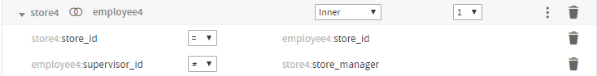
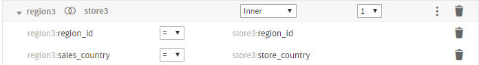
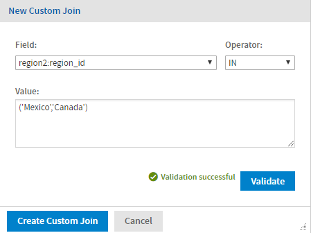
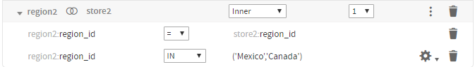
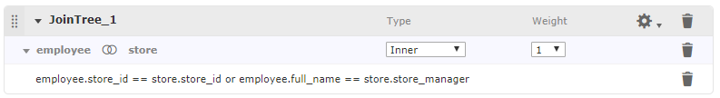
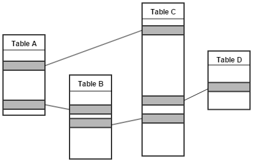
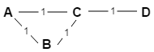
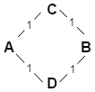
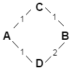

# Advanced Joins

Joins are associations you make between tables so that their rows can be presented together in the same report. Multiple joins associate columns across many tables to create powerful data visualizations when used in reports. The number and complexity of joins in the Domain depends on your business needs.

## Understanding Join Trees

A group of tables that are all connected directly or indirectly through joins is called a join tree. A Domain may contain several join trees, but when a user creates an Ad Hoc view from a Domain, they can only select one of them to be available in the view. Different join trees have no connections between them.

Join trees appear as top-level nodes in the **Data Structure** panel on the **Joins**, **Pre-Filters** and **Data Presentation** tabs. Tables that are not joined appear as children of the data source node at the top of the **Data Structure** panel.

The options on the  menu in the join tree title bar help you prioritize which join paths are chosen when multiple options are possible in an Ad Hoc view. These options are primarily used to avoid circular joins. See Prioritizing Joins for more information.

## Understanding Join Options

If you want to create a join between two tables, each table must have a column that's compatible with a column in the other table. For example, the `store_id` column in the `store` table can be joined with the `store_id` column in the `employee` table.

In some cases, you may need to duplicate a table in order to join it several times without creating a circular join, or to join it to itself. You can also duplicate a table so it may be joined with different tables for different uses.

!!! warning

    The XML design file supports additional join features not supported in the Domain Designer, including:

    - NOT or OR operator between joins inside a composite join.
    - Joins within the same table.

    If you have a Domain design file in XML format that uses these features and you open it in the Domain Designer, these joins will be displayed as read-only joins. See Read-Only Joins for more information.

## Join Type

The Domain Designer supports the four most common join types:

- **Inner**: The result contains only rows where the values in the chosen columns are equal.
- **Left Outer**: The result contains all the rows of the left table, paired with a row of the right table when the values in the chosen columns are equal or contain blanks.
- **Right Outer**: The result contains all the rows of the right table, paired with a row of the left table when the values in the chosen columns are equal or contain blanks.
- **Full Outer**: The result contains all rows from both tables, paired when the joined columns are equal, and filled with blanks when the columns are not equal. Not available in MySQL.

## Comparison Operators

The Domain Designer supports the following comparison operators between fields. You can't compare fields of different data types:

=, ≠, \>, \<, \>=, \<= .

Comparison operators other than = often generate a large amount of rows (similar to a Cartesian product) when used on their own. For best results, use them in a composite join in conjunction with an = join. See Composite Joins for more information.

*Figure 1: Example of a Join that Uses an Inequality*

## Composite Joins

Composite joins implement multiple join conditions for the same pair of tables. You can create composite joins in the following ways:

- Add a join to a join tree that already contains a join between those tables.
- Select **Create Custom Join...** from the  menu of the join.

*Figure 2: Example of Composite Join*

The join options you select on the join title bar, such as join type and weight, apply to the entire composite join. In addition, when the Domain is used in an Ad Hoc view or report, the composite join is treated as a single join with multiple components. See Prioritizing Joins for more information. When the Domain is exported as XML, composite joins are represented as a single join expression with multiple components.

## Custom Joins

You can add custom joins to an existing join. Custom joins let you place constant conditions on a single column from the joined tables.

To add a custom join to an existing join

1.  Click  at the upper right of the join and select **Create Custom Join...**. The **New Custom Join** dialog appears.

    

    *Figure 3: New Custom Join dialog*

2.  Select a column from the Field list. You can select a column from either table in the join.

3.  Select an operator. The available operators depend on the column type.

4.  Enter the range, set, or value you want for the field, based on the operator you chose.

    - = or ≠ (available for all column types)

    \>, \<, \>=, or \<= (available for numeric and date columns only)

    Enter a constant value or an attribute that takes a single value. Strings are enclosed in single quotes. For example:

    - `5000`
    - `'Mexico'`
    - `attribute('CountryAttribute')`

    !!! note

        For more information about using attributes in Domains, see [Using Attributes in the Domain Designer](attributes_in_the_domain_designer.md).

    - IN or NOT IN – Enter one of the following:

      - A set of strings or values, enclosed in parentheses and separated by commas. Strings are enclosed in single quotes. For example:

        - `(1,2,3,4,5)`

        - `('San Francisco','Portland', 'Seattle') `

        - `('true')`

    - A range of values, separated by a colon (numeric and date columns only). For example:

      - `(7000 : 8000)`

5.  To verify that your syntax is correct, click **Validate**. Fix errors if necessary.

6.  Click **Create Custom Join**. The join is added below the existing join as part of a composite join.

    

    *Figure 4: A custom join in the design panel*

7.  To edit or delete a custom join:

- Click  and select **Edit Custom Join…** to open the **Edit Custom Join** dialog and modify the join.
- Click  to delete a custom join.

## Read-Only Joins

The design file format (XML) supports additional join features not supported in the Domain Designer, including:

- NOT or OR operator in a single join expression.
- Joins between different columns in the same table.

If you have a Domain design file in XML that uses these features and you open it in the Domain Designer, these joins are displayed as read-only joins. The join expression is shown as a string. You can still set the join type and weight.

*Figure 5: Example of Read-Only Join*

To create or modify joins outside of the Domain Designer, you must export the Domain in XML format and modify it in a text editor. See [Importing and Exporting Domain Design Files](importing_and_exporting.md) and [Representing Joins in XML](../domain_syntax/representing_joins.md) for more information.

## Prioritizing Joins

The Domain Designer and Domain Design file do not impose any limits on the number of joins you can specify in a join tree. However, when you define joins among N tables, it is good design to use N-1 or fewer joins to avoid circular joins (also known as loops). Circular joins occur, for example, when table A is joined to table B and table B is joined to table C which is in turn joined to table A. However, if your design requires circular joins, JasperReports Server includes features that help you influence how joins are prioritized when they are used in an Ad Hoc view, Topic, or report.

*Figure 6: Circular Joins in a Domain*

### Best Practices for Join Trees

Wherever possible, follow these practices to avoid loops or to minimize their impact on Ad Hoc views:

- For a join tree with N tables, use N-1 joins. A composite join is considered a single join. See Composite Joins for more information.
- Create copies of tables you need to use more than once in the join tree. You can copy a table by right-clicking it in the **Data Structure** panel on the **Joins** tab and selecting **Copy Table** from the context menu.
- Enable **Minimum Path Joins** for each join tree. (This option is not the default.)
- For better join performance, prioritize joins that involve indexed columns. To do this, assign low join weights to the preferred joins and high join weights to less desirable joins.

The options on the  menu in the join tree title bar, along with specific table and join options, give you influence over which join paths are chosen in an Ad Hoc view when multiple options are possible.

### Join Tree Options

Often, an Ad Hoc view created from a join tree in your Domain does not need to use all the tables and joins in the join tree. The  menu on the join tree includes options you can use to change how Ad Hoc views select joins. Only one of these options can be enabled at a time.

Suppose you create an Ad Hoc view using two tables from a Domain with a loop. JasperReports Server attempts to avoid circular joins in the SQL by choosing a path between the tables. However, by default, you cannot be sure which join path the Ad Hoc view will use. If you are using tables A and B, you do not know whether the server will use the direct join from A–B or the indirect join A–C–B. The following options influence which joins are used by the Ad Hoc view:

- **Use minimum path joins** (not selected by default): When this option is selected, an Ad Hoc view created from the join tree uses a minimum join length. When **Use minimum path joins** is selected, you can optionally assign weights to the joins in the join set. Higher weights indicate less desirable joins. For most situations, the best practice is to enable this option to avoid circular joins. Deselect it only if you need backwards compatibility with legacy Domains.
- **Use all joins** (not selected by default): Available for backwards compatibility. When this attribute is selected, an Ad Hoc view created from the data island includes all the joins in the join tree. For most situations, the best practice is to leave this option unselected.

### Join Weights

When **Use minimum path joins** is enabled, each join in the join tree is given a default weight of 1. You can optionally change the weights of some or all of the joins in the join tree. Higher weights indicate lower-priority, less-desirable joins. When **Use minimum path joins** is used with weights, JasperReports Server calculates the total weight of a join path by summing the weights of its individual joins. It uses join path of the possible lowest total weight to generate the data for the Ad Hoc view, Topic, or report.

!!! note

    Increasing the weight increases the cost of a particular join and lowers its priority. To give preferential treatment to joins that involve indexed columns for better join performance, assign lower join weights to the preferred joins and higher join weights to less desirable joins.

In this situation, you can enable **Use minimum path joins**. This automatically assigns a default weight of 1 to each join, as shown in the following simplified diagram.

!!! note

    The best practice is to avoid circular joins in your Domain by creating aliases for one or more tables in the join. You create an alias, or copy, by right-clicking a table in the **Data Structure** panel on the **Joins** tab and selecting **Copy Table** from the context menu.

*Figure 7: Circular Join with Default Weights*

Now, when you create an Ad Hoc view using table A and table B, the Ad Hoc Designer calculates the weight of the possible join paths from A to B by summing the weights of their subpaths. The direct path A–B has total weight=1, while the indirect path A–C–B has weight 1+1=2. The path with the smallest total weight is chosen, in this case, the direct path from A to B.

Note, however, that this does not cover all cases. For example, suppose you have four joins as shown in the following table, where table A is joined to tables C and D, and table B is also joined to tables C and D. If you create an Ad Hoc view with tables A and B, both possible paths A–C–B and A–D–B have weight 1+1=2, so again, you do not know which join is being used.

*Figure 8: Circular Joins with Equal Weights Between A and B*

To exert even more control over the joins used by your Ad Hoc view, you can add an optional weight to one or more of the joins in your join tree. Adding a weight increases the cost of a particular join, and lowers its priority. The higher you set a weight the more you dislike the join. For example, you can add a weight of 2 to the join between table B and table D. Then you can ensure that an Ad Hoc view with tables A and B will use the A–C–B join path, which only has a total weight of 2, and not the A–D–B join path, which now has a total weight of 3. Note that, in this situation, an Ad Hoc view with tables B and D will still use the direct path with weight 2, instead of the path B–C–A–D, which has a total weight of 3.

*Figure 9: Circular Joins with Weights*

### Always Include Table

When **Use minimum path joins** is selected, you can also select **Always Include Table** to the **Data Structure** panel to specify that any Ad Hoc view created from this join tree must include the indicated table in its join path. This option takes effect even when no columns from the table are used in the Ad Hoc view. You can enable this option on multiple tables in the same join tree.

Technically, you can select this property whether or not you have set **Use minimum path joins**. However, it is most useful when **Use minimum path joins** is selected.
