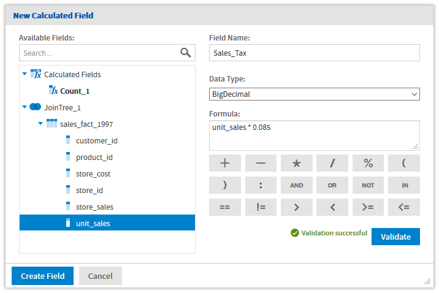
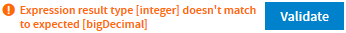
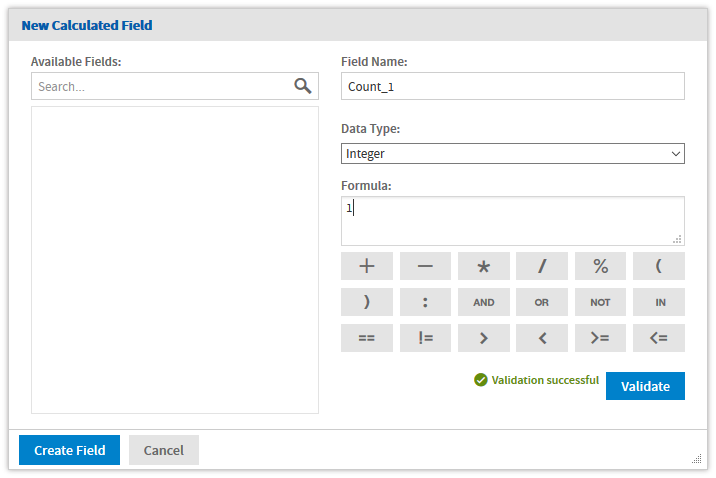
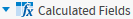

# Calculated Fields

You can add new columns to a Domain by performing calculations on other columns. These are called calculated fields, and once created they can be used like any other fields, for example to create additional calculated fields or pre-filters. They can also be referenced in the Domain's security file and locale bundles.

You create a calculated field for a Domain in two ways:

-   By writing an expression that computes a value based on the data in one or more columns in a single table or join tree. All columns in the expression for a calculated field must be from the same join tree.
-   By creating a constant expression. For example, you might create an integer field named Count that has the value 1 and later has a default summary function to count all occurrences.

!!! note

    Calculated field expressions use the Domain Expression Language, fully described in [Domain Expression Language (DomEL)](../domel/domain_expression_language.md).

    Calculated fields may also be used in the expression to compute another calculated field.

Calculated fields appear in the **Data Structure** panel on the **Joins, Pre-filters**, and **Data Presentation** tabs. Calculated fields are shown in the table or join tree to which they belong in the **Data Structure** panel. Global constant fields appear above the data source. Calculated fields and constants are identified by a distinctive icon, and the field name is shown in bold. In addition, if a calculated field is used by another calculated field, its name is also in italics.

## Creating a Calculated Field

1.  Navigate to the **Join** tab or **Pre-filters** tab and locate the table or join tree containing the fields that you want to perform a calculation on. If the fields are in separate tables, they must first be joined.

2.  Right-click on the table or join tree and select **Create Calculated Field**. The **New Calculated Field** dialog appears.

    

    *Figure 1: New Calculated Field*

3.  In **Field Name**, enter the name you want to use for the calculated field. This name becomes the field's ID in the Domain.

    After it has been created, you can give the calculated field a more meaningful label and full description on the **Data Presentation** tab.

4.  In **Data Type**, select a datatype for the calculated field. The expression you write must return a value of this type.

    Generally, this datatype matches the datatype of the columns in the expression. Therefore, you need to be familiar with the datatypes of columns in the data source.

5.  Enter an expression for the calculated field in the Formula text box:

-   To insert a reference to the value of another column, find it in the **Available Fields** list and double-click the column name. The column name appears in the expression at the cursor, qualified by its table name. You can also type a column name directly in the Formula box, in the format `tablename.fieldname`.

    -   To add a supported operator, click the operator icons below the **Formula** box, or type the operator directly.
    -   To use an attribute, enter `attribute('AttributeName')` or `attribute('AttributeName', 'Level')`. This must be a single-valued attribute; collections cannot be used. See [Using Attributes in the Domain Designer](attributes_in_the_domain_designer.md) for more information.

!!! note

    -   Calculated field expressions use the Domain Expression Language, fully described in [Domain Expression Language (DomEL)](../domel/domain_expression_language.md).

1.  Click **Validate** to verify the calculated field datatype and syntax. You must fix any errors before you can save; the validation error message can help you with this:

    

2.  Click **Create Field** to save the new calculated field.

If the calculated field is valid, it appears in the **Data Selection** panel under the table or join tree you chose. A distinctive icon  identifies it as a calculated field.

## Creating a Constant Field

An expression that does not reference any fields has a constant value. For example, you might create an integer field named Count_1 that has the value 1 and later has a default summary function to count all occurrences. Constant fields are independent of join trees and appear above the data source in the Data Structure panel.

1.  Navigate to any tab where the **Data Structure** panel appears: **Data Management, Joins, Pre-filters**, or **Presentation**.

2.  At the top of the **Data Structure** panel, click  and select **Create Constant Field…**. The **New Calculated Field** dialog appears. The **Available Fields** list shows any other constant fields that you have created.

    

    *Figure 2: Creating a Constant Field*

3.  In **Field Name**, enter the name you want to use for the calculated field. This becomes the ID of the field in the Domain, and you can later give it a label and description on the Presentations tab.

4.  In **Data Type**, select a datatype for the calculated field. The datatype must match the result of the expression.

5.  Enter a constant expression for the calculated field in the Formula text box. Make sure that the value matches the selected datatype, for example 1 for an integer.

6.  Click **Validate** to verify the calculated field is valid. You must fix any errors before you can save. The error message can help you with this.

7.  Click **Create Field** to save the new calculated field.

If the constant field is valid, it appears at the top of the **Data Selection** panel under a **Calculated Fields** node:

## Modifying a Calculated Field

1.  Locate the calculated field in the **Data Structure** panel on the **Joins** tab or **Pre-filters** tab. Constant fields can be edited from any tab on which they appear.
2.  Right-click the calculated field or constant field and select **Edit Calculated Field**. The **Edit Calculated Field** dialog appears.
3.  Modify its name, its type, or its expression.
4.  Click **Validate** to verify the calculated field is still valid.
5.  Click **Update Field** to save your changes.

## Deleting a Calculated Field

1.  Locate the calculated field in the **Data Structure** panel on the **Joins** tab or **Pre-filters** tab. Constant fields can be removed from any tab on which they appear.
2.  Right-click the calculated field or constant field and select **Remove Calculated Field**.
