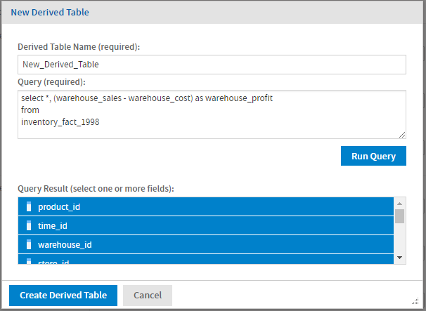
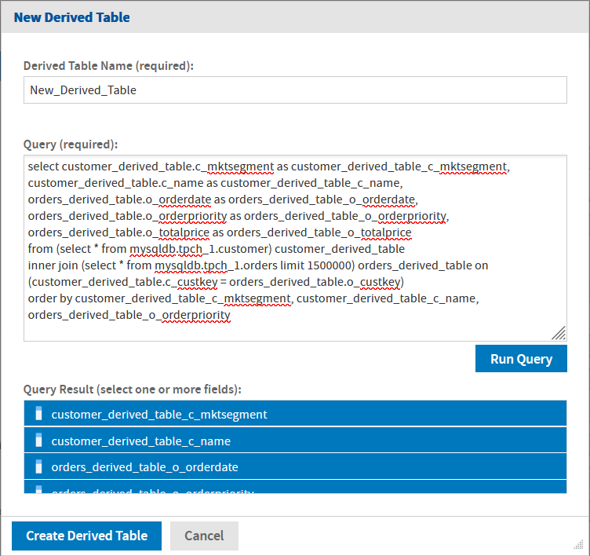

# Derived Tables

You can add tables to your Domain based on SQL queries of the chosen data source. These are called derived tables, and once created, they can be used like other tables to create joins and then displayed as sets and items. They can also be referenced in the Domain's security file and locale bundles.

You create a derived table in a Domain using a custom query. Because Domains are based on JDBC and JNDI data sources, you write the query in SQL. You run the query, and then select columns from the query result for use in the Domain design.

For example, with a JDBC data source, you can write an SQL query that includes complex functions for selecting data. You can use the items in a derived table for other operations on the Domain, such as joining tables, defining a calculated field, or filtering. The items in a derived table can also be referenced in the Domain's security file and locale bundles.

!!! note

    The clauses in a query determine the structure and content of the table returned by the query. For example, the WHERE clause may contain conditions that determine the rows of the derived table.

To define a derived table

1.  Right-click the data source node on the Data Management tab and select **Create Derived Table…** OR click  and select **Create Derived Table…**.

    The **New Derived Table** dialog appears.

    

    *Figure 1: New Derived Table dialog*

    

    *Figure 2: New Derived Table dialog for Trino-based data source*

2.  Type a name for the table in the **Derived Table Name** field.

3.  Enter a valid SQL query in **Query**. Only queries that begin with the `SELECT` statement are allowed. Stored procedures and functions are supported. Do *not* include a closing semi-colon (`;`). For Trino, the query should contain the catalog name in prefix of the table and field name. For example:

    - Query for Table using non-Trino data-source: `select * from schema.table_name;`
    - Query for Table using Trino data-source: `select * from catalog.schema.table_name;`

    To use an attribute, enter `{attribute('AttributeName')}` or `{attribute('AttributeName', 'Level')}`. This must be a single-valued attribute; collections cannot be used. See [Using Attributes in the Domain Designer](attributes_in_the_domain_designer.md) for more information.

4.  When the query is complete, click **Run Query** to test it. If the query is successful, the resulting fields are displayed in the **Query Result** list. By default, all columns in the result are selected.

5.  Ctrl-click fields in the **Query Result** list to change the selection. If you want only a few columns out of many, it may be easier to specify the column names in the `SELECT` clause of the query.

6.  Click **Create Derived Table**.

The derived table is added under the Derived Tables node in the **Data Structure** panel. A distinctive icon  identifies it as a derived table.

**To copy a derived table:**

Right-click the derived table in the **Data Structure** panel, and select **Copy Table**.

**To edit a derived table:**

1.  Right-click the derived table in the **Data Structure** panel, and select **Edit Derived Table…**. The **Edit Derived Table** dialog appears.
2.  Edit the **Derived Table Name, Query**, and selected tables in the **Query Result** list.
3.  Click **Update Derived Table** to save changes.

**To remove a derived table:**

Right-click the derived table in the **Data Structure** panel, and select **Remove Derived Table…**.

!!! note

    You cannot copy, edit, or remove derived tables on the **Data Presentation** tab.

## Trino Functions and Operators

JasperReports Server also supports Trino functions and operators. These functions can be used with derived tables. For more information on functions and operators, refer to [Trino functions documentation](https://trino.io/docs/current/functions.html).

The following is an example of the usage of Trino functions in JasperReports Server.

**Filtering During Aggregation**

You can use FILTER keyword to remove rows from aggregation, with a condition expressed using a WHERE clause. For example, you can filter *store_names* according to *coffee_bar_present* or not, as shown in the following query:

``` sql
SELECT store.store_name, bool_or(coffee_bar) AS coffee_bar_present
FROM postgresqldb.public.store
GROUP BY store_name, coffee_bar
order by coffee_bar_present ;
```

This filters out the *store_name* by *coffee_bar_present*.
