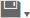

# Importing and Exporting Domain Design Files

You can export and import Domain design files in XML format. This lets you copy or back up Domains, even between different servers. Domain design files can be also created or edited manually in a text editor or programmatically.

The results of editing or using a Domain based on an inconsistent or incorrect design file are unpredictable. Before you modify Domain design files you need to be familiar with the Domain syntax and structure. For more information, see [Working with Domain Files](../domain_files/working_with_domain_files.md) and [XML Design File Reference](../domain_syntax/xml_design_file_reference.md).

## Exporting a Domain Design File

1.  Log into the server as an administrator and edit an existing Domain or create a new one.
2.  Save any changes you have made to the Domain.
3.  Click  on the menu bar to export a Domain schema file, `schema.xml`, in XML format.

## Uploading a Design File to a Domain

After you have modified an XML design file, you can upload it through the Domain Designer. Alternatively, you can create a new Domain based on a modified file or even on a design file created from scratch.

Uploading a design file overwrites the existing Domain and may break Ad Hoc views, Topics, or reports that depend on the Domain.

To upload a Domain design file

1.  Log into the server as an administrator and edit an existing Domain or create a new one.

2.  Click  on the menu bar.

3.  **Browse** to find the design file you want to upload, select it, and click **Open**.

    A warning dialog appears.

4.  Click **Update Domain Design** to continue.

    !!! warning

        The design file overwrites any existing design without prompting. If you make a mistake or upload the wrong file, exit the Domain Designer without saving and start over.

    The server validates the syntax of the uploaded file. If there are syntax or semantic errors, the current design is not replaced. You may also see warnings if you have changed the data source, schema names, or deleted schemas, tables, or columns from the Design file. If there are any errors or inconsistencies, you should make changes to the design file, upload it again, and verify it again.

    The results of editing a design in the Domain Designer based on an inconsistent XML file are unpredictable. If you can't resolve problems, or are unsure that the result will be what you want, exit the Domain Designer without saving.

5.  After the design appears correctly in the Domain Designer, make any further modifications on any of the tabs.

6.  Select **Save Domain** from the  menu to update the Domain in the repository.

7.  If you modified an existing Domain, you must clear the Ad Hoc cache of all queries based on the Domain. This removes any data that was based on the old instance of the Domain and avoids inconsistencies in new reports. For instructions, see the JasperReports Server Administrator Guide.

## Exporting a Domain and Its Resources

The export option on the Domain Designer menu exports the Domain design file, which describes all the features visible in the Domain Designer. This is a good option if you want to modify the Domain in a text editor. However, a Domain in JasperReports Server needs additional information, including: permissions, the data source in the repository, the security file (if it exists), and any localization bundles.

For example, to duplicate a Domain on another instance of JasperReports Server, export it from the repository to create an export catalog file that can be moved to another server. All necessary files are assempled into a zip that can be easily transmitted and uploaded. You can then modify the Domain in the Domain Designer on the destination server to account for any small differences.

To export a Domain with all its associated resources:

1.  Log into JasperReports Server as an administrator.
2.  Browse in the repository to the Domain you want to export.
3.  Right-click on the Domain and select **Export** from the context menu. The **Export Resources** dialog appears.
4.  Enter a name for the exported file, select the options you want, and click **Export**. The file is exported in **.zip** format to the Downloads folder set by your browser.

For more information about exporting and importing repository files, see the JasperReports Server Administrator Guide.
