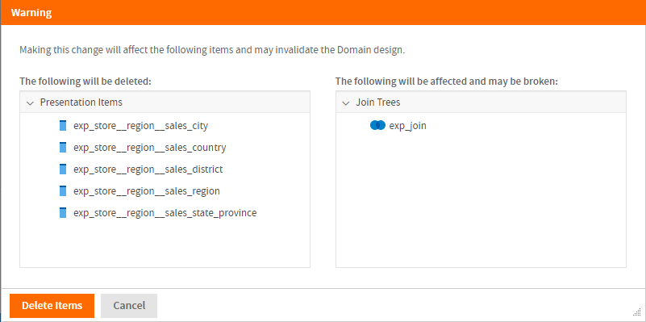
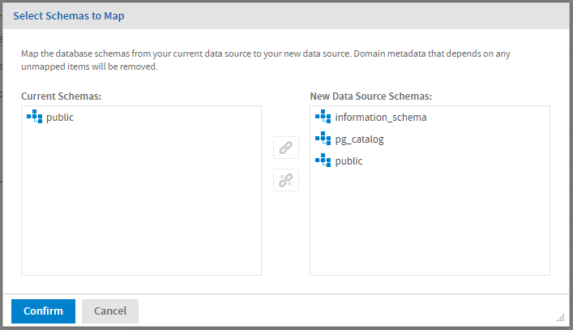
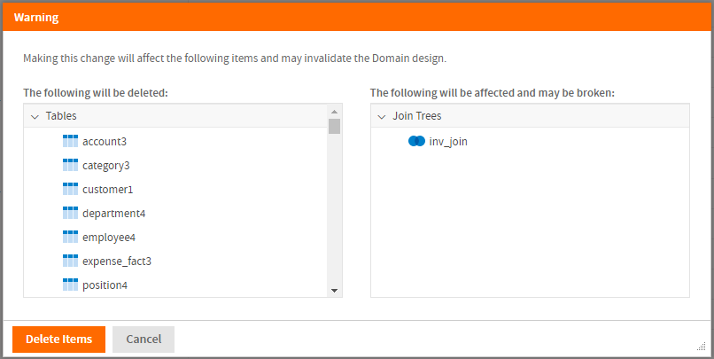

# Modifying a Domain

You can add, change, and delete domain components.

!!! warning

    Use caution when editing Domains that have been used for Ad Hoc views or Domain Topics. By default, if you remove or change Domain elements that are used in an Ad Hoc view or Topic, any dependencies are removed the next time the Ad Hoc view or topic is opens. In some cases, you might want to create a placeholder field to preserve the structure of the Ad Hoc view.

To edit a Domain

1.  Log into the server as an administrator and navigate to the Domain location in the repository.
2.  Right-click the Domain and select **Edit** from the context menu.

The Domain Designer opens on the **Data Presentation** tab. Click the tab with the information you want to edit and make your changes.

1.  If you want to change the data source, select **Replace Data…** from the  menu, select the data source you want in the **Choose Data** dialog, and click **OK**.

If you change to a data source with a different database, the definitions in the Domain design may become invalid and you can't save the Domain. See Changing the Data Source for more information.

!!! warning

    Before you switch the data source for a Domain, back up the Domain by exporting a Domain design file.

1.  Save the Domain.

After modifying a Domain, you must clear the Ad Hoc cache of all queries based on the Domain. This removes any data that was based on the old instance of the Domain and avoids inconsistencies in new reports. For instructions, see the JasperReports Server Administrator Guide.

## Removing Schemas, Tables, and Joins

If you attempt to remove a schema, table, or join that is used in the Domain Designer, a warning dialog lists the affected components of your design. Click **Delete Items** to continue and delete all the items listed, or click **Cancel** to keep the original data source.

If a schema or table is used in a join tree, the individual joins that reference the table are deleted, but other joins in the join tree are preserved. This may affect your design. You should examine the updated join tree to see how it has been affected.

*Figure 1: Deleted Table Warning*

## Changing the Data Source

When you open an existing Domain with the Domain Designer, the Domain Designer reads the current state of the database and uploads it to the design. The Domain Designer does not detect changes to the database schemas, tables, and columns in real-time, but it will detect them the next time you open the Domain in the Domain Designer. The data source or structure can change for any of the following reasons:

- You manually change the JasperReports Server data source by selecting **Replace Data** from the menu.
- The selected data source or a schema uses an attribute and the attribute changes or you log in with a different attribute value.
- The structure of the underlying database or other data source has changed. For example, if a table or column is added to or deleted from the database, it is detected the next time you open the Domain Designer.

Missing schemas, tables, or columns in the new or updated data source are automatically deleted from the design along with any elements, such as calculated fields, joins, or sets, that depend on them.

Because the Domain design relies extensively on the data source, changing the data source makes sense only in certain cases. Examples include:

- Switching to a data source with a different schema but with the same tables, for example, when moving from staging to production.
- Switching from a regular data source to a virtual data source that contains the original data source. In this case, JasperReports Server attempts to locate the original data source inside the virtual data source and create the correct prefix. Derived tables and calculated fields are not preserved.
- Switching from a virtual data source to one of the underlying data sources. In this case, any resources that are not in the selected data source are deleted along with any dependent information, such as derived tables, joins, calculated fields, or labels that depend on the deleted resources.

Before you select a new data source manually or use attributes to specify data sources and/or schemas, do your best to ensure that the schema structures are identical. You should also export your Domain design before changing the data source manually.

### Selecting a New Data Source

!!! note

    If you have modified your database tables, fields, or schema, use **Replace Data** and select your current database to upload the changes.

To select a new data source:

1.  Select **Replace Data…** from the  menu.
2.  Select the data source you want in the **Choose Data** dialog, and click **OK**.

The **Select Schemas to Map** dialog appears. This dialog shows the schemas used by your Domain on the left, and the schemas available in the data source on the right.

*Figure 2: Selecting schemas to map*

!!! note

    If you are switching between a schemaless data source (such as MySQL) and a schema-based data source (such as Oracle), the dialog is different, as follows:

    - If the original data source is schemaless and the new data source supports schemas, the Current Schemas list is omitted. Select a new schema from the available schemas.
    - If the original data source has schemas and the new data source is schemaless, the New Data Source Schemas list is omitted. Select one of the schemas in your Domain to use for the new data source. In addition, if your Domain has only one schema and you are selecting a schemaless data source, the schema is mapped automatically and you do not see this dialog.

1.  To associate an existing schema in your Domain with a schema in the data source:

<!-- -->

1.  Select the schema in the Domain in the **Current Schemas** list.
2.  Select the schema you want to replace it with in the **New Data Source Schemas** list.
3.  Click .

The schemas are associated. A number is added after the schema name to make it easier to manage multiple schemas.

1.  Repeat the previous step for each schema you want to map. If you want to unlink two schemas, click .
2.  Click **Confirm** to map the schemas.

JasperReports Server retrieves the data structure from the data source and validates the Domain. If all the tables and columns in your Domain are found, the Domain Designer opens at the **Data Management** tab.

1.  If there are missing tables or columns, a warning dialog lists the affected components of your design. Click **Delete Items** to continue and delete all the items listed, or click **Cancel** to keep the original data source.

*Figure 3: Warning dialog for changing data source*

If you click **Delete Items**, JasperReports Server deletes all the displayed items. There may still be some errors you need to resolve before the Domain is valid.

### Changes Due to Attributes

If you use attributes to define a database schema, a calculated field, or another Domain element, you may see the following when you log in as a different user:

- If a schema is missing, the **Select Schemas to Map** dialog appears. See Selecting a New Data Source for more information. This can happen because the attribute is no longer defined or because the attribute is defined but resolves to a non-existent schema.
- If you use an attribute for the schema name and you later select a different schema in the **Select Schemas to Map** dialog, the design will always use that schema. The schema will no longer be attribute-based.
- If any tables or fields are missing in the new data source or schema, JasperReports Server displays a warning dialog. Clicking **Delete Items** deletes the missing tables and columns and any Domain design elements that depend on them.
- If an attribute is not defined or does not resolve to a usable value, JasperReports Server displays a warning dialog. Clicking **Delete Items** deletes any Domain design elements that depend on the undefined or invalid attribute(s).

!!! note

    If you use an attribute in your data source definition, you may see similar problems. Data source attributes are defined outside the Domain Designer. See the section on defining attributes in the JasperReports Server Administrator Guide for more information.

### Updating an Existing Data Source

To update a Domain after changes to the underlying data structure, do one of the following:

- Refresh the browser.
- Close the Domain Designer then open the Domain for editing again.
- Select **Replace Data…** from the  menu and select your current data source.

Keep the following points in mind regarding data source updates:

- You will be prompted to remap any schemas no longer found in the database.
- If your design uses tables and columns that are no longer found in the data source, JasperReports Server displays a warning dialog. Clicking **Delete Items** deletes the missing tables and columns and any Domain design elements that depend on them.
- New schemas, tables, and columns appear in the **Data Structure** panel on the **Data Management** tab. JasperReports Server has no way to automatically map schemas, tables, or columns that have been added since the last time you edited the Domain.
- To add a new column to the Domain, move its table to Selected Tables. If the table is already selected, the column is automatically available. Table selection works only with entire tables.

## Domain Validation

Validating a Domain ensures the consistency of all its components. The Domain Designer checks the syntax of files when they're uploaded, and overall consistency is also checked when saving a new or edited Domain.

During validation, the Domain Designer does the following:

1.  Verifies that the tables and columns of the Domain design exist in the data source (validation against data source).

!!! note

    1.  In special cases where you need to create a design before the data source is available, this step can be omitted by setting a parameter in the server configuration file. See the JasperReports Server Administrator Guide.

1.  Verifies that all items in each defined set originate in the same join tree.
2.  Verifies that all items reference existing columns.
3.  Verifies that derived tables have valid SQL queries.
4.  If a security file has been uploaded, verifies that all items and sets in the security file exist in the Domain design.

If validation fails, you will not be able to save the Domain. Make the necessary changes to the settings and save again. If the settings are in the uploaded files, edit the files and upload them again.

Validation occurs at the following times:

- When you open a Domain for editing: JasperReports Server validates the Domain syntax and validates the Domain against the data source.
- When you replace the data source: JasperReports Server validates the Domain syntax and validates the Domain against the data source.
- When you upload a schema from an XML file: JasperReports Server validates the Domain syntax and validates the Domain against the data source.
- When you save the Domain: JasperReports Server validates the Domain syntax and verifies permissions.

When validation fails a message appears to help you correct the error.
