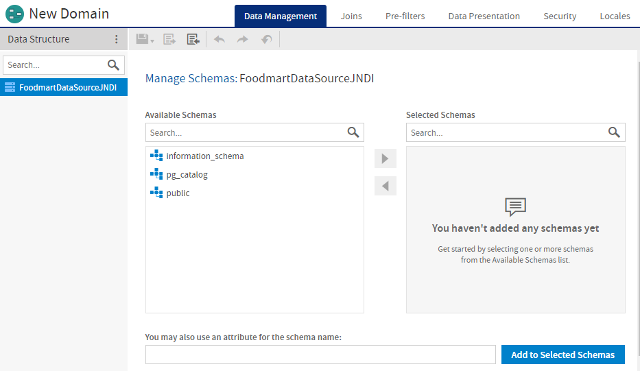
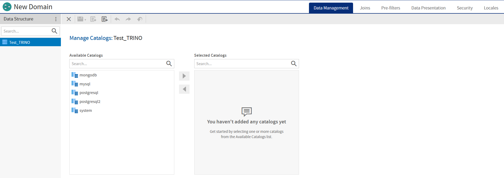
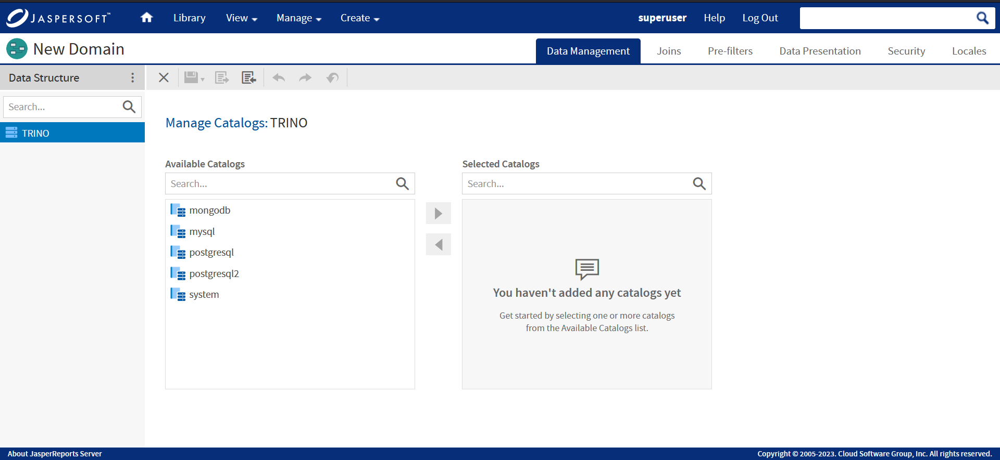
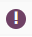
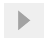
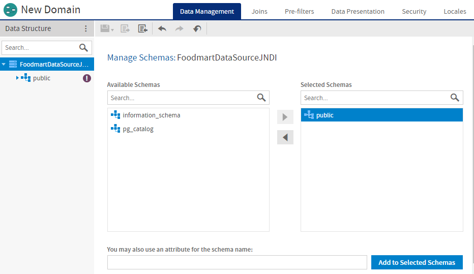
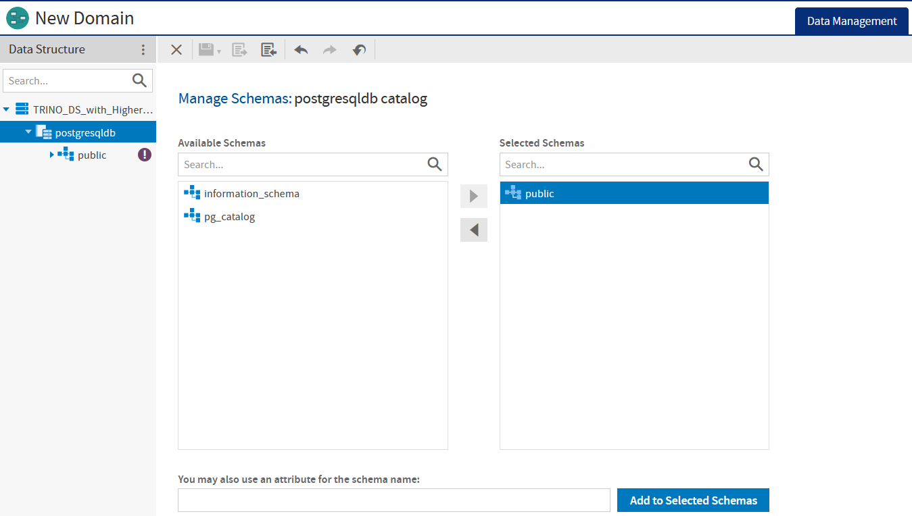
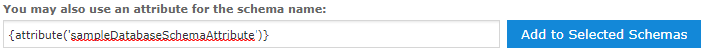
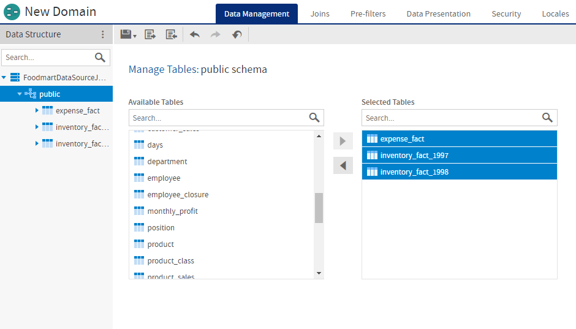
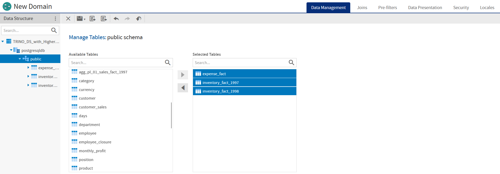

# The Data Management Tab

The **Data Management** tab is where you manage the schemas and tables from your data source and choose which ones to include in your Domain.

*Figure 1: The Data Management tab before a schema has been added to the Domain*

For a Trino-based domain, the **Data Management** tab differs slightly. You need to select a catalog first, before selecting the schema and respective tables.

*Figure 2: The Data Management tab before a catalog has been added to the Domain*

!!! note

    This page displays only for the domains that are created using a Trino data source. Non-Trino domains have the **Manage Schemas** page displayed instead of the **Manage Catalogs** page (usually displayed for Trino).

## The Data Structure Panel on the Data Management Tab

On the **Data Management** tab, the **Data Structure** panel displays the data source and the schemas, tables, and columns from the data source that you have added to the Domain. It also displays any constant fields and derived tables you have created.

!!! note

    The **Data Structure** panel on the **Data Management** tab does not display internally-defined Domain elements, such as joins, calculated fields, or copied tables. It does display derived tables.

!!! note

    The **Data Structure** panel shows columns that have a supported type listed in [Supported Types](../domain_syntax/representing_tables.md). If the data source has special datatypes like CLOB or NVARCHAR2, or if you access synonyms on an Oracle database, you need to configure the server to recognize them. See the configuration chapter in the JasperReports Server Administrator Guide.

- Expand the data source to see the schemas you have added to your Domain design. If you have added any derived tables, they appear under a separate node.
- Select the data source to display the **Manage Schemas** panel and add or remove schemas from your design.
- Right-click the data source to display a context menu with the following choices:
- **Create Derived Table…**: Select this to open the **New Derived Table** dialog and create a derived table. See [Derived Tables](../advanced_domains/derived_tables.md) for more information.
- Expand a schema to see which of its tables you have added to your design.
- Select a schema to display the **Manage Tables** panel for that schema and add or remove tables from your design.
- Expand the **Derived Tables** node to view the derived tables you have created.
- Right-click a derived table to copy, edit, or remove it.
- Expand a table or derived table to view its columns.

!!! note

    You cannot select tables or columns in the **Data Structure** panel on the **Data Management** tab. You can select them on the Joins, Pre-filters, and **Data Presentation** tabs.

## Managing Catalogs

A Trino catalog contains schemas and references a data source via a connector. When you run SQL statements in Trino, you are running them against one or more catalogs. Catalogs are defined in properties files stored in the Trino configuration directory. For more information on catalogs, refer to [Trino's documentation](https://trino.io/docs/current/overview/concepts.html).

*Figure 3: Select Catalog for Trino-based data source*

To add catalogs, first select the data source in the **Data Structure** panel on the **Data Management** tab. The **Manage Catalogs** panel appears in the **Data Design** panel.

- The **Available Catalogs** list displays the available catalogs in your data source.
- The **Selected Catalogs** list shows the catalogs you selected.
- Selected catalogs appear in the **Data Structure** panel. If you have not yet added any schema from the catalog to the Domain design, a exclamation icon appears (), as is shown to the right of the schema name.
- You can move a schema back and forth between the lists by dragging, double-clicking, or selecting the item and clicking an arrow button .

## Managing Schemas

If your data source supports database schemas, like Oracle RDBMS, you need to choose one or more schemas to use in the Domain. You also need to select schemas when using a virtual data source.

*Figure 4: Select Database Schemas*

*Figure 5: Select Database Schemas for Trino-based data source*

To add schemas, first select the data source in the **Data Structure** panel on the **Data Management** tab. The **Manage Schemas** panel appears in the **Data Design** panel.

!!! note

    The **Manage Schemas** panel appears automatically when you create a new domain.

- The **Available Schemas** list displays the available schemas in your data source.
- The **Selected Schemas** list shows the schemas you selected.
- Selected schemas appear in the **Data Structure** panel. If you have not yet added any tables from the schema to the Domain design,  appears shown to the right of the schema name. See Managing Tables for more information.
- You can move a schema back and forth between the lists by dragging, double-clicking, or selecting the item and clicking an arrow button  .

### Using Attributes

You can use an attribute for a schema name. When you use an attribute for the schema name, the Domain Designer displays current name of the attribute as the schema and retrieves the tables and columns from that schema. See [Using Attributes in the Domain Designer](../advanced_domains/attributes_in_the_domain_designer.md) for more information.

!!! note

    When you use an attribute for a schema name, the Domain will fail if the schema is missing. You can optionally set a default schema in the Domain design file. The default schema is used whenever the schema is missing or undefined. See [Default Schema](../domain_syntax/representing_data_sources.md) for more information.

To use an attribute for a schema

1.  Make sure you have defined the attribute you want. See the JasperReports Server Administrator Guide for information about creating attributes.

2.  Enter the correct syntax for the attribute in the **You may also use an attribute for the schema name:** text box, depending on the attribute level:

    - `{attribute('attributeName'), 'server'}` for a server-level attribute.
    - `{attribute('attributeName', 'organization')}` for an organization-level attribute.
    - `{attribute('attributeName', 'user')}` for a user-level attribute.

    If no level is specified, the server will search for the attribute hierarchically, starting at the `'user'` level:

    - `{attribute('attributeName')}`

    

    *Figure 6: Using a server-level attribute for a schema name*

    !!! note

        If you forget the attribute syntax, enter any string in the **You may also use an attribute for the schema name:** text box and click **Add to Selected Schemas** to see a hint with the correct syntax.

3.  Click **Add to Selected Schemas** to add the attribute to the **Selected Schemas** list.

The attribute is resolved to its current value and the corresponding schema is shown in the **Selected Schemas** list. A special icon  appears.

You can view the attribute information for a schema, if any, by going to the **Data Management** tab, clicking on the data source node, and then selecting the schema in the **Selected Schemas** list. The attribute information is show in the **You may also use an attribute for the schema name:** text box.

## Managing Tables

You need to choose one or more tables to use in the Domain. Typically, you select the following tables for use in the Domain:

- Tables that you want to expose to report designers and users.
- Tables that you want to join to other tables.
- Tables that you want to reference in the Domain design, even if their columns do not appear directly in the Domain. For example, make sure to select the tables containing columns that you want to use in a derived table or calculated field.

!!! note

    An understanding of the logical design of tables in the data source is critical to selecting the tables to be joined. Once you have added a table, you can expand it in the Data Structure tab to verify it contains the columns you want.

*Figure 7: Select Tables*

*Figure 8: Select Tables for Trino-based data source*

To work with tables, first select a schema in the **Data Structure** panel on the **Data Management** tab. The **Manage Tables** panel appears on the right and presents two lists:

- The **Available Tables** list displays the available tables in the selected schema.
- The **Selected Tables** list shows the tables in the selected schema that you have added to the Domain. Initially, this list is blank. When you add a table to this list, the table name also appears in the **Data Structure** panel.
- Selected tables appear in the **Data Structure** panel under the correct schema.

To add a table to the Domain:

1.  Select a schema in the **Data Structure** panel on the **Data Management** tab.
2.  Select the table you want in **Available Tables**. Ctrl-click to select multiple tables
3.  Use  to move the highlighted tables to the **Selected Tables** panel. Alternatively, double-click or drag the table name from the **Available Tables** panel to the **Selected Tables** panel.
4.  To remove tables, use , double-click a table, or drag a table from **Selected Tables** to **Available Tables**.

!!! note

    On the Data Management tab, you can select only entire tables. On the Joins, Pre-filters, and **Data Presentation** tabs, you can make table- and column-level selections.
