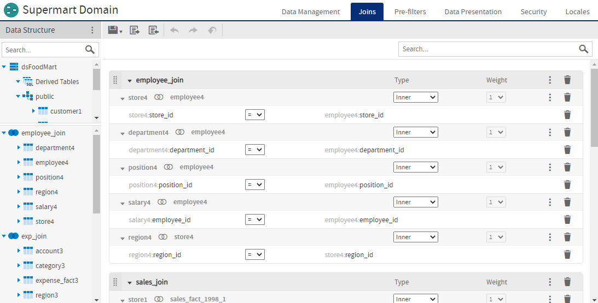
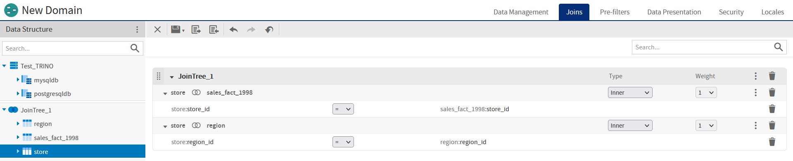
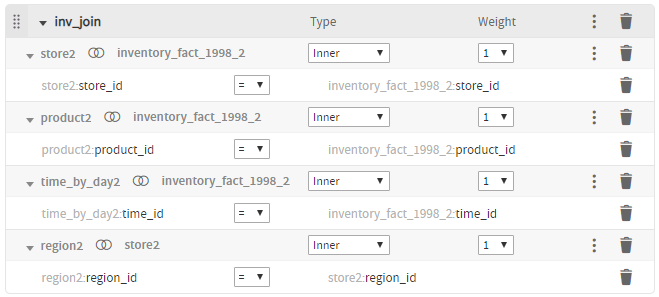
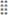
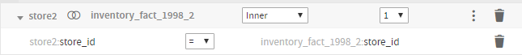
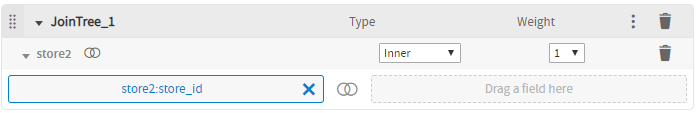
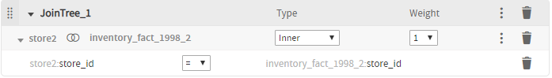

# The Joins Tab

The **Joins** tab is where you create associations between tables so that you can present them together in the same report. Multiple joins associate columns across many tables to create powerful data visualizations when used in reports. The number and complexity of joins in the Domain depends on your business needs.

*Figure 1 Layout of the Joins Tab*

*Figure 2 Layout of the Joins Tab for Trino-based data source*

Joins in the Domain Designer are grouped in join trees. A join tree is a group of tables that are all connected directly or indirectly through joins. Different join trees have no connections between them. The **Joins** tab shows tables organized by join tree in the **Data Structure** panel, and joins organized by join tree in the **Design** panel. You create joins by dragging fields from the **Data Structure** panel to the **Design** panel.

## The Data Structure Panel

On the **Joins** tab, the **Data Structure** panel displays the tables in your Domains, organized into join trees. In this view, a single join tree contains a group of tables that are all connected directly or indirectly through joins. Unjoined tables and columns appear at the top (underneath the data source node), and joined tables and their columns appear at the bottom. The following actions are available:

-   Expand the data source node to see the unjoined tables and columns in your Domain.

-   Drag the divider between the data source tables and the join trees to adjust the viewable area.

-   Expand a join tree to see the tables it contains.

-   Expand a table or derived table to see the columns it contains.

-   Drag a column to the Joins design panel to use it in a join.

-   Right-click the data source node to display a context menu with the following choices:

    -   **Generate Joins**: Automatically creates joins based on foreign keys. If the database does not have foreign keys, you see an error and no joins are generated.

-   Right-click a join tree to display a context menu with the following choices:

    -   **Create Calculated Field**: Opens the **Calculated Field** dialog box to create a calculated field using columns from the tables in the join. See [Calculated Fields](../advanced_domains/calculated_fields.md) for more information.

-   Right-click a table to display a context-sensitive menu that includes some of the following:

    -   **Copy Table**: Copies the selected table and gives it a name with sequential numbering.

    -   **Rename Table**: Changes the name of the selected table. The new name becomes the ID of the table throughout the Domain, and is updated everywhere it appears in the Domain Designer.

    -   **Remove Derived Table…**: (Derived table only.) Removes the selected derived table from the Domain.

    -   **Always Include Table** – (Table in a join tree only; not available for unjoined tables.) Includes this table in all Ad Hoc views that use this join tree, even if the table is not explicitly added by the Ad Hoc user. Enable **Use Minimum Path Joins** when you select this option. See [Prioritizing Joins](../advanced_domains/advanced_joins.md) for more information.

    -   **Create Calculated Field**: Opens the Calculated Field dialog box to create a calculated field using the columns in the table. See [Calculated Fields](../advanced_domains/calculated_fields.md) for more information.

-   Hover over a table or table copy to see the name of the original table in the data source.

## The Joins Design Panel

The **Joins** design panel shows the join trees and joins you have added to your Domain.

### Working With Join Trees

In the **Joins** panel, the join trees in your Domain appear as containers with individual joins inside them. The selected join options are displayed for each join. For more information about the many possible join operations, see [Advanced Joins](../advanced_domains/advanced_joins.md).

*Figure 3 A join tree with multiple joins*

The join tree title bar at the top of each join tree lets you perform the following actions:

-    – Drag to move the join tree container to a new location and change the order of the join trees. A thick blue line appears in locations where you can place the join tree.

-     – Use the arrows to expand and collapse the join tree.

-   **Type**, **Weight** – Read-only headings that refer to properties of the individual joins in the join tree.

-    – **More**. Click to perform the following actions:

    -   **Rename Join Tree** – Displays the **Rename Join Tree** dialog, where you can give your join a more useful name.

    -   **Use Minimum Path Joins** – Helps you choose how joins are chosen in Ad Hoc views. Deselected by default, it is good practice to select this. See [Prioritizing Joins](../advanced_domains/advanced_joins.md) for more information.

    -   **Use all joins** – Forces an Ad Hoc view to include all joins in the join tree. Included for backwards compatibility. Unless you have specific need for it, it is good practice to leave this option unselected. See [Prioritizing Joins](../advanced_domains/advanced_joins.md) for more information.

-    – Click to remove the join tree and all the joins it contains. If there are other Domain items that depend on the join tree, such as pre-filters or sets based on the join, you are prompted to remove them. The tables and columns remain in your Domain.

### Working with Joins

Individual joins appear in their join tree container. A join includes a title bar and entries for the joined columns.

*Figure 4 A Single Join Between Two Tables*

If you create multiple joins between the same two tables, the new join component is added to the existing join. See [Composite Joins](../advanced_domains/advanced_joins.md) for more information.

*Figure 5 Multiple Joins For the Same Two Tables*

The join title bar at the top of each join includes the following:

-     – Use these arrows to expand and collapse the join.

-   Left column name (read-only) – Displays the table used in the left side of the join.

-   Join icon

-   Right column name (read-only) – Displays the table used in the right side of the join.

-   **Type** drop-down – Sets the type of your join: **Inner**, **Left Outer**, **Right Outer**, or **Full Outer**. See [Join Type](../advanced_domains/advanced_joins.md).

    !!! note

        **Full Outer** is not supported for MySQL databases.

-   **Weight** drop-down (default = 1) – Influences which joins are used in an Ad Hoc view. Higher weights indicate less desirable joins. To change this value, you must enable **Use minimum path joins** for this join tree. See [Join Weights](../advanced_domains/advanced_joins.md) for more information.

-    – **More**. Selecting **Create Custom Joins...** opens the **New Custom Join** dialog, which allows you to set a constant condition on a single column. See [Custom Joins](../advanced_domains/advanced_joins.md) for more information.

-    – Deletes the join. If there are other Domain items that depend on the join, s pre-filters or sets based on the join, you are prompted to remove them. The tables and columns remain in your Domain.

    The entry for each component displays the following:

-   Left column name (read-only) – Displays the table and column for the left side of the join.

-   Join comparison menu – Drop-down that lets you select a comparison operator, based on the type of the join. Operators include =, ≠, &gt;, &lt;, &gt;=, and &lt;=.

    !!! warning

        Comparison operators other than = (such as ≠, &gt;, &lt;, &gt;=, &lt;= ) generate a large amount of rows (similar to a Cartesian product) when used on their own. Best practice is to use them as constraints in conjunction with a = join on the same pair of tables. See [Comparison Operators](../advanced_domains/advanced_joins.md) for more information.

-   Right column name (read-only) – Displays the table and column for the right side of the join. For a custom join, displays the constant.

-    (custom joins only) – **More**. Lets you select **Edit Custom Join...**, which opens the **Edit Custom Join** dialog box.

-    – Deletes the join component. Deletes the entire join even if there is only one component in the join.

### Creating a Join

1.  In the **Data Structure** panel, find the column you want to use for the left-hand side of your join and drag it into the **Design** panel in the location you want:

-   To create a new join on an empty canvas, drag the column anywhere on the **Design** panel. A new join is created, along with the join tree that contains it.

    -   To add a new join tree when join trees are already present, drag the column to a blank space above, between, or below the existing join trees. The target area is highlighted with a thick blue line.
    -   To add a join to an existing join tree, drag the column to the join tree. The target join tree is outlined with a dashed line to show it is selected.

A join is added to the **Design** panel. The column you dragged is added on the left, and the **Drag a field here** is displayed on the right.

*Figure 6 Creating a New Join*

1.  Select the join type (**Inner**, **Left Outer**, **Right Outer**, **Full Outer**) you want from the **Type** menu. This can be changed later. See [Join Type](../advanced_domains/advanced_joins.md) for more information.

2.  Drag the column for the right table to the **Drag a field here** box. Make sure to choose a column that is compatible with the column you already chose. The column is added to the join.

    

    *Figure 7 Adding the Right Table to a Join*

3.  If you want to change the comparison operator for the join, select a different operator from the list. The list of available operators depends on the column type.

    !!! warning

        1.  Comparison operators other than = (such as ≠, &gt;, &lt;, &gt;=, &lt;= ) generate a large amount of rows (similar to a Cartesian product) when used on their own. Best practice is to use them in conjunction with a = join on the same pair of tables. See [Comparison Operators](../advanced_domains/advanced_joins.md) for more information.

4.  If you want to add a weight to the join, first make sure that **Use minimum path joins** is selected in the join tree settings. Then select the weight you want from the **Weight** menu. Remember that a higher weight means a less desirable join. See [Join Weights](../advanced_domains/advanced_joins.md) for more information.
