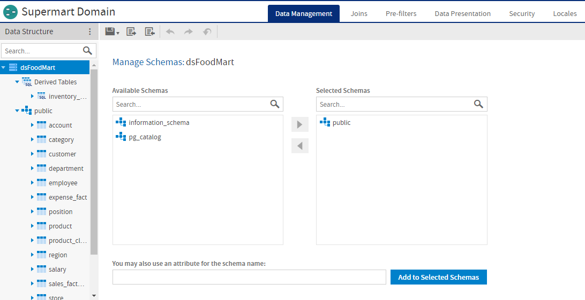
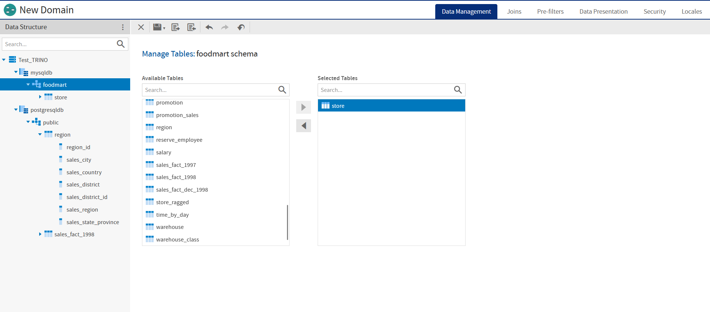
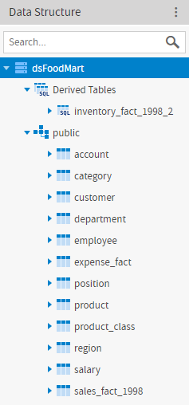
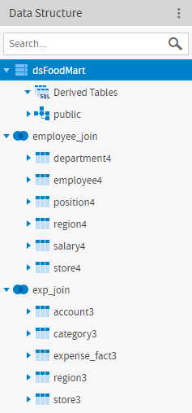
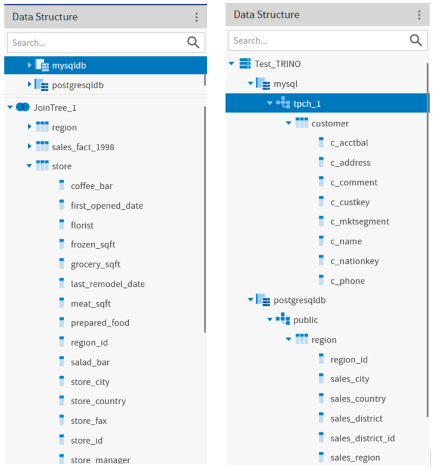
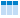

# Overview of the Domain Designer

The Domain Designer is a tool for defining the components of a Domain. Tabs let you choose schemas and tables in your data source, join tables, pre-filter data, and choose the data to present to report creators and users. You can also create calculated fields and derived tables, and upload text files to translate static text or apply security to the Domain.

*Figure 1: User Interface of the Domain Designer*

The following image shows the UI of the Domains Designer when you select a Trino-based data source.

*Figure 2: User Interface of the Domain Designer for a Trino-based data source*

## Domain Designer Tabs

Use the tabs at the top of the Domain Designer to view and edit various aspects of the design. To navigate among tabs, click a tab name at the top of the Domain Designer:

- Data Management tab: Select schemas and tables you want to use in the Domain, including tables you refer to but might not want to expose. See [The Data Management Tab](data-management.md) for more information.
- Joins tab: Define joins between any included tables and/or derived tables. See [The Joins Tab](joins-tab.md) for more information.
- Pre-filters tab: Set conditions on field values to limit the data accessed through the Domain. See [The Pre-filters Tab](prefilters-tab.md) for more information.
- Data Presentation tab: Create sets that specify tables, columns, and items to expose to users. Optionally define or change display properties, such as names and descriptions. See [The Data Presentation Tab](presentation-tab.md) for more information.
- Security tab: Create or upload files in the security file. See [The Security Tab](security-tab.md) for more information.
- Locales tab: Upload locale bundles for translating elements of the Domain. See [The Locales Tab](locales-tab.md) for more information.

All tabs except the Security and Locales have at least two panels, from left to right:

- **Data Structure** panel, which displays the schemas, tables, columns, and joins available on the current tab. Use the search bar at the top of the Data Structure tab to locate a Domain element. Not all elements are available on all tabs.
- A design panel on the right, with a working area specific to the current task. In some cases, the design panel is divided into sub-panels.

## Domain Designer Tool Bar

Use the icons on the tool bar to create derived tables and calculated fields, change the data source, save the Domain, and import and export Domain design files.

<table>
<caption>
Domain Designer Tool Bar Icons
</caption>
<colgroup>
<col style="width: 33%" />
<col style="width: 33%" />
<col style="width: 33%" />
</colgroup>
<thead>
<tr>
<th>
Icon
</th>
<th>Name</th>
<th>
Description
</th>
</tr>
</thead>
<tbody>
<tr>
<td>

</td>
<td>More</td>
<td>
Click to choose one of the following:

<ul>
<li>Create a global constant field</li>
<li>Create a derived table</li>
<li>Choose a different data source or reload data from your existing data source</li>
<li>Clear all data in the Domain</li>
</ul></td>
</tr>
<tr>
<td></td>
<td>Save</td>
<td>Place the cursor over this icon to display a menu of options for saving the Domain.</td>
</tr>
<tr>
<td></td>
<td>Export</td>
<td>Click this icon to export a Domain design file.</td>
</tr>
<tr>
<td></td>
<td>Import</td>
<td>Click this icon to import a Domain design file.</td>
</tr>
<tr>
<td></td>
<td>Undo</td>
<td>Click this icon to undo the most recent action.</td>
</tr>
<tr>
<td></td>
<td>Redo</td>
<td>Click this icon to redo the most recently undone action.</td>
</tr>
<tr>
<td></td>
<td>Undo All</td>
<td>Click this icon to revert the Domain to its state when you last saved.</td>
</tr>
<tr>
<td></td>
<td>Close Domain</td>
<td>Click this icon to close the Domain and return to the previous screen.</td>
</tr>
</tbody>
</table>

Before you can save the design, you must add at least one table to the Domain. The  button on the tool bar validates the design and saves it in the location you specify. For more information, see [Domain Validation](../advanced_domains/modifying_a_domain.md). After saving a Domain, you can continue modifying it using the Domain Designer.

## The Data Structure Panel

The **Data Structure** panel contains a hierarchical view of the available schemas, tables, columns, and joins. The available elements and the layout depend on the current tab. A search bar lets you search for items in the panel by name.

             

*Figure 3: Examples of Data Structure panel on Data Management and Joins tabs*

The following image shows the UI of the Domains Designer when you select a Trino-based data source to create the domain.

             

*Figure 4: Examples of Data Structure panel on Data Management and Joins tabs for a Trino-based data source*

The following icons to indicate element type can appear on the **Data Structure** panel or elsewhere in the Domain Designer:

| Icon | Description |
|----|----|
|  | The data source for the Domain. There is only one data source for a Domain. |
|  | A database schema that has been added to the Domain. |
|  | A database schema that has been added using an attribute for the schema name. |
|  | A table that has been added to the Domain. |
|  | A column (field) in the Domain. |
|  | Constant Fields. Only appears if you have created one or more constant calculated fields. |
|  | A calculated field or constant field that has been added to the Domain. Constant fields appear under the Constant Fields node; other calculated fields appear under the join or table where they were created. |
|  | Derived Tables. Only appears if you have created one or more derived tables. |
|  | A derived table that has been added to the Domain. |
|  | A join tree. A Domain may contain many join trees, but when a user creates an Ad Hoc view from a Domain, they can only select one join tree to use in the view. |
|  | A data island. A data island contains the tables and columns from a specific join tree that you have chosen to expose to users. Data Islands are only visible on the Data Presentation tab. |
|  | A set, that is, a named collection of items grouped together for ease of use in the Ad Hoc Editor. Sets are visible only on the Data Presentation tab. |
|  | An item, that is, the representation of a database field or a calculated field along with its display name and formatting properties. Items are visible only on the Data Presentation tab. Items can be grouped in sets and are used in the creation of Ad Hoc views. |
|  | A catalog that has been added to the Domain (only for Domains that are created from a Trino data source). |

The following icons represent items on the **Data Presentation** tab. An item is the representation of a database field or a calculated field along with its display name and formatting properties. Items can be grouped in sets and are used in the creation of Ad Hoc views.

| Icon | Description |
|----|----|
|  | Boolean field |
|  | Boolean measure |
|  | calculated field |
|  | calculated measure |
|  | date field |
|  | date measure |
|  | numeric field |
|  | numeric measure |
|  | string field |
|  | string measure |
