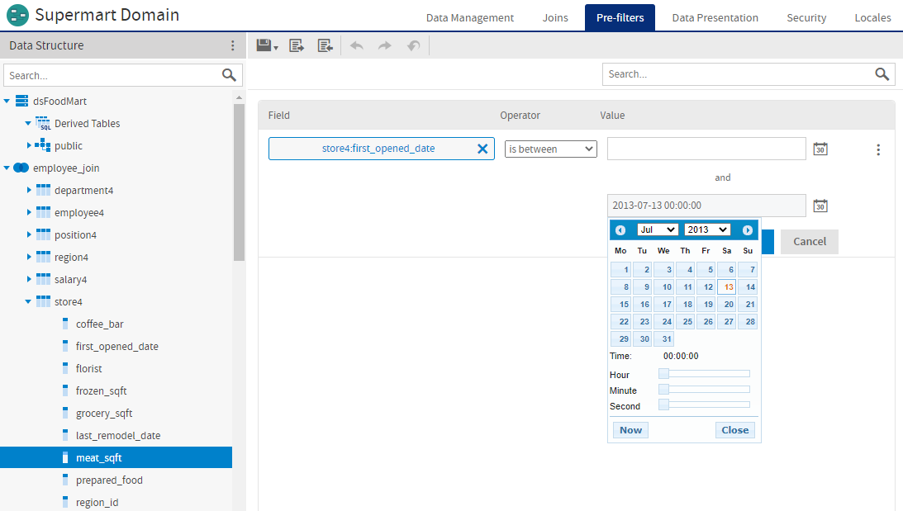

# The Pre-filters Tab

A pre-filter on one or more columns restricts the data that the Domain retrieves from the data source. Pre-filtering irrelevant data reduces the size of query results and processing time. In addition, building frequently-used pre-filters into the Domain design avoids the need for each report designer to define filters independently and reduces the chance for errors.

You can define a pre-filter on a column you do not plan to expose in the Domain. The pre-filter remains active and restricts the data that appears to report users. For example, you can pre-filter data to select a single country, in which case it does not make sense for the column to appear in the Domain's presentation data. However, you should clearly document such data restrictions in the description of the Domain, so users understand what data is accessible through the Domain.

!!! note

    Ad Hoc views and reports based on the Domain can define their own filters. When you use a pre-filter, the data is never retrieved from the database. When you filter on the Ad Hoc level, the data is retrieved, but may not be displayed to the user.

You have two options for defining parameters for a pre-filter:

-   Define the parameters statically, so they are the same for every user. For example, you could create a static filter that filters out data for every country except the USA.

-   Have the server derive the parameter of the filter at run time based on attributes you provide. For example, you can create a filter that only shows data for the logged-in user's country, based on a Country attribute set in your users' profiles. If the specified attribute has not been defined anywhere on the server, the filter will fail. If the attributes are NULL, the filter will not retrieve any data.

!!! note

    You can also filter the data using calculated fields. The primary difference between pre-filters and calculated fields is that calculated fields are visible to report designers and users, and can be used as the basis for additional filters in the Ad Hoc Designer. See [Calculated Fields](../advanced_domains/calculated_fields.md).

For more information on attributes, see [Using Attributes in the Domain Designer](../advanced_domains/attributes_in_the_domain_designer.md).

To define a pre-filter

1.  Go to the **Pre-filters** tab in your Domain.

2.  Drag a column from the **Data Structure** panel to the **Pre-filters** panel.

    The column appears in the **Field** column of the **Pre-filters** design panel with a list of comparison operators you can apply to that column.

3.  Choose the comparison operator from the drop-down in the **Operator** column.

    In the **Pre-filters** panel, the choice of comparison operators depends on the column's datatype. For example, strings offer a choice of search operators and dates offer time-comparison operators.

4.  Select **Field to Value Comparison** or **Field to Field Comparison** from the  menu.

    If you select **Field to Field Comparison**, the **Value** column displays a box labeled **Drag a field here**.

5.  Select or enter a value for your filter. For a filter that compares fields, drag field(s) of the same type to the **Drag a field here** box.

    The format of the filter value changes depending on your previous selections. For example, if you select a date column with the `is between` operator, the **Filters** panel displays two calendar widgets for specifying a date range:

    

    *Figure 1 Filters Panel of the Domain Designer*

    Text columns have both substring comparison operators such as `starts with` or `contains` and whole string matching such as `equals` or `is one of`. When you select a whole string matching operator, the panel displays a list of all existing values for the chosen column, retrieved in real-time from the database. If more than 50 values are available, use search  to narrow the list. For multiple value matching, double-click the available values to select them. You may perform multiple searches and select values from each list of results.

    If you want to use an attribute for a parameter, enter the attribute in the field using the syntax `attribute('<attrName>')`. For example, if you want to use an attribute called Cities in the filter, enter `attribute('Cities')` into the field. If you want to specify that this is a user attribute, and not an organizational or server one, enter `attribute('Cities', 'user')`.

6.  Click **OK** to define the filter.

The **Pre-filters** panel shows all the filters you have defined. The overall filter applied to the data is the logical AND of all conditions you defined.

To modify an existing filter, click . To remove a filter, click .

!!! warning

    Pre-filters defined in the Domain Designer are limited to conditions on one column or comparisons of two columns, with more complex filters created by the conjunction (logical AND) of several conditions. Other filter expressions are not supported. You can create more complex filters in the Domain Design file, but these filters are read-only and are not editable in the Domain Designer.
