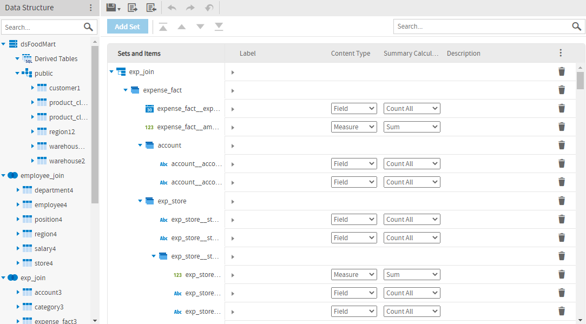
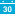
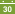
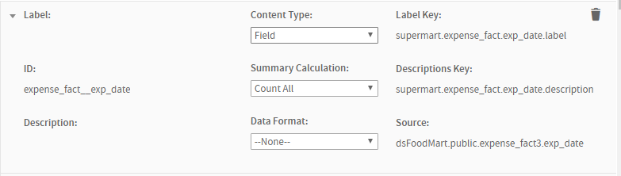
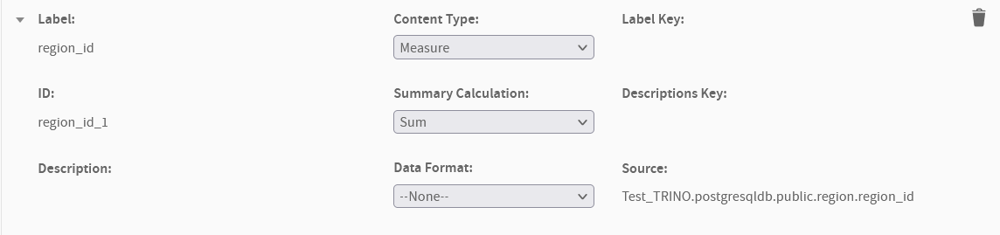

# The Data Presentation Tab

The **Data Presentation** tab is where you specify the columns and calculated fields you want visible to users. You can also create user-friendly names and descriptions and set other column display properties. Typically, you expose only columns that are useful in building or filtering reports. Columns that you do not display are still part of the Domain and can affect the data retrieved.

*Figure 1: The Data Presentation Tab*

The **Data Presentation** tab contains the following:

-   **Data Structure** panel: Displays available tables and fields for this Domain, including table copies, derived tables, and calculated fields. Joined tables appear as join trees. Dragging a join tree, table, or column from Data Structure to Sets and Items does not remove it from the **Data Structure** panel. This reflects the fact that you can add a resource to more than one set.

    !!! note

        You cannot delete tables from the Domain on the **Data Presentation** tab. You must do this on the **Data Management** or **Joins** tab.

-   **Sets and Items** list: Lists resources that will appear to report creators who use the Domain.

-   **Properties** pane: Displays the properties of the associated set or item. This area can be expanded or collapsed.

    To specify which columns and calculated fields are exposed to users of the Domain, drag them from the **Data Structure** panel to the **Sets and Items** panel. The following icons show the different resources:

-    – A data island. Corresponds to a join tree or unjoined table, but does not necessarily have the same structure. For example, a data island does not need to contain all the tables or columns from its join tree. In addition, it can contain sets that do not correspond to any table, and it can contain the same field or table several times across different sets. However, a data island can only contain resources from a single join tree or unjoined table, and a join tree or unjoined table can correspond to at most one data island. Can contain sets and items.

    !!! note

        When a user creates an Ad Hoc view, they can only choose sets from the same data island.

-    – A set. A group of resources; can contain items and other sets. Sets can be created by dragging a table, in which case they can only contain items from that table; or they can be created by clicking **Add Set**, in which case they can contain items from different tables in the same join tree.

-   Item icons. An item is a column or calculated field that you want to appear in the Domain. The icon shows the data type of the item:

| Icon | Description |
|----|----|
|  | Boolean field |
|  | Boolean measure |
|  | calculated field |
|  | calculated measure |
|  | date field |
|  | date measure |
|  | numeric field |
|  | numeric measure |
|  | string field |
|  | string measure |

## The Data Structure Panel

On the **Data Presentation** tab, the **Data Structure** panel displays the tables in your Domains organized into join trees. In this view, a single join tree contains a group of tables that are all connected directly or indirectly through joins. Unjoined tables and columns appear at the top (underneath the data source node), and joined tables and their columns appear at the bottom. The following actions are available:

-   Expand the data source node to see the unjoined tables and columns in your Domain.

-   Expand a join tree to see the tables it contains.

-   Expand a table or derived table to see the columns it contains.

-   Use **Ctrl-click** or **Command-click** to select multiple items. Use **Shift-click** to select a range of items.

-   Drag selected items to the Sets and Items design panel to display it to the users.

-   Hover over an item to see its ID.

!!! note

    In previous versions, you were not required to create data islands. Now, adding an item automatically adds it to the correct data island or creates a new data island if it does not yet exist. Opening and saving a Domain with the previous model updates it the current model. It is good practice to update older Domains.

## The Sets and Items List

The **Sets and Items** list shows the resources you want the user to see, organized into data islands, sets, and items in a nested hierarchy. If there are sets and items at the same level, items appear first. The menu bar at the top of the **Sets and Items** list shows the following:

-   **Add Set** – Creates a new subset of a selected set. Not available when no sets have been added.

-       – Move the current selection as follows: to the top, up, down, or to the bottom. Data islands are moved relative to other data islands; items and sets are moved within their containing set or data island.

    You can also move a set or item by dragging. You can reorder sets and items by dragging them to another location in the same set; however, when you close and reopen a Domain, sets always appear below items. Data islands can be dragged above or below other data islands. You can move items and lower-level sets to any level in the same data island. If you drag a set or item between sets, it appears at the top of the set that it was moved to.

     – Controls the display of sets and items and their properties:

    -   The following selections control the properties you view when a set or item is collapsed. When a resource is expanded, all available properties are visible.

        | Menu Item | Description | Visible Properties |
        |----|----|----|
        | **Default Properties** | Displays an overview of the resource. | Label, Content Type, Summary Calculation, Description |
        | **Identification Properties** | Lets you view the ID and edit the label and description. | Label, ID, Description |
        | **Bundle Keys Properties** | Lets you view and edit properties related to bundle keys for localization. | Label Key, Descriptions Key |
        | **Data Properties** | Lets you select whether an item is a dimension or measure; lets you view and edit properties specific to measures. | Source, Content Type, Summary Calculation, Data Format |

    -   The following selections let you expand and collapse the list of sets and items and their properties.

        -   **Expand All Properties**: Expands all sets and items and displays expanded properties for all.

        -   **Collapse All Properties**: Collapses all sets and items and displays collapsed properties for all. The properties shown depend on the selection you made.

            The following selections are available for resources:

-   ,  – Expands or collapses a node in the Sets and Items list.

-   ,  – Expands or collapses properties. Click in any property to start editing it.

-    – Removes the associated resource.

-    – Searches items and sets and shows matches if any of the following contain the search string: label, ID, description, label key, descriptions key. Can be used to quickly find similar items and compare and edit their properties.

## Properties

*Figure 2: Item Properties on the Data Presentation Tab*

*Figure 3: Item Properties on the Data Presentation Tab for Trino-based data source*

The **Properties** pane of the **Data Presentation** tab lets you refine the Domain's appearance by renaming and providing descriptions for data islands, sets, and items. The following table describes the properties that may appear.

<table>
<colgroup>
<col style="width: 33%" />
<col style="width: 33%" />
<col style="width: 33%" />
</colgroup>
<thead>
<tr>
<th>
Property
</th>
<th>
Appears On
</th>
<th>
Description
</th>
</tr>
</thead>
<tbody>
<tr>
<td>
Label
</td>
<td>
Data Island, Set, Item
</td>
<td>
User-friendly name displayed in the Data Chooser and the Ad Hoc Editor.
</td>
</tr>
<tr>
<td>
ID
</td>
<td>
Data Island, Set, Item
</td>
<td>
An identifier used within the Domain. Default table and field IDs are based on the names in the data source, but you can change the ID of a table as long as it remains unique. Presentation IDs are a separate namespace in which each ID must be unique, although based on table and field IDs by default. The ID property value must be alphanumeric.

You should not change IDs for a Domain that has already been used to create Ad Hoc views or Topics.
</td>
</tr>
<tr>
<td>
Description
</td>
<td>
Data Island, Set, Item
</td>
<td>
User-friendly description displayed as tooltip on the label in the Ad Hoc Editor. The description helps the report creator understand the data represented by this set or item.
</td>
</tr>
<tr>
<td>
Content Type
</td>
<td>
Item
</td>
<td>
Label that designates the item as either a qualitative value (field) or quantitative value (measure). By default, all numeric types are assumed to be measures, and all non-numeric items are plain fields. Use this setting to override the default.
</td>
</tr>
<tr>
<td>
Summary Calculation
</td>
<td>
Item
</td>
<td>
Default summary calculation for the item when used in a report. The available functions depend on the field's data type (Boolean, date, numeric, or text). See the JasperReports Server User Guide for more information.
</td>
</tr>
<tr>
<td>
Data Format
</td>
<td>
Item
</td>
<td>
Default numerical format (such as number of decimal places) for the item when used in a report. Numeric and dates only.
</td>
</tr>
<tr>
<td>
Label Key 

</td>
<td>
Data Island, Set, Item
</td>
<td>
Internationalization key for the label property; locale bundles associate this key with the localized text for the label.
</td>
</tr>
<tr>
<td>Descriptions Key</td>
<td>Data Island, Set, Item</td>
<td>
Internationalization key for the description property; locale bundles associate this key with the localized text for the description.
</td>
</tr>
<tr>
<td>
Source
</td>
<td>
Item
</td>
<td>
For a domain based on Trino:

References the data source, catalog, schema, table, and field associated with this item; the syntax is <code>datasource.catalog.schema.table.field</code>. Not editable

For a Domain not based on Trino:

References the data source, schema, table, and field associated with this item; the syntax is <code>datasource.schema.table.field</code>. Not editable.
</td>
</tr>
</tbody>
</table>

Labels and descriptions are visible to users of the Domain. Descriptions of sets and items appear as tooltips in the Ad Hoc Editor to help report creators understand their purpose.

The internationalization keys must match the property names of strings in locale bundles. Keys may use only characters from the ISO Latin-1 set, digits, and underscores (\_). If you create internationalization keys on the Data Presentation tab, you can download the keys as a template file for locale bundles by clicking **Download Template** in the **Locale Bundles** section on the **Options** tab.
