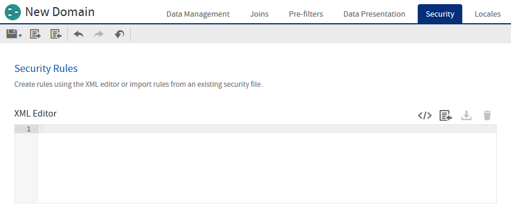
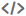

# The Security Tab

The **Security** tab is where you enter and view rules that restrict access to the data in a Domain, based on a user's roles and attributes. Rules are stored in an XML file that works together with the Domain's XML design file to identify what data you want to expose to each user. When creating or running a report based on a Domain, the user name and roles are checked against the permissions in the security file. When a user is designing a report in the Ad Hoc Editor, they see only the columns to which they have access. When the report runs, portions to which the user has no access are blank.

The **Security** tab in the Domain designer provides a basic editor that lets you upload, view, and edit the Domain's security file. The contents of the editor is the current security file defined for the Domain.

To create security rules, you need to understand the syntax for Domain files and Domain security files. Make sure to read and understand the material in [Securing Data in a Domain](../domain_security/securing_data_in_a_domain.md) before you create a security file.

*Figure 1 Security Tab with no Security Rules Created*

The security file references the `id`s of tables, columns, sets, and items in the Domain design file. When creating a security file, be sure to use the `id`s of items and groups as they are defined in the Domain design file exported from the `Domain Designer`.

The `Security` tab has the following icons to work with the security file editor.

**Domain Designer Security File Icons**

<table>
<colgroup>
<col style="width: 33%" />
<col style="width: 33%" />
<col style="width: 33%" />
</colgroup>
<thead>
<tr>
<th>
Icon
</th>
<th>Name</th>
<th>
Description
</th>
</tr>
</thead>
<tbody>
<tr>
<td>

</td>
<td>Create 
Template</td>
<td>
Generates a generic security file template in the file editor. If the file editor contains any text, you are prompted to replace it.

This template contains a pattern of access grants that you can use to start your security file. The template does not contain any IDs from the Domain. You can then modify this template to create your file or download it to work in an external editor. For more information, see <a href="../domain_security/creating-a-security-file.md">Downloading the Security File Template</a>.
</td>
</tr>
<tr>
<td></td>
<td>Import</td>
<td>
Uploads a security file from your computer or from one stored in the repository. If the file editor contains any text, you are prompted to replace it. For more information, see <a href="../domain_security/creating-a-security-file.md">Uploading the Security File</a>.
</td>
</tr>
<tr>
<td></td>
<td>Download</td>
<td>
Prompts you to save the contents of the security file editor as an XML file on your computer.
</td>
</tr>
<tr>
<td></td>
<td>Clear</td>
<td>
Removes the security file from the Domain and erases the content of the editor. If the file editor contains any text, you are prompted before deleting it.
</td>
</tr>
</tbody>
</table>

The editor checks the XML syntax and Domain IDs of your file and lets you fix any errors. Upon saving the Domain, the contents of the editor are validated for join references and principal expressions, then becomes the Domain's security file.

If you modify the Domain, you should edit the security file on this tab with any IDs that have changed. Or if the changes are extensive, download the file, edit it in an external editor, and upload it again.

For a comprehensive example of designing, writing, and uploading a security file, see [Securing Data in a Domain](../domain_security/securing_data_in_a_domain.md).
