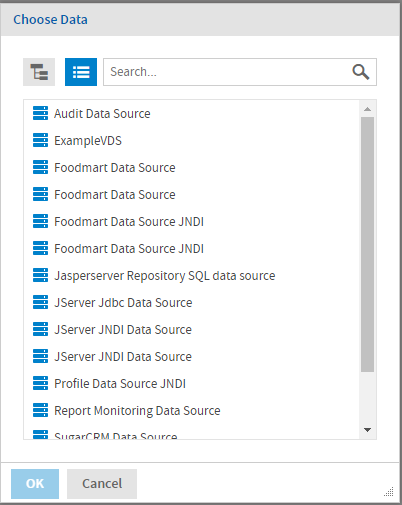
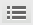

# Opening the Domain Designer

To open the Domain Designer and create a new Domain

1.  Log in as an administrative user.
2.  Create a Domain in one of the following ways:

- Select **Create \> Domain** from the main menu.
- Click **Create** in the Domains section of the home page.
- Right-click a repository folder and choose **Add Resource \> Domain**.

The **Choose Data** dialog appears.

*Figure 1: The Choose a Data Source dialog*

1.  Select a data source in the **Choose Data** dialog and click **OK**.

- Use only data sources in the repository for which the intended user has at least execute permission.
- If you installed the sample data, you can use the sample JDBC, JNDI, and virtual data sources in **Organization \> Data Sources** or **Organization \> Analysis Components \> Analysis Data Sources**.
- You can use the icons at the top of the **Choose Data** dialog to switch between a repository tree view and a flat list of data sources:

: Display data sources as a repository view.

: Display data sources as a list.

- For performance reasons, the **Choose Data** dialog has an upper limit on the number of data sources it displays. If the data source you want does not appear in the list, use the **Search...** bar  to locate it.

1.  Click **OK** to open the **Domain Designer** with the selected data source.

To edit an existing Domain

1.  Log in as an administrative user.
2.  Display a list of Domains in one of the following ways:

- Navigate to a folder in the Repository that contains Domains.
- Click the large icon in the Domains block on the home page.

1.  Right-click the Domain you want and select **Edit** from the menu.

The **Domain Designer** displays the **Data Management** tab for the Domain you selected.

If you close the domain without saving the changes, you are prompted to save or cancel the changes to the existing domain.
