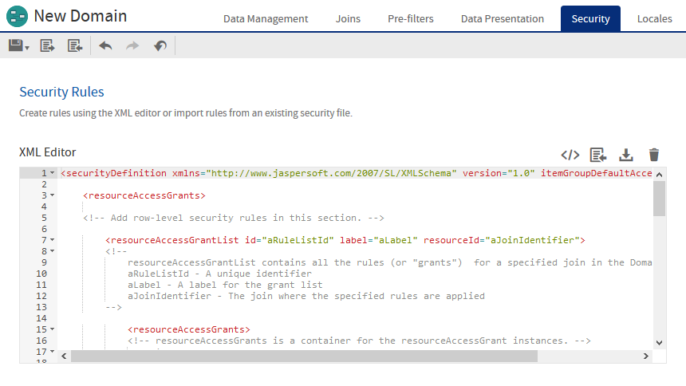
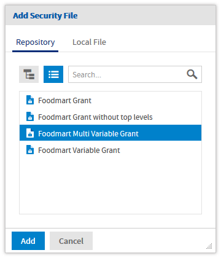
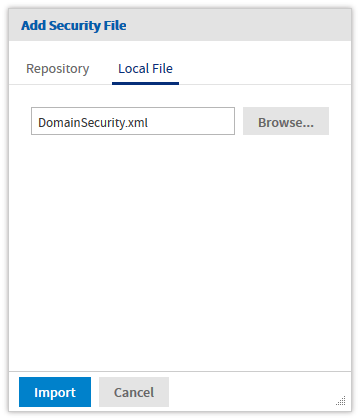

# Creating a Domain Security File

A Domain’s security file contains item and resource access grants that specify access based on certain aspects of a user, such as attributes or roles. Typically, access grants check a user’s roles or attributes and grant access to the items (columns) and resources (rows) of the Domain. This mechanism tailors the data that is available to each user.

A Domain’s security file has two types of access definitions:

- Row-level access determines which rows in the data source can be displayed to a specific user.

- Column-level access determines which columns in the data source can be displayed to a specific user.

This section describes the access grant syntax and illustrates both kinds of access grant.

!!! note

    Note the comments in the XML examples in this section; for example: `<!-- Comment -->`. It’s good practice to comment the access grants you define, and to format your XML neatly. We recommend using an XML editor when creating security files. See [Domain and Security Recommendations](recommendations.md).

## Downloading the Security File Template

To begin writing your security file, download the template provided on the **Security** tab.

1.  Open your Domain in the Domain Designer and navigate to the **Security** tab.
2.  Click  to display the generic template in the editor.



*Figure 1: Security Tab with the Generic Template*

1.  Click  to download the template and save it as an XML file on your computer.

Modify the template as shown in the code samples in the following sections. The samples do not strictly follow the template, but the template gives you the structure of the file.

## Access Grant Syntax

All access grants take a `principalExpression` that gets the user's attributes or roles and evaluates them. When the `principalExpression` evaluates to true, that means the column-level grant or row-level grant applies to the current user. Column-level grants then have a list of columns, called items, that are denied or granted access. Row-level grants have a `filterExpression` that filters rows based on the attributes or roles. In practice, when the `principalExpression` of a row-level grant is true, the `filterExpression` is added to the `WHERE` clause of the database query to restrict the rows that are returned.

You can use the following services in a `principalExpression` or `filterExpression`:

- `authentication.getPrincipal().getRoles()`: Use this function to access the roles of the current user.

- `attributesService`: Use to retrieve or test for an attribute you have defined at the user, organization, or server level.

The following service is only used in a `filterExpression` to filter rows:

- `testProfileAttribute`: Compares a given attribute to a field in the data.

### The getRoles() Function

To retrieve information about roles, you must access Spring's currently authenticated principal object. You do this using `authentication.getPrincipal().getRoles()` to get a list of all roles defined for the user. Your expression must process this list to compare it to the desired role names. For example, the following principal expression checks whether the user has the ROLE_ADMINISTRATOR or ROLE_SALES_MANAGER role.

```
<principalExpression>
  authentication.getPrincipal().getRoles().any{ it.getRoleName()
    in ['ROLE_ADMINISTRATOR','ROLE_SALES_MANAGER'] }
</principalExpression>
```

The `authentication.getPrincipal()` function can access other information about the user, but Jaspersoft recommends using only the functions described in this section.

### The attributesService

The `attributesService` retrieves the value of a given attribute for a user. A user can inherit attributes from their organization or the server in addition to any attributes assigned to the user directly. When specifying an attribute, you can either choose the category (user, tenant (organization), or server) in which the server should look for its value, or allow the server to locate the value hierarchically.

When determining an attribute hierarchically, the server first searches for attributes defined at the user level, then at the organization-level, then on any parent organizations, then finally at the server level. It will return the first value it finds, such that an attribute defined at a lower level can override the same attribute at a higher level.

This function has the following syntax:

`attributesService.getAttribute('AttrName',Level[,required])`

where:

- `AttrName`: String that specifies the attribute to check. This can be any customer-defined attribute, such as `Cities`.
- `Level`: Category that specifies a level in the hierarchy to check for attributes. One of: `null`, `'USER'`, `'TENANT'`, or `'SERVER'`. To search for attributes hierarchically from all levels, use `null`.
- `required` (optional):Boolean that specifies whether or not the attribute is required.
- When set to `true`, an error message is displayed in the UI if the attribute is not present.
- When set to `false` (default), if the attribute is not present, no error is thrown and the `filterExpression` is not performed. In this case, unfiltered information which the user is not explicitly authorized to view may be displayed.

!!! note

    - `attributesService` is implemented in Groovy. For more information about Groovy, see [www.groovy-lang.org](http://www.groovy-lang.org/).

For example, the following expression tests whether the user has `myValue` set for `myAttribute` anywhere in the hierarchy.

```
<principalExpression>
  attributesService.getAttribute('myAttribute',null,true)?.getAttrValue().equals('myValue')
</principalExpression>
```

### The testProfileAttribute Function

Within a `filterExpression`, you often want to compare an attribute to a database field value. The `testProfileAttribute` function provides an easy way to do so:

`testProfileAttribute(table_ID.field_name, 'attribute'[,Level])`

where:

- `table_ID.field_name`: The table name and field name of a field whose value you’re comparing to an attribute.
- `attribute`: The name of an attribute.
- `Level` (optional): A specific level where the attribute should be defined, one of `'USER'`, `'TENANT'`, or `'SERVER'`. When this argument is omitted, the attribute value is determined hierarchically across all levels.

Filter expression using `testProfileAttribute`

`<filterExpression>testProfileAttribute(store1.store_country,'country')</filterExpression>`

!!! note

    JasperReports Server 6.0 added support for hierarchical attributes and changed the behavior of `testProfileAttribute` to use them by default.

You can also use `attributesService` in a filter expression. The following filter expression gives the same results as the filter expression in Filter expression using testProfileAttribute

Filter expression using `attributesService`

```
<filterExpression>
  store1.store_country ==(groovy('attributesService.getAttribute("country", null).attrValue'))
</filterExpression>
```

## Row-level Security

This section gives an overview of row-level security and then shows how CZS uses row-level security to restrict access based on `Cities` and `ProductDepartment`.

### Understanding Row-level Security

Row-level access determines which rows in the data source can be displayed to a specific user.

For example, consider a table that includes values for the cities where products are sold. You could define a resource access grant that finds users for which a city has been defined as a profile attribute and, for each such user, limits access to rows where the city value is the user’s specific city.

For example, take Rita and Alexi. Both have the same role and the same access to the Sales Numbers analysis view, but CZS doesn’t want them to see the same data—Rita should see data about San Francisco, Sacramento, and Los Angeles; and Alexi should see data about Osaka and Sakai. Without attributes, this would be possible only if CZS’s access roles were defined along geographic lines.

!!! note

    Each access grant ID must be unique within the scope of the security file.

    You can define several similar resource access grants for each resource defined in your Domain. By default, the server assumes access grants are combined with a logical AND. You can force the server to use a logical OR by setting the `orMultipleExpressions` property to TRUE.

To implement row security, CZS uses `attributesService` to check for attributes.

For example, CZS used the following XML to define a principal expression and filter expression that grant access to users based on their `Cities` profile attribute:

```
<resourceAccessGrant id="Jointree_1_row_access_grant_20">
  <principalExpression>attributesService.getAttribute('Cities', null, true) != null
  </principalExpression>
  <filterExpression>testProfileAttribute(store.store_city,'Cities')
  </filterExpression>
</resourceAccessGrant>
```

The principal expression gets the values of the `Cities` attribute for the logged-in user. Since `attributesService` supports hierarchical attributes, CZS set the `null` parameter to indicate that they want to look at the values from all levels. The optional `true` parameter ensures that if a user without any values for the Cities attribute accesses the view, they will receive an error.

The filter expression checks the user’s `Cities` profile attribute as well, but it compares this value with the values in the Domain’s `store_city` field. The Domain then returns all the rows that match the user’s `Cities` profile attribute.

### CZS’s Resource Access Grants

CZS uses the access grant above to determine data access based on a user’s `Cities` attribute. Because CZS defines all their attributes in the same manner, they can use a similar resource access grant to determine data access for users based on their `ProductDepartment` attribute.

The resulting security file included these two resource access grants.

```
  <!-- Row level security -->
  <!-- What access do roles/users have to the rows in the resource? -->
  <resourceAccessGrantList id="JoinTree_1_List" label="ListLabel"
    resourceId="JoinTree_1">
    <resourceAccessGrants>
      <!-- Row level for Cities -->
      <resourceAccessGrant id="Jointree_1_row_access_grant_20">
        <principalExpression>attributesService.getAttribute('Cities', null, true) != null
          </principalExpression>
        <filterExpression>testProfileAttribute(store.store_city,'Cities')
        </filterExpression>
      </resourceAccessGrant>
      <!-- Row level for Product Dept -->
      <resourceAccessGrant id="Jointree_1_row_access_grant_30">
        <principalExpression>
          attributesService.getAttribute('ProductDepartment', null, true) != null
        </principalExpression>
        <filterExpression>testProfileAttribute(product_class.product_department,
          'ProductDepartment')</filterExpression>
      </resourceAccessGrant>
    </resourceAccessGrants>
  </resourceAccessGrantList>
```

## Column-level Security

Column-level access determines which columns in the data source can be displayed to specific users.

### Understanding Column-level Security

Consider a table that includes employee contact and salary information. You could define item group access grants that check the user’s role and grant access to the salary field only if the user has the Human Resources role. For example, the following code sample modifies access for the ROLE_SALESREP role, first by revoking the default access for that role and then granting access to sales information only. The principle expression determines which users the item group access grant applies to (users with the ROLE_SALES_REP role). The item access grants determine the specific access of the users. All role-specific access is revoked then access to the `StoreSales` and `StoreCost` item is granted:

```
<itemGroupAccessGrant id="Jointree_1_item_group_access_grant_2" access="granted">
  <principalExpression>authentication.getPrincipal().getRoles().any
    { it.getRoleName() in ['ROLE_SALES_REP'] }</principalExpression>
    <itemAccessGrantList id="Jointree_1_grant2_item_group_items"
      defaultAccess="denied">
      <itemAccessGrants>
        <itemAccessGrant id="Jointree_1_grant2_items_grant1" itemId="StoreSales"
          access="granted" />
        <itemAccessGrant id="Jointree_1_grant2_items_grant2" itemId="UnitSales"
          access="granted" />
      </itemAccessGrants>
    </itemAccessGrantList>
  </itemGroupAccessGrant>
</itemGroupAccessGrants>
```

## CZS’s Item Group Access Grants for Sales Data

To ensure that sales representatives don’t have access to cost information, CZS adds item group access grants; the first grants full access to managers and the administrator:

```
<!-- Column-level access for Sales Manager and Admins-->
<itemGroupAccessGrant id="Jointree1_item_group_access_grant_MNG" access="granted">
  <principalExpression>authentication.getPrincipal().getRoles().any
    { it.getRoleName() in ['ROLE_ADMINISTRATOR','ROLE_SALES_MANAGER'] }
    </principalExpression>
</itemGroupAccessGrant>
```

CZS then adds an item group access grant that grants limited access to sales representatives; the following XML grants access to the Store Sales and Sales Units fields while revoking access to the Store Cost field:

```
<!-- Column-level access for Sales Reps-->
<itemGroupAccessGrant id="Jointree_1_item_group_access_grant_REP"
  access="granted">
  <principalExpression>authentication.getPrincipal().getRoles().any
    { it.getRoleName() in ['ROLE_SALES_REP'] }</principalExpression>
  <itemAccessGrantList id="Jointree_1_grant2_item_group_items"
    defaultAccess="denied">
    <itemAccessGrants>
      <itemAccessGrant id="Jointree_1_grant2_items_grant1" itemId="StoreSales"
        access="granted" />
      <itemAccessGrant id="Jointree_1_grant2_items_grant2" itemId="UnitSales"
        access="granted" />
    </itemAccessGrants>
  </itemAccessGrantList>
</itemGroupAccessGrant>
```

## Uploading the Security File

CZS uploads the security file each time they add a new access grant. You can upload the security file when you add or edit a Domain.

You can also store the security file in the repository as a file resource, and then add it to your Domain. When stored in the repository, the security file can be shared with several Domains, as long as they have the same structure and IDs. This can be useful when the only differences between the Domains are managed with attributes, so a Domain can be copied to several similar organizations.

1.  Open your Domain in the Domain Designer and navigate to the **Security** tab.
2.  Click  to add the security file, then select the **Repository** or **Local File** tab at the top of the dialog.

      

*Figure 2: Add Security File Dialogs*

1.  If you stored the security file in the repository, use the controls to navigate the tree or search for your file, then click **Add**.

If the file is on your computer, browse to select it, then click **Import**.

1.  The server uploads the file and validates it. If there was any XML in the **Security** tab editor, you are prompted to replace it.

The editor checks the XML syntax and Domain IDs of your file and lets you fix any errors. Upon saving the Domain, the contents of the editor are validated for join references and principal expressions, then becomes the Domain's security file.

Use the same procedure to modify or replace the security file when you make any changes to the Domain that affect the access grants.
