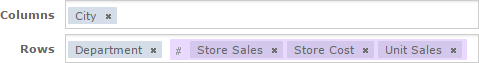

# Setting Up Logging and Testing

Before creating a security file, CZS prepares for the implementation by:

- Enabling Logging
- Creating a Test Report

## Enabling Logging

To assist in the iterative creation of their security file, CZS enables more verbose logging to help troubleshoot problems with the Sales Domain and security file. Such logging features are disabled by default to minimize the log size. They should be enabled in test environments when defining security.

To enable Domain security logging

1.  Locate and open the `log4j.properties` file and scroll to the bottom.

You'll find this file in the `WEB-INF` folder; if you use Tomcat as your application server, the default path to this location is:

`<js-install>\apache-tomcat\webapps\jasperserver-pro\WEB-INF`.

1.  Add the following lines after the last line in the file:

```
log4j.logger.com.jaspersoft.commons.semantic.datasource.impl.
    SemanticLayerSecurityResolverImpl=debug
log4j.logger.com.jaspersoft.commons.semantic.dsimpl.JdbcTableDataSet=DEBUG, stdout, fileout
log4j.logger.com.jaspersoft.commons.util.JSControlledJdbcQueryExecuter=DEBUG, stdout, fileout
```

1.  Save the file.
2.  Restart JasperReports Server.

Information about Domains and their security will now be written to the log and to the console.

!!! note

    The additional information written to the log can be very verbose, and your log files will grow more quickly with these properties enabled. You can manage your logs in the file system, in the WEB-INF/logs folder under your JasperReports Server installation. For more information, refer to the log4j documentation, which is available at:<br>
    <http://logging.apache.org/log4j/docs/manual.html>

    Because these options are so verbose, we recommend using them only during debugging and disabling them in your production environment.

## Creating a Test Report

CZS creates an Ad Hoc crosstab based on the Sales Domain to assist in testing the security file as they create each access grant. The report displays store sales amount, store sales cost, and store units sold for all cities and departments.



*Figure 1: Fields added to CZS Ad Hoc crosstab*

Each user’s limited view of this report is shown in [Testing and Results](verfiying-domain-security.md).
