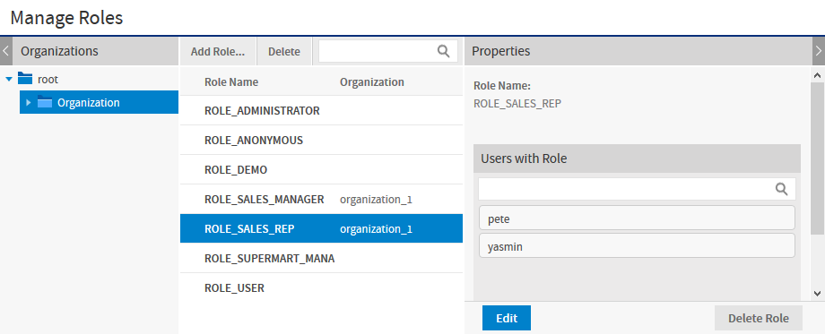
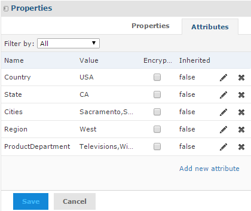

# Roles, Users, and Attributes

## Roles

Domain security can reference a user’s roles to determine the access permissions to grant. The following roles meet CZS’s needs:

-   ROLE_SALES_MANAGER is assigned to sales managers.
-   ROLE_SALES_REP is assigned to sales representatives.

CZS grants each role access to view the Sales Domain. For details about creating roles and assigning privileges, refer to the JasperReports Server Administrator Guide. The following shows CZS’s ROLE_SALES_REP:

*Figure 1: CZS Sales Representative Role*

## Users

CZS created a user for each of their employees and assigned roles based on each employee’s level of responsibility:

| User   | Role               |
|--------|--------------------|
| Alexi  | ROLE_SALES_MANAGER |
| Pete   | ROLE_SALES_REP     |
| Rita   | ROLE_SALES_MANAGER |
| Yasmin | ROLE_SALES_REP     |

For details about creating users, refer to the JasperReports Server Administrator Guide.

## User Attributes

A user attribute is a name-value pair defined at the user level that corresponds to some data in a Domain. CZS wants to be able to describe their users in terms of product lines that they sell and the cities where they sell them. So each user is assigned two attributes in addition to a role:

-   The `Cities` profile attribute corresponds to the City field in the Geography item group in the Sales Domain.
-   The `ProductDepartment` attribute corresponds to the Department field in the Product item group in the Sales Domain.

<table>
<caption>
UserAttributes of All CZS Users
</caption>
<thead>
<tr>
<th rowspan="2">
User
</th>
<th colspan="2">
Profile Attributes
</th>
</tr>
<tr>
<th>
Cities
</th>
<th>
Product/Department
</th>
</tr>
</thead>
<tbody>
<tr>
<td>
Rita
</td>
<td>
San Francisco, Los Angeles, Sacramento
</td>
<td>
Television, Wireless Devices
</td>
</tr>
<tr>
<td>
Pete
</td>
<td>
San Francisco
</td>
<td>
Television
</td>
</tr>
<tr>
<td>
Yasmin
</td>
<td>
San Francisco
</td>
<td>
Wireless Devices
</td>
</tr>
<tr>
<td>
Alexi
</td>
<td>
Osaka, Sakai
</td>
<td>
Wireless Devices
</td>
</tr>
</tbody>
</table>

When these attributes are used in the security file in an access grant definition, each user’s attributes determine the data returned for them by the Domain. For example, Rita’s attribute value for `Cities` is `San Francisco, Los Angeles, Sacramento`. So she sees data for all those cities.

The following figure shows the configuration of Rita’s user account. Notice Rita’s attributes listed below her roles:

*Figure 2: CZS User Rita’s Configuration*
