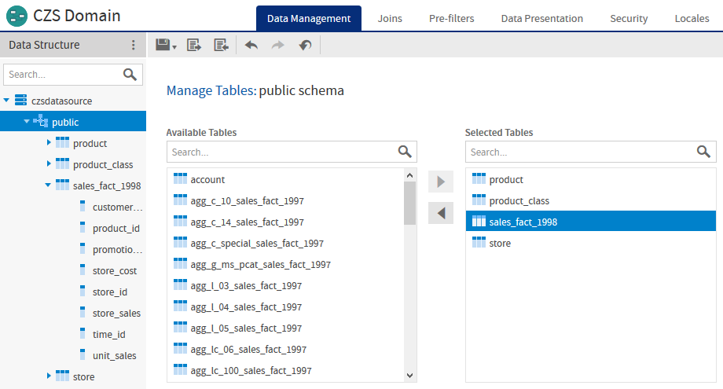
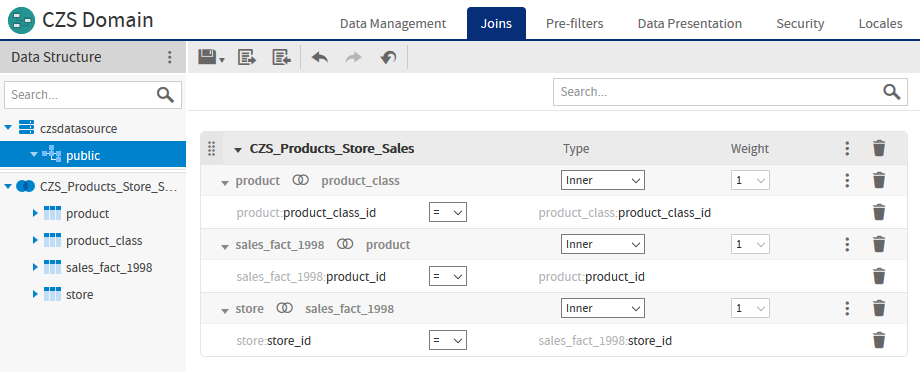
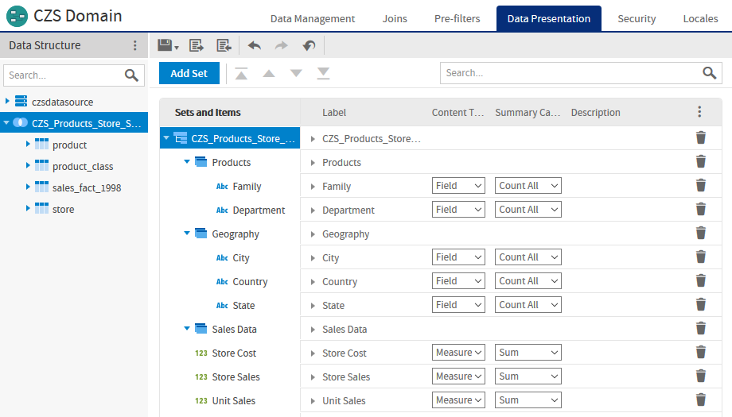

# 1.1 Sales Domain

The first step is to create a Domain that presents the relevant data. CZS is primarily interested in the volume and revenue of their sales, as well as their operational cost. These metrics are represented in the Sales Domain as fields: unit sales, store sales, and store cost. The Domain also includes fields to establish context for the sales data, such as product department, city, and state. The following figures show the configuration of this Domain in the designer.

*Figure 1-1 Data Management Tab for the CZS Domain*

*Figure 1-2 Joins Tab for the CZS Domain*

*Figure 1-3 Data Presentation Tab for the CZS Domain*
