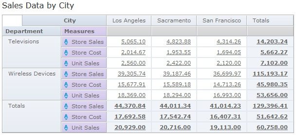
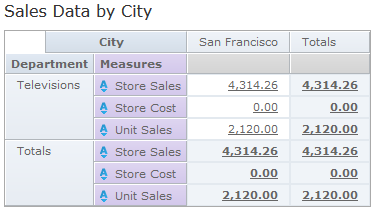
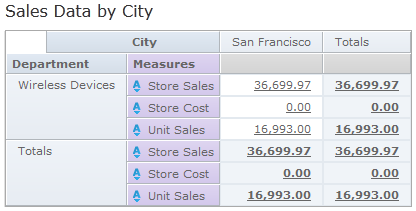
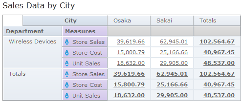
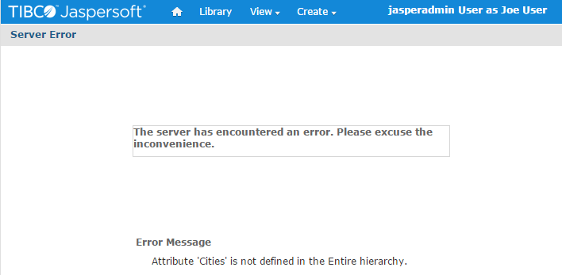

# Testing and Results

Finally, CZS verifies Domain access as various users by clicking the **Login as User** button on the **Manage Users** page.

To test the access granted to users on data in the Domain

1.  Log in as administrator (`jasperadmin`) if necessary.
2.  Click **Manage &gt; Users**.
3.  In the list of user names, click the name of the user you want to test.
4.  On the **User** page, click **Log in as User**. The selected user’s Home page appears.
5.  Click **View &gt; Reports**.
6.  In the list of reports, click the test report you created when defining your security file.
7.  Review the report to ensure that it shows only the data this user should see. Also, verify that you have not restricted data that the user should see. The figures below show CZS’s results.
8.  Click **Logout** to return to the administrator view.

When viewing the test report created from the Sales Domain:

-   Rita can see all data pertaining to California and the three Californian cities where CZS has offices (Los Angeles, Sacramento, and San Francisco):

    

    *Figure 1 Rita’s view of the CZS Test Report*

-   Pete can see only Television data about San Francisco; he sees zeros for Store Cost because he is denied access to that field:

    

    *Figure 2 Pete’s View of the CZS Test Report*

-   Yasmin can see only Wireless Devices data about San Francisco; she sees zeros for Store Cost because she is denied access to that field:

    

    *Figure 3 Yasmin’s view of the CZS Test Report*

-   Alexi can see Wireless device data pertaining to the two Japanese cities where CZS has stores (Osaka and Sakai):

    

    *Figure 4 Alexi’s view of the CZS Test Report*

-   Finally, make sure that any user who doesn't have the Cities attribute set can't see any data. For example, joeuser receives an error:

*Figure 5 joeuser's view of the CZS Test Report*
