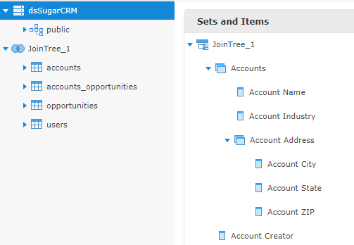

# Representing Sets and Items in XML

The hierarchy of data islands, sets, and items are defined through the `dataIslands` and `itemGroups` elements and their children. These two elements, which are defined together, are direct children of the top-level `schema` element.

### Presentation Hierarchy

The following hierarchy is used to represent data islands, sets, and items. This hierarchy is at the top level, directly under the `schema` element.

``` xml
<schema>
    <dataIslands> (0...1)
        <itemGroup> (1...n)
    <itemGroups> (1...n)
        <itemGroup> (0...n)
            <itemGroups> (0...n)
                    <itemGroup> (0...n)
                            <itemGroups> (0...n)
                <items> (0...n)
                    <item> (1...n)
                    ...
            <items> (0...n)
                <item> (1...n)
        <items> (0...n)
            <item> (1...n)
    <items> (0...n)
        <item> (1...n)
```

The `itemGroups` and `items` elements are recursive elements that are equivalent to the sets and items on the Data Presentation tab of the Domain Designer. They create a hierarchy of sets, subsets and items and hold attributes that define all the properties available on sets and items. For a description of each possible property, see [Properties](../domain_designer/properties.md).

## dataIslands

The `dataIslands` element lists all the data islands on the Data Presentation tab. A schema can have at most one `dataIslands` element. If there are no data islands in the presentation, the `dataIslands` element is not required.

Each data island in the Domain must be represented by an `itemGroup` child of the `dataIslands` element. `dataIslands` is a child of `schema`.

### Child Elements

| Element Name | Description |
|----|----|
| `<`[`itemGroup`](#itemgroup)`>` | (Required) As a child of `dataIslands`, each `itemGroup` represents a data island. |

## itemGroup

As a child element of `dataIslands`, `itemGroup` represents a data island. Each `itemGroup` in the `dataIslands` element corresponds to an `itemGroups` element that describes the hierarchy of sets and items in the data island. There can be at most one data island for each join tree or unjoined table.

!!! note

    `itemGroup` is also used to represent a set in the Domain presentation. See [itemGroup](#itemgroup_1) for more information.

### XML Attributes

<table>
<colgroup>
<col style="width: 33%" />
<col style="width: 33%" />
<col style="width: 33%" />
</colgroup>
<thead>
<tr>
<th><p>Attribute</p></th>
<th>Type</th>
<th><p>Description</p></th>
</tr>
</thead>
<tbody>
<tr>
<td><p><code>id</code></p></td>
<td>String</td>
<td><p>(Required) Unique identifier for the data island in the Domain design file.</p>
<p>The <code>id</code> XML attribute can contain alphanumeric characters along with any combination of the following: @#$^`_~? It cannot start with a digit.</p>
<p>The <code>id</code> attribute is used by other elements in the presentation representation to identify the data island, via the <code>referenceId</code>. In XML files exported from Domain Designer, the <code>id</code> attribute corresponds to the data island's <code>ID</code> property on the <strong>Data Presentation</strong> tab.</p></td>
</tr>
<tr>
<td><code>label</code></td>
<td>String</td>
<td>The data island's name, visible to users of the Domain. If the label is missing, the Ad Hoc Editor displays the <code>id</code>. Corresponds to <code>Label</code> on the <strong>Data Presentation</strong> tab.</td>
</tr>
<tr>
<td><code>description</code></td>
<td>String</td>
<td>A description of the set, visible to users as a tooltip on the set name in the Ad Hoc Editor. Corresponds to <strong>Description</strong> on the <strong>Data Presentation</strong> tab.</td>
</tr>
<tr>
<td><code>labelId</code></td>
<td>String</td>
<td>The internationalization key for the label in the Domain’s locale bundles. Corresponds to <strong>Label Key</strong> on the <strong>Data Presentation</strong> tab.
<p>Can contain alphanumeric characters along with any of the following: .`~_</p></td>
</tr>
<tr>
<td><code>descriptionId</code></td>
<td>String</td>
<td>The internationalization key for the description in the Domain’s locale bundles. Corresponds to <code>Descriptions Key</code> on the Data Presentation tab.
<p>Can contain alphanumeric characters along with any of the following: .`~_</p></td>
</tr>
<tr>
<td><code>resourceId</code></td>
<td>String</td>
<td><p>(Required) <code>resourceId</code> of the <code>jdbcTable</code> or <code>jdbcQuery</code> element for the join tree or unjoined table that corresponds to the data island. <code>jdbcQuery</code> is only used in the case when your data island comes from a derived table that isn't joined to anybody.</p></td>
</tr>
</tbody>
</table>

## itemGroups

`itemGroups`: A container for `itemGroup` elements and/or `items` elements. Each instance of `itemGroups` corresponds to a data island defined as an `itemGroup` in `dataIslands`.

All descendents of a specific `itemGroups` element must refer to the same join tree or unjoined table. This means that the `resourceId` attribute of all descendents of an `itemGroups` element must reference the `id` attribute of the same `jdbcTable` or `jdbcQuery`.

You can upload a Domain with an empty `itemGroups` element, but for the corresponding data island to be used, it must contain at least one `itemGroup` or `items` element.

A recursive relationship between `itemGroups` and `itemGroup` is used to show sets and subsets. The top-level element in a set hierarchy is always an `itemGroups` element. Every `itemGroups` element must contain at least one `items` or `itemGroup` element.

### Child Elements

| Element Name                      | Description                      |
|-----------------------------------|----------------------------------|
| `<`[`itemGroup`](#itemgroup_1)`>` | A set in the data presentation.  |
| `<`[`items`](#items)`>`           | A container for `item` elements. |

## itemGroup

As a child of the `itemGroups` element or `itemGroup` element, `itemGroup` represents a set or subset. `itemGroup` contains `itemGroups` elements and/or `items` elements. Set properties are represented as attributes.

A recursive relationship between `itemGroups` and `itemGroup` is used to show sets and subsets. The top-level element in a set hierarchy is always an `itemGroups` element. Every `itemGroups` element must contain at least one `items` or `itemGroup` element.

!!! note

    `itemGroup` is also used to represent a data island in `dataIslands`. See [itemGroup](#itemgroup) for more information.

### Child Elements

The hierarchy of `itemGroups` and `items` elements defines the hierarchy of sets and items in the data island.

| Element Name | Description |
|----|----|
| `<`[`itemGroups`](#itemgroups)`>` | A container for `itemGroup` elements, which represent sets. |
| `<`[`items`](#items)`>` | A container for `item` elements, which represent items. |

### XML Attributes

The attributes of `itemGroup` specify the properties of the set or data island. See [Properties](../domain_designer/properties.md) for more information.

<table>
<colgroup>
<col style="width: 33%" />
<col style="width: 33%" />
<col style="width: 33%" />
</colgroup>
<thead>
<tr>
<th><p>Attribute</p></th>
<th>Type</th>
<th><p>Description</p></th>
</tr>
</thead>
<tbody>
<tr>
<td><code>id</code></td>
<td>String</td>
<td><p>(Required) The unique identifier of the set among all set and item IDs.</p>
<p>The <code>id</code> XML attribute can contain alphanumeric characters along with any combination of the following: @#$^`_~? It cannot start with a digit.</p>
<p>The <code>id</code> attribute is used by other elements in the presentation representation to identify the set. In XML files exported from Domain Designer, the <code>id</code> attribute corresponds to the set's <code>ID</code> property on the <strong>Data Presentation</strong> tab.</p></td>
</tr>
<tr>
<td><code>label</code></td>
<td>String</td>
<td>The set’s name, visible to users of the Domain. If the label is missing, the Ad Hoc Editor displays the <code>id</code>. Corresponds to <strong>Label</strong> on the <strong>Data Presentation</strong> tab.</td>
</tr>
<tr>
<td><code>description</code></td>
<td>String</td>
<td>A description of the set, visible to users as a tooltip on the set name in the Ad Hoc Editor. Corresponds to <strong>Description</strong> on the <strong>Data Presentation</strong> tab.</td>
</tr>
<tr>
<td><code>labelId</code></td>
<td>String</td>
<td>The internationalization key for the label in the Domain’s locale bundles. Corresponds to <strong>Label Key</strong> on the <strong>Data Presentation</strong> tab. If blank, the default key is used.
<p>Can contain alphanumeric characters along with any of the following: .`~_</p></td>
</tr>
<tr>
<td><code>descriptionId</code></td>
<td>String</td>
<td>The internationalization key for the description in the Domain’s locale bundles. Corresponds to <strong>Descriptions Key</strong> on the <strong>Data Presentation</strong> tab. If blank, the default key is used.
<p>Can contain alphanumeric characters along with any of the following: .`~_</p></td>
</tr>
<tr>
<td><code>resourceId</code></td>
<td>String</td>
<td>(Required) <code>id</code> of the join tree or unjoined table that contains this set, as specified in <code>dataIslands</code>. The <code>resourceId</code> attribute must be the same for all <code>item</code> and <code>itemGroup</code> elements that descend from the same <code>itemGroups</code> element.</td>
</tr>
</tbody>
</table>

When an internationalization key is defined for the label or description, the label or description is replaced with the value given by the key in the local bundle corresponding to the user’s locale. See [Localizing Domains](../localizing/localizing_domains.md).

## items

The `items` element is a container for `item` elements, which represent items on the Data Presentation tab. `items` can be a child of `itemGroup` or `schema`.

-   As a child of `schema`, `items` is a container for items in a single data island that do not belong to any a set. All `item` elements in an items element must belong to the same data island. There is one `items` element in `schema` for each data island that has items that are not in a set.
-   As a child of `itemGroup`, items is a container for the `items` in the set represented by `itemGroup`.

### Child Elements

| Element Name          | Description                       |
|-----------------------|-----------------------------------|
| `<`[`item`](#item)`>` | An item in the data presentation. |

## item

The `item` element represents an item in the data presentation of the Domain. An item is the representation of a database field or a calculated field along with the display name and formatting properties defined in the Domain.

### XML Attributes

The attributes of `item` specify the properties of the item. See [Properties](../domain_designer/properties.md) for more information.

<table>
<colgroup>
<col style="width: 33%" />
<col style="width: 33%" />
<col style="width: 33%" />
</colgroup>
<thead>
<tr>
<th><p>Attribute</p></th>
<th>Type</th>
<th><p>Description</p></th>
</tr>
</thead>
<tbody>
<tr>
<td><code>id</code></td>
<td>String</td>
<td>(Required) The unique identifier of the item among all set and item IDs.
<p>The <code>id</code> XML attribute can contain alphanumeric characters along with any combination of the following: @#$^`_~? It cannot start with a digit.</p>
<p>By default, the Domain Designer uses the name of the <code>field</code> as the id. If there are multiple instances of the field in the data island, then the Domain Designer appends a number to the name, such as <code>field2</code>.</p></td>
</tr>
<tr>
<td><code>label</code></td>
<td>String</td>
<td>The item’s name, visible to users. If the label is missing, the Ad Hoc Editor displays the <code>id</code>.</td>
</tr>
<tr>
<td><code>description</code></td>
<td>String</td>
<td><p>An optional description of the item, visible as a tooltip on the item name in the Ad Hoc Editor.</p></td>
</tr>
<tr>
<td><code>labelId</code></td>
<td>String</td>
<td>The internationalization key for the label in the Domain’s locale bundles.
<p>Can contain alphanumeric characters along with any of the following: .`~_</p></td>
</tr>
<tr>
<td><code>descriptionId</code></td>
<td>String</td>
<td>The internationalization key for the description in the Domain’s locale bundles.
<p>Can contain alphanumeric characters along with any of the following: .`~_</p></td>
</tr>
<tr>
<td><code>resourceId</code></td>
<td>String</td>
<td><p>(Required) A reference to the column on which the item is based. This defines the connection between what the user sees and the corresponding data in the data source. The precise format depends on the location of the column in the data structure:</p>
<ul>
<li>When the item refers to a column in an unjoined table, <code>resourceId</code> has the form <code>table_id.field_ID</code>.</li>
<li>When the item refers to a column in a join tree, <code>resourceId</code> has the form<br />
<code>jointree_id.table_ID.field_name</code>.</li>
</ul>
<p>In the Domain Designer, <code>table_id</code> and <code>jointree_id</code> can be set using the <code>Rename...</code> option from the context menu on the <strong>Joins</strong> tab.</p>
<p>The <code>table_id</code> or <code>jointree_id</code> component of the <code>resourceId</code> attribute must be the same for all <code>item</code> and <code>itemGroup</code> elements that descend from the same <code>itemGroups</code> element.</p></td>
</tr>
<tr>
<td><code>dimensionOrMeasure</code></td>
<td><code>Field</code> or<br />
<code>Measure</code></td>
<td><p>Corresponds to the <strong>Field or measure</strong> setting in the user interface. Its possible values are <code>Dimension</code> (equivalent to field) or <code>Measure</code>.</p>
<p>This attribute is optional and necessary only when overriding the default behavior, for example to make a numeric item explicitly not a measure. By default, all numeric fields are treated as measures in the Ad Hoc Editor.</p></td>
</tr>
<tr>
<td><code>defaultMask</code></td>
<td>See table</td>
<td><p>A representation of the default data format to use when this item is included in a report. The possible values depend on the <code>type</code> attribute of the column referenced by the <code>resourceId</code>. See <span>Table 1-1   on page 1</span> for the data formats available for each <code>type</code>.</p></td>
</tr>
<tr>
<td><code>defaultAgg</code></td>
<td>See table.</td>
<td><p>The name of the default summary function (also called aggregation) to use when this item is included in a report. The possible values for the <code>defaultAgg</code> depend on the <code>type</code> attribute of the column referenced by the <code>resourceId</code>. See <span>Table 1-2   on page 1</span> for the possible summary functions based on the column type. The <code>Appearance</code> column shows the equivalent setting in the <strong>Data Presentation</strong> tab.</p></td>
</tr>
</tbody>
</table>

Labels and descriptions may contain any characters, but the ID property value of both `itemGroup` and `item` elements must be alphanumeric.

**Data Formats for Aggregation by Type**

<table>
<colgroup>
<col style="width: 33%" />
<col style="width: 33%" />
<col style="width: 33%" />
</colgroup>
<thead>
<tr>
<th><p>Content Type</p></th>
<th><p>Attribute Value</p></th>
<th><p>Appearance</p></th>
</tr>
</thead>
<tbody>
<tr>
<td><p>Integer</p></td>
<td><p><code>#,##0</code><br />
<code>0</code><br />
<code>$#,##0;($#,##0)</code><br />
<code>#,##0;(#,##0)</code></p></td>
<td><p><code>-1,234</code><br />
<code>-1234</code><br />
<code>($1,234)</code><br />
<code>(1234)</code></p></td>
</tr>
<tr>
<td><p>Double</p></td>
<td><p><code>#,##0.00</code><br />
<code>0</code><br />
<code>$#,##0.00;($#,##0.00)</code><br />
<code>$#,##0;($#,##0)</code></p></td>
<td><p>-1,234.56<br />
-1234<br />
($1,234.56)<br />
($1,234)</p></td>
</tr>
<tr>
<td><p>Date</p></td>
<td><p><code>short</code><br />
hide medium<br />
hide long<br />
medium</p></td>
<td><p>3/31/09<br />
Mar 31, 2009<br />
March 31, 2009<br />
23:59:59</p></td>
</tr>
<tr>
<td><p>All others</p></td>
<td colspan="2"><p><span>Not allowed</span></p></td>
</tr>
</tbody>
</table>

**Default Summary Functions By Type**

<table>
<colgroup>
<col style="width: 50%" />
<col style="width: 50%" />
</colgroup>
<thead>
<tr>
<th><p>Attribute Value</p></th>
<th><p>Appearance</p></th>
</tr>
</thead>
<tbody>
<tr>
<td><p><code>Max</code></p>
<p><code>Min</code></p>
<p><code>Average</code></p>
<p><code>Sum</code></p>
<p><code>CountDistinct</code></p>
<p><code>CountAll</code></p></td>
<td><p>Maximum</p>
<p>Minimum</p>
<p>Average</p>
<p>Sum</p>
<p>Distinct Count</p>
<p>Count All</p></td>
</tr>
</tbody>
</table>

## Example

For example, suppose you have a join tree, JoinTree_1, with the following hierarchy:

-   A set labeled Accounts
-   A subset of Accounts, with the label Account Address
-   A single element, Account Creator, that is in the join tree, but is not in any set.



*Figure 1 Example of a Join Tree Hierarchy*

The XML for this join tree might look like this:

``` xml
<dataIslands>
  <itemGroup id="JoinTree_1" resourceId="JoinTree_1" />
</dataIslands>
<itemGroups>
  <itemGroup id="AccountsSet" label="Accounts" resourceId="JoinTree_1">
    <itemGroups>
      <itemGroup id="AddressSubset" label="Account Address" resourceId="JoinTree_1">
        <items>
          <item id="billing_address_city" label="Account City" resourceId="JoinTree_1.accounts.billing_address_city" />
          <item id="billing_address_state" label="Account State" resourceId="JoinTree_1.accounts.billing_address_state" />
          <item id="billing_address_postalcode" label="Account ZIP" resourceId="JoinTree_1.accounts.billing_address_postalcode" />
        </items>
      </itemGroup>
    </itemGroups>
    <items>
      <item id="name" label="Account Name" resourceId="JoinTree_1.accounts.name" />
      <item id="industry" label="Account Industry" resourceId="JoinTree_1.accounts.industry" />
    </items>
  </itemGroup>
</itemGroups>
<items>
    <item id="created_by" label="Account Creator" resourceId="JoinTree_1.accounts.created_by" />
</items>
```
