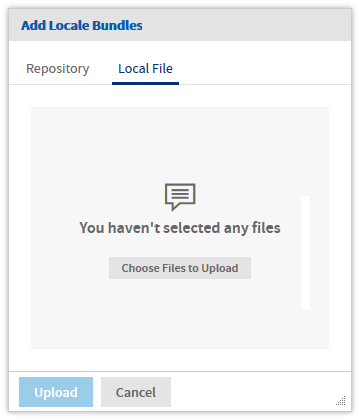
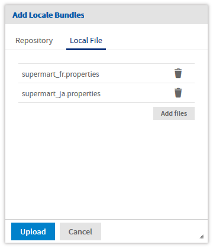
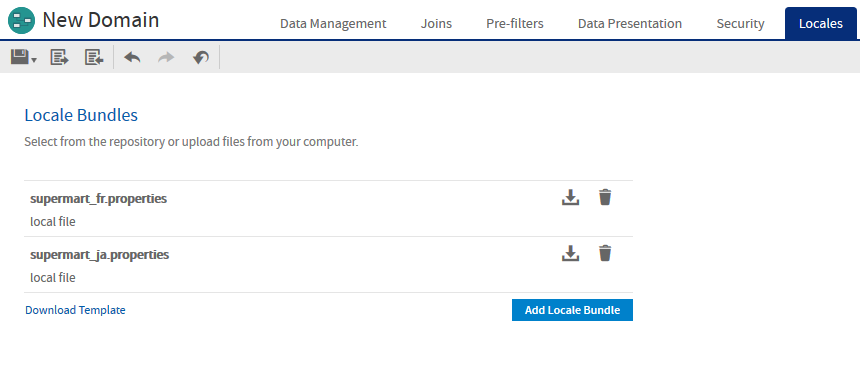
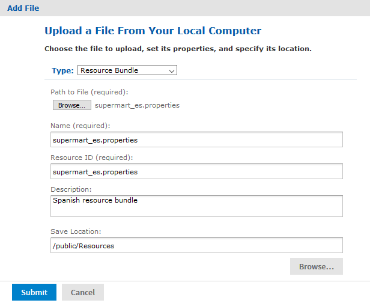
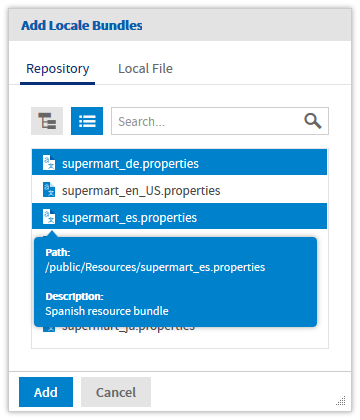
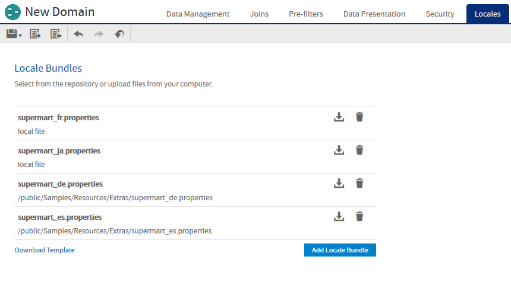

# Adding Locale Bundles to a Domain

After you have created the locale bundle, use the **Locales** tab in the Domain Designer to upload and manage the bundles in your Domain. A Domain can have any number of locale bundles, one for each language you want to support.

Locale bundles can be uploaded from files for use with the current Domain, or they can be stored in the repository for use with multiple Domains:

-   Uploading locale bundles directly to the Domain: When you upload a bundle file on the **Locales** tab, the files are uploaded from your computer and attached to the current Domain. These bundles are stored with the Domain and can't be accessed or shared by other Domains.
-   Sharing bundles from the repository: The repository can also store locale bundles as file resources. Locale bundles uploaded to the repository are not attached to a specific Domain. Instead, they can be referenced by multiple Domains, allowing you to reuse your translations across Domains. Care must be taken to ensure that the keys for labels and descriptions are consistent across all Domains that share a locale bundle.

If you need to modify the bundle, the Locales tab lets you download the bundle, upload it again, or delete it from the Domain.

*Figure 1: Locales Tab When No Resources Are Attached*

## Uploading Locale Bundles Directly to the Domain

Use the following procedures to add bundles directly to your Domain.

1.  Edit the Domain, and on the **Locales** tab, click **Add Locale Bundles**.

2.  In the **Add Locale Bundle** dialog, select the **Local File** category at the top.

3.  Click **Choose Files to Upload**, and select one or more bundles from your file system.

      

    *Figure 2: Adding Bundles from your File System*

    The dialog displays a list of the files you have selected. You can add or remove items from this list to create a list of bundles to upload.

4.  Click **Upload** to add these locale bundles to your Domain.

    

    *Figure 3: Locales Tab with Bundles List*

    The server validates the file to make sure it matches the format of a locale bundle. If the file type is not recognized or there is a syntax error, you must select another file or click **Cancel**.

    When validated, the bundles are added to the Domain and displayed on the **Locales** tab.

5.  After adding bundles to a Domain that is in use, you should clear the Ad Hoc cache of all queries based on the Domain. This removes any datasets that did not rely on the locale bundles. For instructions, see the JasperReports Server Administrator Guide.

Once locale bundles are associated with the Domain, they are active and used to display labels in the given languages. Whenever a user logs in with a locale corresponding to one of the bundles, they will see the labels in the bundle.

## Uploading Locale Bundles from the Repository

Use the following procedures to add bundles to the repository as shared resources, then use them in your Domain.

1.  As an administrator, select **View &gt; Repository** and navigate to the folder where you want to store locale bundles.

2.  Right-click the folder, and select **Add Resource &gt; File &gt; Resource Bundle**.

    

    *Figure 4: Adding a Locales Bundle to the Repository*

3.  In the **Add File** dialog, click **Browse** under **Path to File**, and select the locale bundle on your computer. The **Name** and **Resource ID** fields are automatically filled in with the file name. You must keep the `.properties` extension on the Name and ID.

4.  Give the resource a description if desired, and change the save location as needed, then click submit.

    The locale bundle is uploaded and stored in the repository.

    !!! note

        A warning is displayed if you attempt to delete a resource bundle file that is referenced by a Domain, but not if you replace the files with a different file. When you store these files in the repository, ensure that any updates to the files are compatible with the Domains that reference them.

5.  Edit the Domain, and on the **Locales** tab, click **Add Locale Bundles**.

6.  In the **Add Locale Bundle** dialog, select the **Repository** category at the top.

    The dialog displays a list of all the items of type Resource Bundle in the repository. You can mouse over a bundle to see its folder location and description, then click to select the bundles you want to use.

    

    *Figure 5: Selecting Bundles from the Repository*

    You can also click the hierarchy icon at the top and browse the folder tree of the Repository to find the bundles you want to use. Or enter a name to search the repository.

7.  When you have selected all the bundles you need, click **Add**.

    The server validates the resource to make sure it matches the format of a locale bundle. If the file type is not recognized or there is a syntax error, you must select another resource or click **Cancel**.

    When validated, the bundles are added to the Domain and displayed on the Locales tab. You can build up a list of bundles by adding more any time. The list shows where the bundle is stored in the repository, or whether it's a local file uploaded directly to the Domain.

    

    *Figure 6: Locales Tab with Local and Repository Bundles*

8.  After adding bundles to a Domain that is in use, you should clear the Ad Hoc cache of all queries based on the Domain. This removes any datasets that did not rely on the locale bundles. For instructions, see the JasperReports Server Administrator Guide.

## Modifying and Removing Locale Bundles

For each bundle listed on the Locales tab, there are two available actions represented by icons:

-    – Downloads the selected resource as a `.properties` file.

-    – Removes the bundle from the Domain. Repository resources are not removed from the repository.

    To modify a locale bundle, upload or add the new file with the same name. You are given a warning that the old bundle will be overwritten and can choose to proceed. When you agree, the old bundle with the same name is overwritten and no longer available in the Domain. If you replace a bundle added from the repository, the old bundle remains in the repository, but it is no longer referenced by this Domain. The new bundle is added to the Domain and takes effect.

    There are three common cases:

-   When you modify a bundle that was uploaded as a local file, you can download it from the **Locales** Tab, then modify it, and upload it again. Uploading the file with the same name will replace the old version of the bundle.

-   If you need to modify a shared bundle, you can download it from the **Locales** tab, modify it, and replace it in the repository. This will change the bundle for all Domains that use it.

-   If you change the current Domain such that it can no longer use the shared bundle, you can download the bundle from the **Locales** tab, modify it, then upload it again as an unshared bundle file.

If you change the name of a locale bundle, remove the old one after uploading the new one.

The Download Template action lets you create an empty bundle when you first start localizing your Domain, as described in [Creating Locale Bundles](creating_locale_bundles.md). When you already have locale bundles for your Domain, it is easier to start with an existing bundle and translate it. In that case, use its download icon as described above.

## Maintaining Locale Bundles

Once you have the files you will need to update them as keys are added or changed, or as you add locales. Start from a saved properties file or the default properties file as a template. Alternatively, download one of the existing bundles and remove the translated text.

To add or change keys

1.  If you change the Domain design, download the template again and compare it to your previous template to find all new keys.
2.  If you have defined descriptions and keys in the Domain design, delete the exported values to create a new blank template.
3.  Translate the new keys and add them to your properties files for your supported locales.
4.  Use the **Locales** tab in the Domain Designer to attach the properties files to the Domain.

To add or change a locale

1.  Make another copy of the blank properties file, and save the original for
2.  Rename file to set the `_<locale>` designator and create a properties file for the new locale. For information about file naming, see [Properties File Names](creating_locale_bundles.md).
3.  If you have defined descriptions and keys in the Domain design, delete the exported values to create a new blank template.
4.  Translate the new keys and add them to your properties files for your supported locales.
5.  Use specialized software or a translation service to create the Java localization properties files for each locale you want to support.
6.  Upload the new locale bundle to the Domain or to the repository.

For additional information about locales and properties files for the JasperReports Server user interface, see the Localization chapter in the JasperReports Server Administrator Guide.
