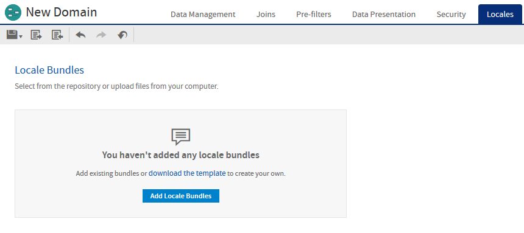
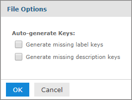

# Creating Locale Bundles

To localize Domain labels and descriptions, you must create a properties file for each locale you want to support. You can also create an optional "default" file that holds untranslated text common to all locales. The default file is also used as a fallback whenever a message is missing in the properties file for the current locale.

To get started, download the template file.

## Downloading the Bundle Template

The Domain Designer lets you download a template with all keys currently defined in the Domain.

1.  Open the Domain for editing and navigate to the **Locales** tab.

2.  Click **download the template**.

    

    *Figure 1 Template Download Link on the Locales Tab*

3.  In the **File Options** dialog box, select which keys to export:

-   **Generate missing label keys**: Automatically generates label key names for any elements where **Label Key** is not defined.

    -   **Generate missing description keys**: Automatically generates description key names for any elements where **Description Key** is not defined.

    -   When both options are deselected, keys are not generated automatically. Only keys explicitly defined as **Label Key** or **Descriptions Key** are exported.

        

        *Figure 2 File Options for Downloading a .properties Template*

        1.  Click **OK**.

        The bundle is exported with a generated file name such as "domain `name.properties`". You can change the name to match the name you want to use for your properties files.

        The file contains the following:

    -   All explicitly defined keys.

    -   Optional generated keys, if selected. For the format of generated keys, see [Key Names](properties_file_syntax.md).

    -   Any values that are explicitly defined as the **Label** or **Description** field for an element on the Presentation tab, or the `labelId` or `descriptionId` attributes on an `itemGroup` or `item` element in the XML design file.

The exported file is a Java properties file in the proper format containing the selected keys. If you did not set any label or descriptions in the Domain Designer or XML design file, then the file contains blank values and is ready for translation.

!!! warning

    If the design file does not load properly in the Domain Designer, you are not able to use the exported design file. In this case, do not overwrite the design file, but save the exported file to another name and attempt to merge in the generated keys.

## Properties File Names

The file names of a locale bundle is of the form &lt;any_name&gt;\_&lt;locale&gt;.properties, where:

-   &lt;any_name&gt; is arbitrary and should be the same for all bundle files in a Domain.
-   &lt;locale&gt; is any Java-compliant locale identifier, for example `fr` or `fr_CA`.
-   You can optionally include a default .properties file, which is used for the default locale or when a key is missing or empty in one of the other .properties files. The default properties file name is &lt;any_name&gt;.properties. It does not have a locale identifier.

The following table shows an example relationship between file names, key names, and values in two files, a default file in English and a file of French translations.

<table>
<colgroup>
<col style="width: 25%" />
<col style="width: 25%" />
<col style="width: 25%" />
<col style="width: 25%" />
</colgroup>
<thead>
<tr>
<th>
Language
</th>
<th>
Locale
</th>
<th>
File Name
</th>
<th>
Sample Contents
</th>
</tr>
</thead>
<tbody>
<tr>
<td>
English
</td>
<td>
default
</td>
<td>
<code>Labels.properties</code>
</td>
<td>
<code>JOINTREE_1.SET1.STORE_CITY.LABEL=City</code>

<code>JOINTREE_1.SET1.STORE_CITY.DESCR=City or town where the store is located</code>
</td>
</tr>
<tr>
<td>
French
</td>
<td>
fr
</td>
<td>
<code>Labels_fr.properties</code>
</td>
<td>
<code>JOINTREE_1.SET1.STORE_CITY.LABEL=Ville</code>

<code>JOINTREE_1.SET1.STORE_CITY.DESCR=Ville ou commune d'exploitation</code>
</td>
</tr>
</tbody>
</table>
