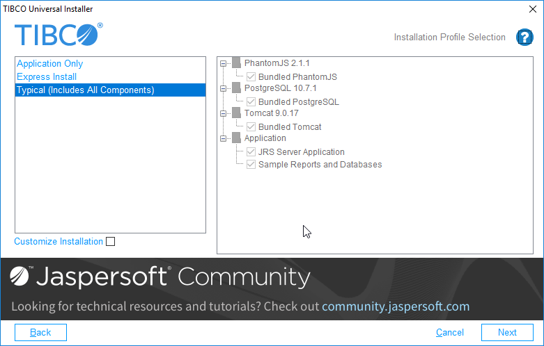

# Installation

TIBCO provides downloadable product archive files and the products can be installed using TIBCO Universal Installer. Extract the downloaded product archive file to a temporary directory, and then run the TIBCO Universal Installer executable from that directory.

!!! note

    If installing more than one product, you can extract multiple product archive files to the same temporary directory and then run TIBCO Universal Installer.

## Installation Modes

You can run the installer in one of the following modes: GUI, console, or silent. Each mode is supported on all platforms.

### GUI Mode

In GUI mode, invoke the installer by double-clicking the executable file `TIBCOUniversalInstaller`. The binary installer cannot be run as root. The installer presents windows that you can use to select the product components, its location, and so on. Proceed through the installation process by providing your input.

### Console Mode

In console mode, you invoke the installer from a command prompt or a terminal window, and the installer prompts for values on the console. You can move through the installation process by responding to the prompts. This mode is useful if your machine does not have a Windows environment.

### Silent Mode

In silent mode, the installer installs without prompting you for information. Silent mode either installs using the default settings or uses a response file that was created earlier.

## Installing in GUI Mode

When you run the installer in GUI mode, the installer presents panels that you can use to choose the installation environment and customize your installation.

1.  Run the TIBCOUniversalInstaller executable.

-   On Microsoft Windows: `TIBCOUniversalInstaller.exe`

    -   On Unix: `TIBCOUniversalInstaller.bin`

    -   On Mac OS: `TIBCOUniversalInstaller-mac.command`

        1.  On the Welcome screen, click **Next**.
        2.  Read through the license agreement, select **I accept the terms of the license agreement** if you agree to the terms, and click **Next**.
        3.  Choose the directory you want for your TIBCO_HOME. TIBCO_HOME is a directory where you can install multiple TIBCO products, as well as multiple versions of the same product. You can use an existing TIBCO_HOME or create a new one.

    -   **Create a new TIBCO_HOME**: In the **Directory** field, specify the directory where you want the product installed. The directory cannot be the same as the directory of an existing installation environment. If the directory does not exist, it will be created.

        The directory path cannot contain the following special characters:

        \# $ % & \* &lt; &gt; ? \` \|

    -   **Use an existing TIBCO_HOME**: Select an existing installation environment from the drop-down menu.

        !!! note

            If you are upgrading to the latest version of the software from an earlier version, it is good practice to install the latest version in the same installation environment.

        1.  Click **Next.**
        2.  On the Installation Profile Selection screen, select the profile you want.

        |  |
        |----|
        |  |
        | Installation Profile Selection Screen |

    -   **Application Only** installs the JasperReports Server and samples. Make sure you have installed supported versions of Tomcat, PostgreSQL, and PhantomJS if you choose this option. If you are using a pre-installed Tomcat, make sure it is stopped. If you are using an existing PostgreSQL instance, it must be running during install. See the JasperReports Server Supported Platforms Datasheet for information about supported versions.

        !!! note

            If you want to use the Rhino library for rendering, select **Application Only** and then select **Use Rhino library instead for rendering** on the PhantomJS Configuration screen.

    -   **Express Install** installs all components.

    -   **Typical** installs all components and lets you verify or modify ports.

To choose some pre-installed and some bundled components, select **Customize Installation** and select or deselect the pre-installed components you want.

1.  When you are ready, click **Next**.

2.  On the Java Home screen, select whether to use a pre-existing instance of the JVM already on your machine, or whether to have the installer add a new JVM. If you select **Specify Currently Installed Java**, enter the location of the JVM you want to use. Then click **Next**.

3.  On the Pre-Install Summary screen, verify the list of products and components selected for installation, and click **Next**.

4.  (Existing Tomcat only) If you are using an existing Tomcat, enter its location on the Tomcat Existing Directory Path screen. Then click **Next**.

5.  On the Tomcat Port Configuration screen, verify your Tomcat server, shutdown, and JMX diagnostic ports, and make any changes. Then click **Next**. (Not shown for **Express Install**.)

6.  On the PostgreSQL Server Parameters screen, verify your PostgreSQL port and make any changes. If you are using a pre-existing PostgreSQL instance, enter the IP/Hostname and the password for the `postgres` admin user. Then click **Next**. (Not shown for **Express Install**.)

7.  On the PhantomJS Configuration screen, if you chose to use an existing PhantomJS instance, enter or browse to the path for the PhantomJS binary. Or select **Use Rhino library instead for rendering**. Then click **Next**.

    JasperReports Server and any selected bundled components are installed on your system.

8.  Verify the Post-Install Summary. If you selected both bundled Tomcat and PostgreSQL, you will see an option **Launch JasperReports Server Login Page**. If you’re installing on Linux, don't close the terminal window running the start script. If you choose not to **Launch JasperReports Server Now**, the bundled components won't be started. If you have only one bundled component, it won't be started unless you use the Start/Stop menus or scripts.

9.  Click **Finish** to complete the installation process, and close the installer window.
