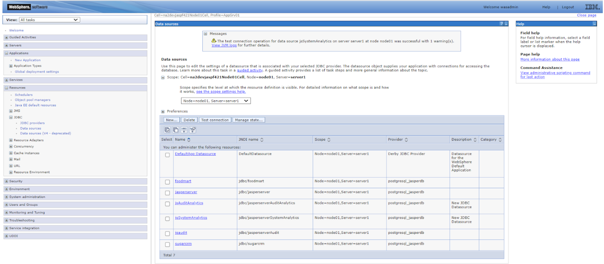
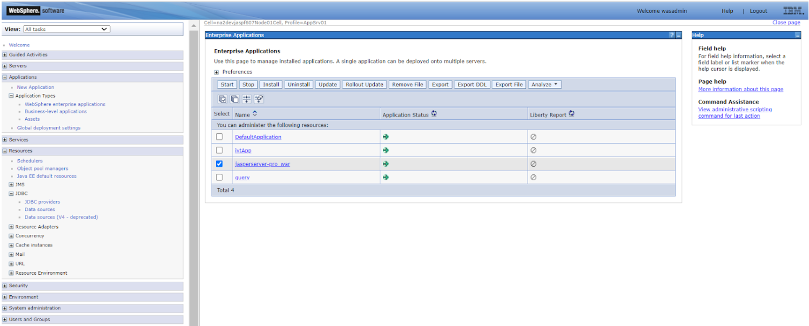
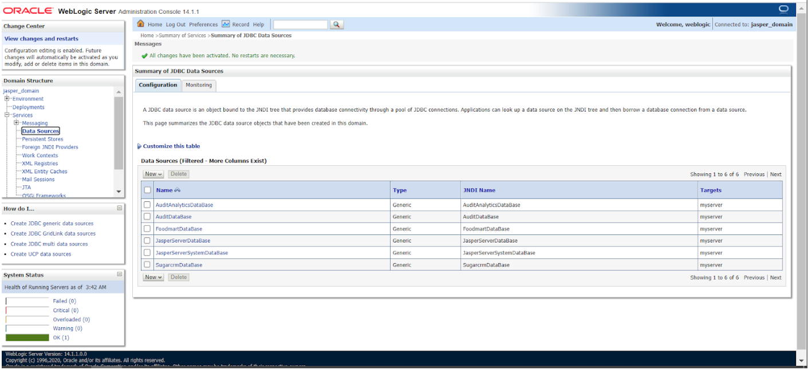
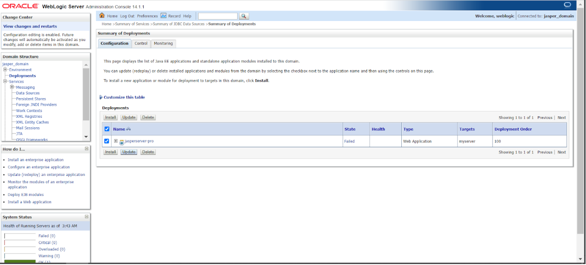

# Enabling Java Naming and Directory Interface (JNDI) Security

Enabling JNDI security or restricted access provides access-control to data sources. With JNDI restricted access, read-only access is provided to data sources.

This chapter includes the following sections:

-   Additional Buildomatic Configuration for JNDI Security Installation Upgrade

-   Create Read-only Users

-   Websphere Installation for Enabling JNDI Security

-   Weblogic Installation for JNDI Security

-   Enabling JNDI Security post Installing JasperReports Server

## Additional Buildomatic Configuration for JNDI Security Installation Upgrade

The `default_master.properties` file handles the configuration for the JNDI security installation upgrade.

To configure the `default_master.properties` file for the JNDI security installation upgrade:

-   Edit the `default_master.properties` file to configure settings specific to your database and application server.

Look for the line **Disable Edit/Delete access to jasperserver and jasperserverAudit JNDI connections** and uncomment the settings listed in Sample Values for the default_master.properties File for JNDI Restricted Access Installation.

For example: To uncomment ` #jndi.restrictedAccess=true`, change it to `jndi.restrictedAccess=true`.

Sample Values for the default_master.properties File for JNDI Restricted Access Installation lists the settings that you need to uncomment with sample values for each supported database.

<table>
<caption><p>Sample Values for the default_master.properties File for JNDI Restricted Access Installation</p></caption>
<colgroup>
<col style="width: 50%" />
<col style="width: 50%" />
</colgroup>
<thead>
<tr>
<th><p>Database</p></th>
<th><p>Sample Property Values</p></th>
</tr>
</thead>
<tbody>
<tr>
<td><p>PostgreSQL</p></td>
<td><code># jndi.restrictedAccess=true</code>
<p><code># analytics.dbUsername=jasperuser</code></p>
<p><code># analytics.dbPassword=password</code></p>
<p><code># auditAnalytics.dbUsername=jasperuser</code></p>
<p><code># auditAnalytics.dbPassword=password</code></p></td>
</tr>
<tr>
<td><p>MySQL</p></td>
<td><code># jndi.restrictedAccess=true</code>
<p><code># analytics.dbUsername=jasperuser</code></p>
<p><code># analytics.dbPassword=password</code></p>
<p><code># auditAnalytics.dbUsername=jasperuser</code></p>
<p><code># auditAnalytics.dbPassword=password</code></p></td>
</tr>
<tr>
<td><p>Oracle</p></td>
<td><code># jndi.restrictedAccess=true</code>
<p><code># analytics.dbUsername=jasperuser</code></p>
<p><code># analytics.dbPassword=password</code></p>
<p><code># auditAnalytics.dbUsername=jasperuser</code></p>
<p><code># auditAnalytics.dbPassword=password</code></p></td>
</tr>
<tr>
<td><p>DB2</p></td>
<td><p><code># jndi.restrictedAccess=true</code></p>
<p><code># analytics.dbUsername=jasperuser</code></p>
<p><code># analytics.dbPassword=password</code></p>
<p><code># auditAnalytics.dbUsername=jasperuser</code></p>
<p><code># auditAnalytics.dbPassword=password</code></p></td>
</tr>
<tr>
<td><p>SQL Server</p></td>
<td><p><code># jndi.restrictedAccess=true</code></p>
<p><code># analytics.dbUsername=jasperuser</code></p>
<p><code># analytics.dbPassword=Pass@123</code></p>
<p><code># auditAnalytics.dbUsername=jasperuser</code></p>
<p><code># auditAnalytics.dbPassword=Pass@123</code></p>
<p>**Note** The password for SQL Server must be a combination of a special character, a number, an uppercase, and a lower case character.</p></td>
</tr>
<tr>
<td colspan="2"><p>**Note** Once the database is created, you must create read-only users. For details, refer to Create Read-only Users</p></td>
</tr>
</tbody>
</table>

Each `sample_conf/<dbType>_master.properties` file contains the properties and appropriate sample values.

You can enable JNDI restricted access while deploying JasperReports Server on Tomcat or JBoss EAP or WildFly. For details, refer to the JasperReports® Server Security Guide.

## Create Read-only Users

The following table lists the database and the steps to create read-only users:

<table>
<caption> </caption>
<colgroup>
<col style="width: 50%" />
<col style="width: 50%" />
</colgroup>
<thead>
<tr>
<th><p>Database</p></th>
<th><p>Steps to create read-only users</p></th>
</tr>
</thead>
<tbody>
<tr>
<td><p>PostgreSQL</p></td>
<td><p>Create user:</p>
<p><code>CREATE USER postgres WITH PASSWORD 'postgres';</code></p>
<p>Assign read-only permissions:</p>
<p><code>GRANT CONNECT ON DATABASE jasperserver TO jasperuser;</code></p>
<p><code>GRANT USAGE ON SCHEMA public TO jasperuser;</code></p>
<p><code>GRANT SELECT ON ALL TABLES IN SCHEMA public TO jasperuser;</code></p>
<p>**Note** The above steps are for the jasperserver database. If you use split installation follow the same steps for the jsaudit database too.</p></td>
</tr>
<tr>
<td><p>MySQL</p></td>
<td>Create user:
<p><code>CREATE USER 'jasperuser' IDENTIFIED BY 'password';</code></p>
Assign read-only permissions:
<p><code>GRANT SELECT ON *.* TO 'jasperuser';</code></p>
<p>Or</p>
<p><code>GRANT SELECT, SHOW VIEW ON *.* TO ''jasperuser'' IDENTIFIED BY 'password';</code></p></td>
</tr>
<tr>
<td><p>Oracle</p></td>
<td><p>Create user:</p>
<p><code>CREATE USER jasperuser IDENTIFIED BY password;</code></p>
<p>Assign read-only permissions:</p>
<p><code>GRANT CREATE SESSION TO jasperuser;</code></p>
<p><code>GRANT READ ANY TABLE TO jasperuser;</code></p></td>
</tr>
<tr>
<td><p>DB2</p></td>
<td><p>Create user:</p>
<p><code>sudo useradd jasperuser</code></p>
<p><code>sudo passwd jasperuser (enter password as 'password')</code></p>
<p>Assign read-only permissions:</p>
<p>login using db2inst1/password</p>
<p>#Connect to the database</p>
<p><code>db2 connect to JSPRSRVR user db2inst1 using password</code></p>
<p># Create the 'read-only' role if it does not exist</p>
<p><code>db2 "create role readonly"</code></p>
<p># Retrieve the list of table names in the 'JSPRSRVR' schema and save them to a file</p>
<p><code>db2 -x "SELECT tabname FROM syscat.tables WHERE tabschema = 'JSPRSRVR'" &gt; table_list.txt</code></p>
<p># Grant 'SELECT' privilege for each table in the 'read-only' role</p>
<p><code>while IFS= read -r table; do</code></p>
<p><code>db2 "grant select on JSPRSRVR.$table to role readonly"</code></p>
<p><code>done &lt; table_list.txt</code></p>
<p># Grant the 'read-only' role to the 'jasperserver' user</p>
<p><code>db2 "grant role readonly to user jasperuser"</code></p>
<p># Clean up - remove the temporary file</p>
<p><code>rm table_list.txt</code></p></td>
</tr>
<tr>
<td><p>SQL Server</p></td>
<td><p>Create user:</p>
<p><code>CREATE LOGIN jasperuser WITH PASSWORD =’Pass@123’;</code></p>
<p><code>CREATE USER jasperuser FOR LOGIN jasperuser;</code></p>
<p>Assign read-only permissions:</p>
<p><code>ALTER ROLE db_datareader ADD MEMBER jasperuser;</code></p></td>
</tr>
</tbody>
</table>

## Websphere Installation for Enabling JNDI Security

1.  Deploy the VM on the Websphere application server.

2.  Log in to the Websphere console `https://<ip_address>:9043/ibm/console`, using the credentials `wasadmin` and `wasadmin`.

3.  Navigate to **Resources &gt; JDBC &gt; Data Sources &gt; Add New JNDI Data Sources**. For details, refer to [Configuring a JDBC Provider in WebSphere](../websphere/websphere_install_procedure.md).

    |  |
    |----|
    |  |
    | *Figure 1: Add New JNDI Data Sources* |

4.  Restart the Websphere server.

5.  Navigate to **Applications &gt; Application Types &gt; Websphere Enterprise Application &gt;** Select your application (for example, `jasperserver-pro_war`) **&gt; Stop &gt; Start**.

    |  |
    |----|
    |  |
    | *Figure 2: Restart Websphere Server* |

6.  Log in to JasperReports Server and check the connection to all JNDI data sources.

7.  Set `hibernate.propeties=true`.

    ``` text
    cd
    IBM/WebSphere/AppServer/profiles/AppSrv01/installedApps/na2devjaspf607Node01Cell/jasperserver-pro_war.ear/jasperserver-pro.war/WEBINF/classes/
    vim hibernate.properties
    ```

8.  Set `metadata.hibernate.jndi.restrictedAccess.enabled=true`.

9.  Restart the application server again and go to JasperReports Server. The test connection should fail for `jasperserver` and `jasperserverAudit` data sources.

## Weblogic Installation for JNDI Security

1.  Deploy the VM on the Weblogic application server.

2.  Log in to the Weblogic console `http://host:port/console` using the credentials `weblogic` and `just4eng`.

3.  If the console is not accessible, then start Weblogic by using the following commands:

    `sudo chmod -R 777 Oracle`

    `cd /opt/Oracle/Middleware/Oracle_Home/domains/jasper_domain/bin`

    `sudo ./startWebLogic.sh`

4.  Navigate to **Domain Structure&gt; Services&gt; Data Sources&gt;Add AuditAnalyticsDataBase and JasperServerSystemDataBase**. For details, refer to [Procedure for Installing the WAR File for WebLogic.](../weblogic/weblogic_install_procedure.md)

    |  |
    |----|
    |  |
    | *Figure 3: Add New JNDI Data Sources* |

5.  Redeploy WAR file.

6.  Navigate to **Deployment**.

7.  Select `jasperserver-pro` file and click **Update**.

    |                                                                          |
    |--------------------------------------------------------------------------|
    |  |
    | *Figure 4: Redeploy WAR file*                                            |

8.  Log in to JasperReports Server and check the connection to all JNDI data sources.

9.  Set `metadata.hibernate.jndi.restrictedAccess.enabled=true`.

10. Update the `hibernate.properties` in `jasperserver-pro.war` file.

11. Redeploy the `jasperserver-pro.war` file.

12. Go to JasperReports Server. The test connection should fail for `jasperserver` and `jasperserverAudit` data sources.

## Enabling JNDI Security post Installing JasperReports Server

1.  Follow the steps in Create Read-only Users to create read-only users.

2.  Update the `jasperreports server>/WEB-INF/hibernate.properties` file and set `metadata.hibernate.jndi.restrictedAccess.enabled=true`.

3.  Edit the `jasperreports server>/META-INF/context.xml` file.

    Based on the values used in Step 1, change the username and password for the following two resources:

    -   `jdbc/jasperserverSystemAnalytics`

    -   `jdbc/jasperserverAuditAnalytics`

4.  Complete the changes and restart the application server.

5.  Create a JNDI data source by using either of the following two connections:

    -   `jdbc/jasperserver`

    -   `jdbc/jasperserverAudit`

    A message stating `If your JNDI Data Connection has Edit/Delete access disabled, jasperserver and jasperserverAudit cannot be used for creating a new data source. Please select another JNDI connection.` is displayed.

6.  Create a JNDI data source by using either of the following two connections:

    -   `jdbc/jasperserverSystemAnalytics`

    -   `jdbc/jasperserverAuditAnalytics`

    You should be able to create data source using these connections.
