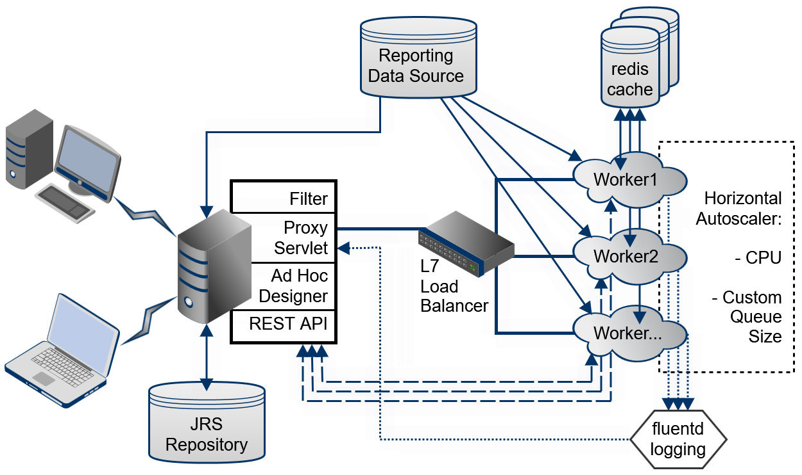

# Architecture

When deployed, the scalable query engine has a container-based architecture where multiple pods or workers process Ad Hoc views in parallel. The following figure shows its components that are further described in this section:

|  |
|----|
|  |
| *Figure 1: Architecture of the Scalable Query Engine* |

## Filter

Once the scalable query engine is activated in JasperReports Server, a new filter processes all requests for embedded Ad Hoc views and reports. Ad Hoc views in dashboards or requested by Visualize.js clients are sent to the filter and then to the scalable query engine. Ad Hoc views in the Ad Hoc designer and Ad Hoc reports in the report viewer are handled internally by the server and never sent to the filter.

The filter then checks the data source of the embedded Ad Hoc views to make sure they can be processed by the workers. See [Overview](overview.md) for the list of supported data sources. The filter also checks to make sure the workers are active and able to process Ad Hoc requests. After the filter determines that an Ad Hoc view can be handled by the scalable query engine, the filter sends the embedded Ad Hoc request to the proxy servlet.

## Proxy Servlet

The proxy servlet manages the communication between the server and the workers, so that the Ad Hoc view can be securely processed on a remote worker pod.

First, the proxy servlet creates the Ad Hoc task that is sent to a worker pod, including information such as the URI of the Ad Hoc view in the repository and any attributes that apply to the user session. This information is encoded in JSON web tokens (JWT) that are signed with the server's keys. These tokens allow access to the server's REST APIs that worker pods need to begin processing the Ad Hoc request, for example the metadata in the repository for the Ad Hoc view or its input controls.

If there is an error while a worker is processing an Ad Hoc task, the proxy servlet handles retries and displays any error messages.

## Load Balancer

As part of the Kubernetes cluster that manages the workers, the layer 7 load balancer distributes Ad Hoc requests to the available workers. By default, requests are queued, and it uses a round-robin algorithm to select a worker for each request.

On Kubernetes, Ingress is the load balancer by default.

## Worker Pods

After receiving an Ad Hoc request, a worker pod does the querying and processing to render an Ad Hoc view. The pods are deployed in Kubernetes, usually on virtual machines in a cloud, and the general sequence of events is as follows:

1.  When the worker receives the request, it is given the URI of the Ad Hoc view in the repository. It then accesses the repository through the server's REST API to get the data source and query needed for the report.

2.  Using other context such as attributes and input controls, the worker determines the final query needed to obtain the dataset for the report.

3.  Before sending the query to the data source, the worker first accesses the redis cache to determine if the dataset is available without running the query again. Access to the cache is based on the user who requested the Ad Hoc view and the query, so that all data access is secure.

    1.  If the query is already in the redis cache, the dataset of the results is sent from the cache to the worker.

    2.  If the query was not found in the redis cache, the query is sent to the reporting data source, and the worker waits for the new dataset. This new query result is then also added to the redis cache with its query string.

4.  The worker performs the in-memory processing of the dataset, for example, doing the grouping or aggregation that is necessary in the required table, crosstab, or chart.

5.  The data processing results are also stored in the redis cache for later re-use.

6.  The worker generates the required table, crosstab, or chart, and through the proxy servlet, publishes it in the container that is associated with this Ad Hoc task, for example embedded in the server's dashboard interface or in a Visualize.js client.

## Redis Cache

The redis cache is a high-performance distributed data store shared by all worker pods and is itself managed in the Kubernetes cluster as separate pods.

The redis cache holds the results of Ad Hoc queries, which can be huge datasets, and workers can get these results without performing the correspondingly long queries while they are held in the cache. The redis cache is actually composed of several separate caches:

- The main cache for datasets resulting from queries.

- A cache for Ad Hoc view output that has already been processed and is ready to display.

- A cache of the Ad Hoc view descriptors from the JasperReports Server repository.

- A cache for attributes associated with a given Ad Hoc view and user.

The Ad Hoc workers check each of these caches before making a request for the corresponding contents. For example, before calling the repository REST API to get the report metadata, the worker checks the descriptors cache to see if that descriptor has already been requested and is still valid.

All the caches have timeout values that you can configure to determine how long datasets and descriptors are valid before needing to be reloaded.

## Autoscaler

The Horizontal Pod Autoscaler manages the Kubernetes cluster and can launch new worker pods or remove them as needed. Through the configuration, you can set rules for scaling based on CPU usage and, optionally, memory queue size.

When the scalable query engine is live in production, the autoscaler then starts new worker pods automatically to improve performance, or stop unused pods to save on virtual machine costs.

## Fluentd Logging

Because the worker pods are running on virtual nodes that can be difficult to access, the scalable query engine enables a fluentd chart to collect the logs from all the nodes. The workers use the log4j2 library, and you can set logging levels when configuring the helm chart. Then use Elasticsearch to aggregate and search the logs.

When there are errors while processing an Ad Hoc view, you can then use command-line tools on the server to view the aggregated logs from the workers and pinpoint the problem.
