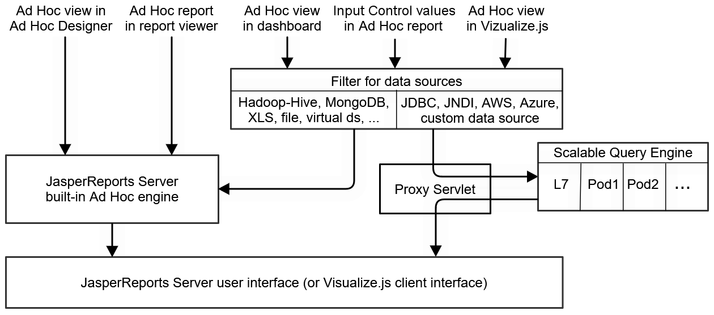

# Overview

The JasperReports Server scalable query engine runs certain Ad Hoc views in parallel on separate virtual nodes, called workers, to improve the performance. For example, a dashboard may contain several Ad Hoc views and take several seconds to display even on a server with no load. When many users open dashboards simultaneously, the load increases on the server and all users experience delays.

When the scalable query engine is deployed, the server sends dashboard Ad Hoc tasks to the workers, the workers independently query the data source and process the results, and then the completed reports are displayed seamlessly in each dashboard. With many workers processing reports in parallel, the delays for each user are minimized. The workers have their own data cache, so repeated queries are handled efficiently. You can also configure Kubernetes to scale automatically, launching new workers when load is high and removing workers when it's low.

In addition to embedded Ad Hoc views, the engine also processes queries (but not rendering) for Ad Hoc reports and lists of input control values. In order to display a list of possible values for an input control, the server must query the data source and process a list of potentially thousands of results. The scalable query engine can do this work in parallel and benefit from its local cache, just like Ad Hoc views.

The scalable query engine runs on virtual nodes that are separate from and in addition to the host running your instance of JasperReports Server. If you choose to deploy the scalable query engine, you will need to provision these additional nodes, usually through a cloud provider.

It is important to understand which reports are handled by the scalable query engine:

-   The scalable query engine applies only to embedded Ad Hoc views: those that run in dashboards and through Visualize.js.

    The scalable query engine does not apply to Ad Hoc views in the designer or Ad Hoc reports in the viewer. These are always processed by the server's own Ad Hoc engine, even if they are large reports with a longer response time.

-   The engine can handle the following types of data sources:

    -   JDBC data source (JdbcReportDataSource)

    -   JNDI data source (JndiJdbcReportDataSource), requires configuration

    -   Custom data source (CustomReportDataSource)

    -   AWS data source (AwsReportDataSource)

    -   Azure data source (AzureSqlReportDataSource)

    Other types of data sources such as the various big data adapters are not certified for use with the scalable query engine. Embedded Ad Hoc views with unsupported data sources are again processed by the server's own Ad Hoc engine. The user doesn't see any change in behavior, the embedded Ad Hoc view is still displayed as expected, the only difference is the scalability (performance under load). Make sure your embedded Ad Hoc views use the data sources listed above to take advantage of the scalable query engine.

-   The scalable query engine processes only embedded Ad Hoc views. If you want improved performance for JRXML reports, Jaspersoft provides the JasperReports IO (JRIO) At-Scale product that is also based on a Kubernetes cluster of autoscalable pods. Both JRIO At-Scale and the Scalable Query Engine can be deployed simultaneously with the same server, but they remain separate clusters with separate Helm charts.

The following diagram summarizes which Ad Hoc views can be processed by the scalable query engine:

|  |
|----|
|  |
| *Figure 1: Ad Hoc Views Processed by the Scalable Query Engine* |

The scalable query engine is completely transparent: users are still logged into JasperReports Server through a browser or authenticated with Visualize.js. They view dashboards containing Ad Hoc views in their JasperReports Server sessions or Visualize.js clients as before. There is no user-visible change to the server when the scalable query engine is deployed, only a performance improvement under load.

The rest of this chapter describes the components of the scalable query engine and how to deploy them. When you are ready to deploy the scalable query engine, first install JasperReports Server WAR file distribution, then download and configure the Docker container for the Ad Hoc workers, provision your virtual machines, and finally deploy the worker pods in a cluster with Kubernetes. Jaspersoft recommends doing this during the installation process, before putting your server into production. However, it can also be done at a later time, though you will need to reconfigure and restart the server while deploying the workers.
